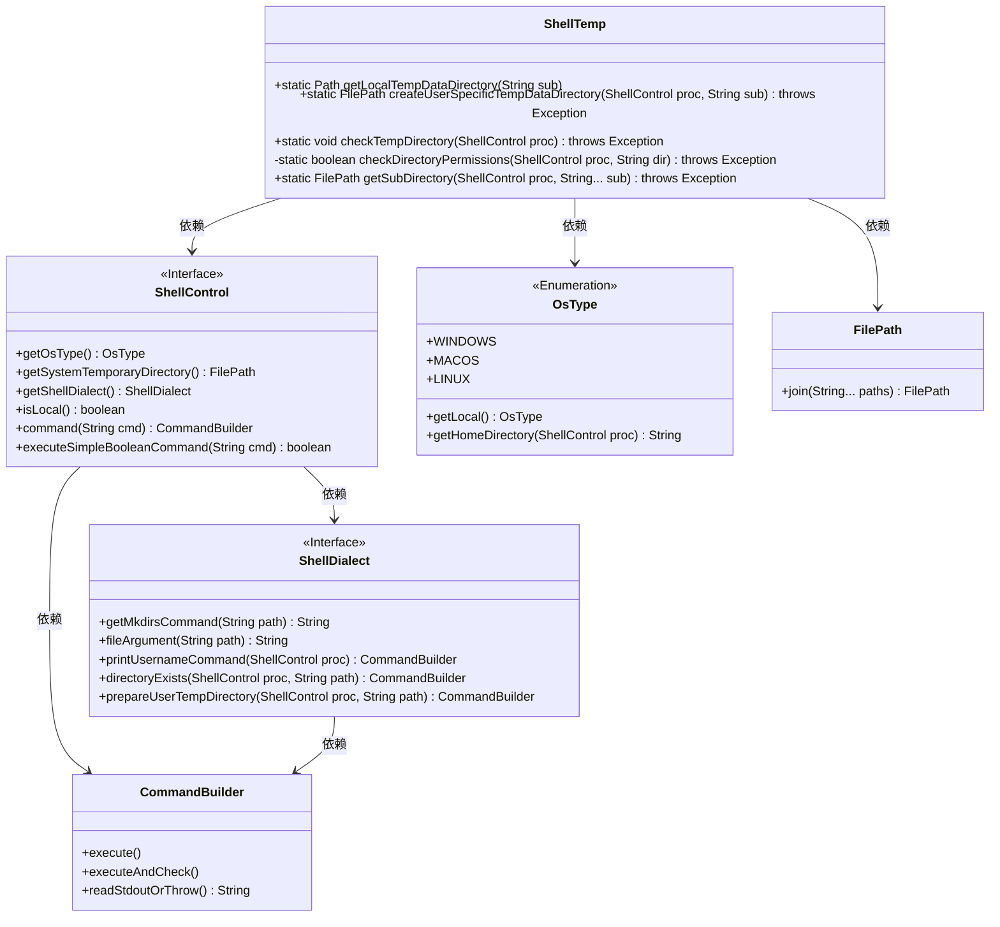
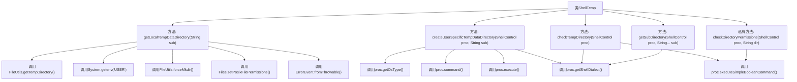
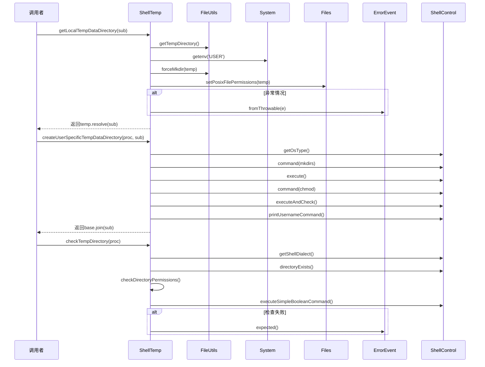

# 基础信息

|      |      |
|------|------|
| 名称 | ShellTemp |
| 编码语言 | .java |
| 代码路径 | xpipe/app/src/main/java/io/xpipe/app/util/ShellTemp.java |
| 包名 | io.xpipe.app.util |
| 依赖项 | ['io.xpipe.app.issue.ErrorEvent', 'io.xpipe.core.process.OsType', 'io.xpipe.core.process.ShellControl', 'io.xpipe.core.process.ShellDialects', 'io.xpipe.core.store.FilePath', 'org.apache.commons.io.FileUtils', 'java.io.IOException', 'java.nio.file.Files', 'java.nio.file.Path', 'java.nio.file.attribute.PosixFilePermissions'] |
| 概述说明 | ShellTemp类提供跨平台临时目录管理，支持Linux用户隔离，检查权限并创建子目录。 |

# 说明

ShellTemp类提供了管理临时目录的方法。getLocalTempDataDirectory方法根据操作系统类型创建用户特定的临时目录，Linux下会设置权限为777。createUserSpecificTempDataDirectory方法在远程Shell中创建用户临时目录并设置权限。checkTempDirectory方法验证临时目录的可访问性和权限。getSubDirectory方法创建子目录。这些方法主要处理Windows、macOS和Linux系统的临时目录管理，确保跨平台兼容性和权限正确性。

# 类列表 Class Summary

| 名称   | 类型  | 说明 |
|-------|------|-------------|
| ShellTemp | class | ShellTemp类提供跨平台临时目录管理，支持Linux用户隔离并检查权限。 |

## 类 ShellTemp

|      |      |
|------|------|
| 访问范围 | public |
| 类型 | class |
| 名称 | ShellTemp |
| 说明 | ShellTemp类提供跨平台临时目录管理，支持Linux用户隔离并检查权限。 |

### UML类图

这段代码主要实现了跨平台的临时目录管理功能，包含本地和远程Shell环境下的目录创建、权限检查和清理操作。ShellTemp类提供了4个核心方法：getLocalTempDataDirectory处理本地临时目录，createUserSpecificTempDataDirectory创建用户专属目录，checkTempDirectory验证目录权限，getSubDirectory获取子目录。通过ShellControl接口抽象不同操作系统和Shell环境的差异，配合ShellDialect处理具体命令语法，OsType枚举区分操作系统类型，FilePath处理路径拼接，形成完整的跨平台临时目录管理解决方案。

### 内部方法调用关系图

这段代码主要处理与临时目录相关的操作，包括创建本地临时目录、创建用户特定的临时目录、检查临时目录权限以及获取子目录。流程图展示了类中各个方法的调用关系，时序图则详细描述了关键方法的执行流程。代码特别关注不同操作系统（Windows、macOS、Linux）的兼容性处理，并通过ShellControl对象执行远程命令。异常处理机制完善，使用ErrorEvent统一处理可能出现的错误情况。

### 字段列表 Field List

| 名称  | 类型  | 说明 |
|-------|-------|------|

### 方法列表 Method List

| 名称  | 类型  | 说明 |
|-------|-------|------|
| checkDirectoryPermissions | boolean | 检查目录权限：Windows直接通过，非Windows需验证读、写、执行权限。 |
| createUserSpecificTempDataDirectory | FilePath | 创建用户专属临时目录，非Win/Mac系统需设置权限，支持子目录。 |
| getSubDirectory | FilePath | 获取子目录路径，若不存在则创建。 |
| getLocalTempDataDirectory | Path | 获取本地临时数据目录路径，Linux下处理用户权限，返回子目录路径。 |
| checkTempDirectory | void | 检查临时目录权限，非本地或非CMD环境跳过，无权限则报错。 |

