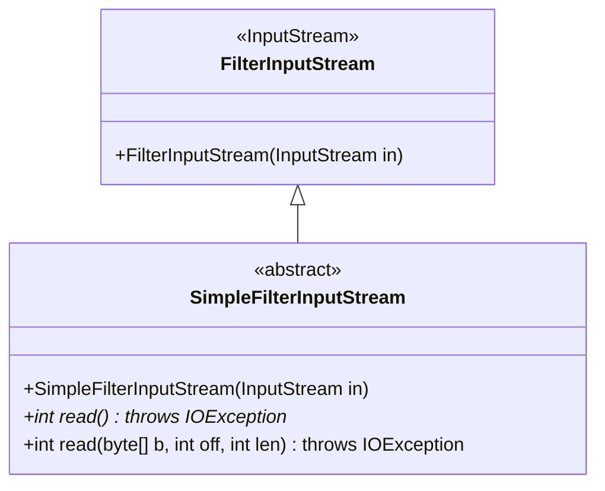
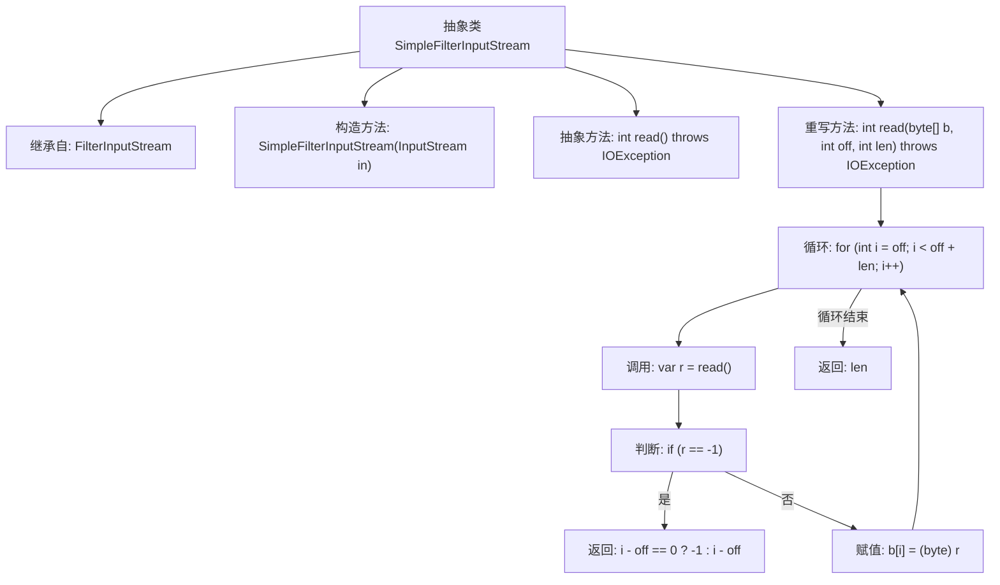

# 基础信息

|      |      |
|------|------|
| 名称 | SimpleFilterInputStream |
| 编码语言 | .java |
| 代码路径 | xpipe/app/src/main/java/io/xpipe/app/util/SimpleFilterInputStream.java |
| 包名 | io.xpipe.app.util |
| 依赖项 | ['lombok.NonNull', 'java.io.FilterInputStream', 'java.io.IOException', 'java.io.InputStream'] |
| 概述说明 | 抽象输入流类，实现读取字节方法，支持单字节和字节数组读取。 |

# 说明

该内容定义了一个名为SimpleFilterInputStream的抽象类，继承自FilterInputStream。该类包含一个受保护的构造函数，接收InputStream参数并调用父类构造函数。它声明了抽象的read方法，必须由子类实现。同时提供了read方法的重载实现，该方法读取字节数据到指定数组的偏移位置，处理读取结束条件并返回实际读取的字节数。当读取到流末尾时返回-1，否则返回读取的字节长度。所有方法都可能抛出IOException异常。

# 类列表 Class Summary

| 名称   | 类型  | 说明 |
|-------|------|-------------|
| SimpleFilterInputStream | class | 抽象输入流过滤器类，提供read方法实现，支持字节数组读取。 |

## 类 SimpleFilterInputStream

|      |      |
|------|------|
| 访问范围 | public abstract |
| 类型 | class |
| 名称 | SimpleFilterInputStream |
| 说明 | 抽象输入流过滤器类，提供read方法实现，支持字节数组读取。 |

### UML类图

类图描述：
该图展示了一个继承关系，抽象类SimpleFilterInputStream继承自FilterInputStream。SimpleFilterInputStream实现了两个read方法：一个抽象方法用于读取单个字节，一个具体方法用于批量读取字节到缓冲区。类图中明确标注了抽象类和方法，以及继承关系，体现了Java IO流处理中的典型装饰器模式结构，其中FilterInputStream作为基础装饰类提供核心功能。

### 内部方法调用关系图

这段代码展示了一个抽象类SimpleFilterInputStream，它继承自FilterInputStream并实现了两个读取数据的方法。流程图清晰地描述了类的继承关系、构造方法以及read方法的具体实现逻辑，包括循环读取字节、处理流结束标志(-1)以及返回读取的字节数。通过该图可以直观理解数据流的处理过程和异常情况的处理方式。

### 字段列表 Field List

| 名称  | 类型  | 说明 |
|-------|-------|------|

### 方法列表 Method List

| 名称  | 类型  | 说明 |
|-------|-------|------|
| read | int | 重写read方法，读取字节到数组，处理结束返回-1，否则返回读取长度。 |
| read | int | 抽象方法read()，返回int，可能抛出IOException。 |

