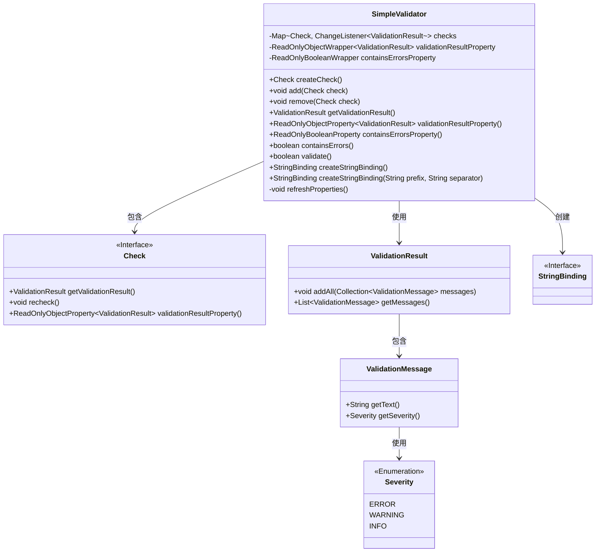
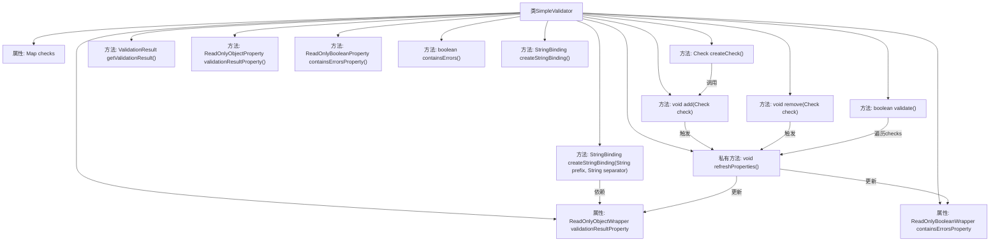

# 基础信息

|      |      |
|------|------|
| 名称 | SimpleValidator |
| 编码语言 | .java |
| 代码路径 | xpipe/app/src/main/java/io/xpipe/app/util/SimpleValidator.java |
| 包名 | io.xpipe.app.util |
| 依赖项 | ['javafx.beans.binding.Bindings', 'javafx.beans.binding.StringBinding', 'javafx.beans.property.ReadOnlyBooleanProperty', 'javafx.beans.property.ReadOnlyBooleanWrapper', 'javafx.beans.property.ReadOnlyObjectProperty', 'javafx.beans.property.ReadOnlyObjectWrapper', 'javafx.beans.value.ChangeListener', 'net.synedra.validatorfx.Check', 'net.synedra.validatorfx.Severity', 'net.synedra.validatorfx.ValidationMessage', 'net.synedra.validatorfx.ValidationResult', 'java.util.LinkedHashMap', 'java.util.Map'] |
| 概述说明 | Java验证器类，管理检查项并跟踪验证结果和错误状态。 |

# 说明

SimpleValidator是一个验证器实现类，用于管理多个检查项并汇总验证结果。它维护一个检查项映射表，每个检查项的状态变化会触发验证结果更新。类提供添加、移除检查项的方法，并能生成包含所有错误信息的字符串绑定。验证结果通过只读属性暴露，包含是否有错误的布尔状态。核心功能包括执行所有检查项的重新验证，动态刷新验证结果，并支持自定义错误信息格式。内部通过监听器机制实现检查项状态变化的自动响应。

# 类列表 Class Summary

| 名称   | 类型  | 说明 |
|-------|------|-------------|
| SimpleValidator | class | SimpleValidator类实现验证器，管理多个Check实例，提供验证结果和错误状态跟踪功能。 |

## 类 SimpleValidator

|      |      |
|------|------|
| 访问范围 | public |
| 类型 | class |
| 名称 | SimpleValidator |
| 说明 | SimpleValidator类实现验证器，管理多个Check实例，提供验证结果和错误状态跟踪功能。 |

### UML类图

这段代码展示了一个验证器框架的核心结构。SimpleValidator类通过维护一组Check对象来执行验证逻辑，每个Check会产生ValidationResult，其中包含多个带有严重程度(Severity)的ValidationMessage。验证器提供了属性绑定功能(StringBinding)来动态显示错误信息，并通过refreshProperties()方法聚合所有检查结果。整个设计采用观察者模式，当检查结果变化时自动更新验证状态。

### 内部方法调用关系图

该流程图展示了SimpleValidator类的完整结构，包含3个核心属性和10个主要方法。类通过checks映射表管理多个Check对象，通过validationResultProperty和containsErrorsProperty维护验证状态。关键流程包括：创建检查项(add/remove)→触发属性刷新(refreshProperties)→更新验证结果→反馈到界面绑定(StringBinding)。所有验证操作最终都会汇聚到refreshProperties方法进行统一状态更新，形成闭环验证体系。

### 字段列表 Field List

| 名称  | 类型  | 说明 |
|-------|-------|------|
| containsErrorsProperty = new ReadOnlyBooleanWrapper() | ReadOnlyBooleanWrapper | 私有只读布尔包装属性containsErrorsProperty |
| checks = new LinkedHashMap<>() | Map<Check, ChangeListener<ValidationResult>> | 私有映射存储检查器与验证结果监听器的关联。 |
| validationResultProperty =            new ReadOnlyObjectWrapper<>(new ValidationResult()) | ReadOnlyObjectWrapper<ValidationResult> | 私有只读属性validationResultProperty，初始化为新的ValidationResult对象。 |

### 方法列表 Method List

| 名称  | 类型  | 说明 |
|-------|-------|------|
| containsErrors | boolean | 检查错误状态的方法，返回布尔值。 |
| refreshProperties | void | 刷新属性：遍历检查项，收集验证消息，更新结果和错误状态。 |
| add | void | 添加检查项并监听验证结果变化以刷新属性。 |
| createStringBinding | StringBinding | 创建字符串绑定，拼接验证消息，带前缀和分隔符。 |
| createStringBinding | StringBinding | 创建字符串绑定方法，返回带前缀和分隔符的字符串。 |
| containsErrorsProperty | ReadOnlyBooleanProperty | 返回只读布尔属性containsErrors的只读视图。 |
| validate | boolean | 方法验证所有检查项并返回无错误结果。 |
| validationResultProperty | ReadOnlyObjectProperty<ValidationResult> | 公开只读属性方法，返回验证结果的只读属性对象。 |
| createCheck | Check | 创建检查对象并返回。 |
| remove | void | 移除检查项并取消其验证监听，最后刷新属性。 |
| getValidationResult | ValidationResult | 获取验证结果属性值 |

