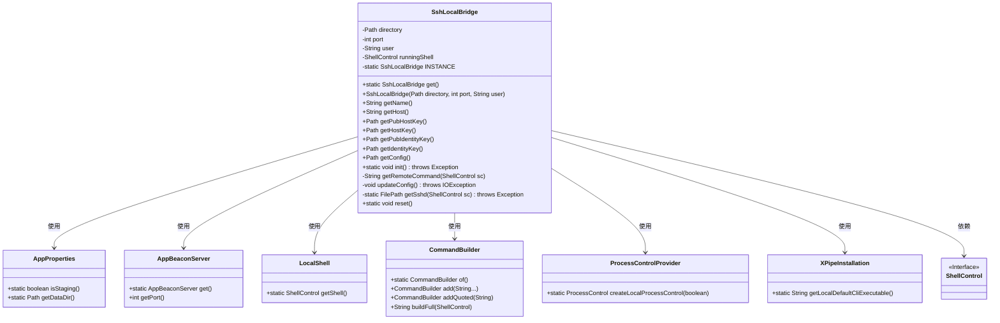

# 基础信息

|      |      |
|------|------|
| 名称 | SshLocalBridge |
| 编码语言 | .java |
| 代码路径 | xpipe/app/src/main/java/io/xpipe/app/util/SshLocalBridge.java |
| 包名 | io.xpipe.app.util |
| 依赖项 | ['io.xpipe.app.beacon.AppBeaconServer', 'io.xpipe.app.core.AppProperties', 'io.xpipe.app.ext.ProcessControlProvider', 'io.xpipe.app.issue.ErrorEvent', 'io.xpipe.core.process.CommandBuilder', 'io.xpipe.core.process.ShellControl', 'io.xpipe.core.process.ShellDialects', 'io.xpipe.core.store.FilePath', 'io.xpipe.core.util.XPipeInstallation', 'lombok.Getter', 'lombok.Setter', 'java.io.IOException', 'java.nio.file.Files', 'java.nio.file.Path', 'java.util.regex.Matcher', 'java.util.regex.Pattern', 'java.util.stream.Collectors'] |
| 概述说明 | SSH本地桥接类，管理密钥、配置和端口，支持单例模式与远程命令执行。 |

# 说明

SshLocalBridge类是一个单例实现，用于管理本地SSH桥接服务。它包含目录路径、端口和用户信息，提供获取主机名、密钥文件路径等方法。初始化时检查并生成必要的SSH密钥和配置文件，启动SSH服务器进程。支持更新本地SSH客户端配置，提供远程命令执行功能。包含重置功能以停止服务并清理实例。

# 类列表 Class Summary

| 名称   | 类型  | 说明 |
|-------|------|-------------|
| SshLocalBridge | class | SSH本地桥接类，管理SSH配置、密钥生成和服务器启动。 |

## 类 SshLocalBridge

|      |      |
|------|------|
| 访问范围 | @Getter;public |
| 类型 | class |
| 名称 | SshLocalBridge |
| 说明 | SSH本地桥接类，管理SSH配置、密钥生成和服务器启动。 |

### UML类图

这段代码实现了一个SSH本地桥接功能，通过单例模式管理SSH服务实例。主要功能包括初始化SSH密钥对、生成配置文件、启动SSH守护进程等。类图展示了SshLocalBridge与多个工具类的交互关系，包括AppProperties获取配置、AppBeaconServer获取端口、LocalShell执行命令、CommandBuilder构建命令等。该设计通过静态方法和依赖注入实现松耦合，支持跨平台SSH服务管理。

### 内部方法调用关系图

```mermaid
graph TD
    A["类SshLocalBridge"]
    B["静态属性: SshLocalBridge INSTANCE"]
    C["属性: Path directory"]
    D["属性: int port"]
    E["属性: String user"]
    F["属性: ShellControl runningShell"]
    G["静态方法: get()"]
    H["构造方法: SshLocalBridge(Path, int, String)"]
    I["方法: String getName()"]
    J["方法: String getHost()"]
    K["方法: Path getPubHostKey()"]
    L["方法: Path getHostKey()"]
    M["方法: Path getPubIdentityKey()"]
    N["方法: Path getIdentityKey()"]
    O["方法: Path getConfig()"]
    P["静态方法: init()"]
    Q["方法: String getRemoteCommand(ShellControl)"]
    R["方法: void updateConfig()"]
    S["静态方法: FilePath getSshd(ShellControl)"]
    T["静态方法: reset()"]

    A --> B
    A --> C
    A --> D
    A --> E
    A --> F
    A --> G
    A --> H
    A --> I
    A --> J
    A --> K
    A --> L
    A --> M
    A --> N
    A --> O
    A -.-> P
    A --> Q
    A --> R
    A -.-> S
    A -.-> T
```

该流程图展示了SshLocalBridge类的完整结构，包含5个核心属性（1个静态属性）、12个方法（4个静态方法）以及它们之间的关联关系。类主要实现SSH本地桥接功能，通过INSTANCE单例模式管理状态，提供SSH密钥生成、配置文件管理、服务进程控制等核心操作。静态方法init()和reset()分别负责初始化和清理工作，而实例方法则处理SSH连接参数生成和配置更新等具体业务逻辑。

### 字段列表 Field List

| 名称  | 类型  | 说明 |
|-------|-------|------|
| user | String | 私有字符串变量user |
| INSTANCE | SshLocalBridge | 私有静态SSH本地桥实例变量 |
| runningShell | ShellControl | 设置运行Shell的私有变量 |
| directory | Path | 私有路径变量directory |
| port | int | 私有整型端口变量 |

### 方法列表 Method List

| 名称  | 类型  | 说明 |
|-------|-------|------|
| getIdentityKey | Path | 方法返回身份密钥路径，由目录路径和名称组合而成。 |
| getConfig | Path | 获取配置文件路径，返回目录下的sshd_config文件。 |
| getHost | String | 返回本地主机IP地址"127.0.0.1"。 |
| get | SshLocalBridge | 获取SshLocalBridge单例实例。 |
| getName | String | 根据环境返回不同桥接名称，测试环境为xpipe_ptb_bridge，正式环境为xpipe_bridge。 |
| getPubHostKey | Path | 公开方法返回主机公钥文件路径。 |
| getPubIdentityKey | Path | 获取公钥身份文件路径 |
| getHostKey | Path | 方法返回主机密钥路径，由目录和文件名拼接而成。 |
| init | void | 初始化SSH桥接服务，检查端口、生成密钥、配置并启动SSH守护进程。 |
| getRemoteCommand | String | 生成SSH启动命令，处理路径空格问题。 |
| updateConfig | void | 更新SSH配置，检查并替换或添加主机条目。 |
| getSshd | FilePath | 获取sshd路径，若不存在则报错。 |
| reset | void | 静态方法reset()：关闭运行中Shell的输入流并终止进程，最后清空实例。 |

