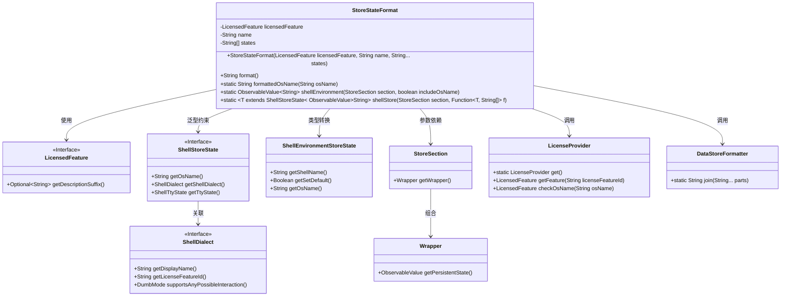
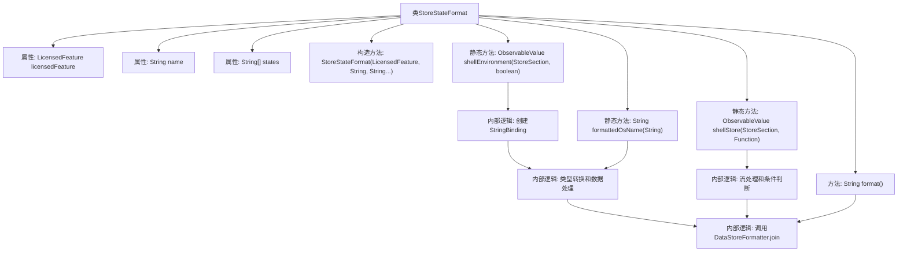

# 基础信息

|      |      |
|------|------|
| 名称 | StoreStateFormat |
| 编码语言 | .java |
| 代码路径 | xpipe/app/src/main/java/io/xpipe/app/util/StoreStateFormat.java |
| 包名 | io.xpipe.app.util |
| 依赖项 | ['io.xpipe.app.comp.store.StoreSection', 'io.xpipe.app.core.AppI18n', 'io.xpipe.core.process.ShellDialects', 'io.xpipe.core.process.ShellEnvironmentStoreState', 'io.xpipe.core.process.ShellStoreState', 'io.xpipe.core.process.ShellTtyState', 'javafx.beans.binding.Bindings', 'javafx.beans.value.ObservableValue', 'lombok.Value', 'java.util.Arrays', 'java.util.function.Function', 'java.util.stream.Collectors', 'java.util.stream.Stream'] |
| 概述说明 | StoreStateFormat类提供格式化shell环境和存储状态的方法，支持许可证检查和状态拼接。 |

# 说明

StoreStateFormat类提供格式化存储状态的功能，包含两个核心静态方法。shellEnvironment方法生成包含操作系统名称和shell名称的可观察字符串值，支持默认状态标记。shellStore方法根据shell状态和许可证信息生成格式化字符串，处理不同交互模式、许可证验证及TTY状态。类构造函数接收许可证特性、名称和状态数组，format方法将这些元素组合成最终字符串。formattedOsName方法用于规范化操作系统名称字符串。

# 类列表 Class Summary

| 名称   | 类型  | 说明 |
|-------|------|-------------|
| StoreStateFormat | class | StoreStateFormat类提供格式化shell环境和状态的方法，支持许可证检查和OS名称处理。 |

## 类 StoreStateFormat

|      |      |
|------|------|
| 访问范围 | @Value;public |
| 类型 | class |
| 名称 | StoreStateFormat |
| 说明 | StoreStateFormat类提供格式化shell环境和状态的方法，支持许可证检查和OS名称处理。 |

### UML类图

**类图描述**：该图展示了`StoreStateFormat`核心类及其关联关系，该类用于格式化存储状态信息。通过组合`LicensedFeature`、`ShellStoreState`等接口实现许可证检查、操作系统名称处理等功能，依赖`LicenseProvider`进行许可证验证，使用`DataStoreFormatter`拼接字符串。包含两个静态工厂方法，分别处理环境变量和存储状态的格式化，体现了泛型、观察者模式等设计。

### 内部方法调用关系图

这段代码流程图展示了StoreStateFormat类的完整结构，包含3个属性和5个核心方法。静态方法shellEnvironment和shellStore分别处理不同场景的shell状态格式化，通过Bindings.createStringBinding和BindingsHelper.map实现响应式数据绑定。format()方法为核心格式化逻辑，整合许可证信息、名称和状态数据。流程图清晰呈现了数据从输入到格式化输出的完整处理链条，包括类型转换、条件判断和流式处理等关键步骤，最终通过DataStoreFormatter.join生成格式化字符串。

### 字段列表 Field List

| 名称  | 类型  | 说明 |
|-------|-------|------|
| name | String | 声明字符串变量name。 |
| states | String[] | 声明字符串数组变量states。 |
| licensedFeature | LicensedFeature | 授权功能对象 |

### 方法列表 Method List

| 名称  | 类型  | 说明 |
|-------|-------|------|
| shellEnvironment | ObservableValue<String> | 静态方法返回字符串绑定，合并系统名和Shell名，含默认标记。依赖语言和状态变更。 |
| shellStore | ObservableValue<String> | 方法根据ShellStoreState生成ObservableValue，处理不同shell状态和OS名称，返回格式化字符串。 |
| format | String | 格式化方法：拼接许可证描述、名称和状态信息。 |
| formattedOsName | String | 静态方法格式化操作系统名称，去除"Microsoft "前缀，替换"Enterprise Evaluation"为"Enterprise"。 |

