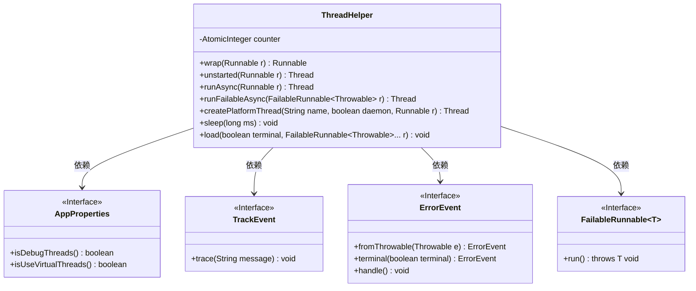
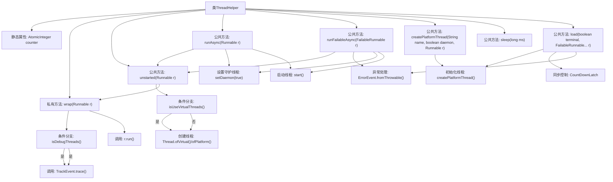

# 基础信息

|      |      |
|------|------|
| 名称 | ThreadHelper |
| 编码语言 | .java |
| 代码路径 | xpipe/app/src/main/java/io/xpipe/app/util/ThreadHelper.java |
| 包名 | io.xpipe.app.util |
| 依赖项 | ['io.xpipe.app.core.AppProperties', 'io.xpipe.app.issue.ErrorEvent', 'io.xpipe.app.issue.TrackEvent', 'io.xpipe.core.util.FailableRunnable', 'lombok.SneakyThrows', 'java.util.concurrent.CountDownLatch', 'java.util.concurrent.atomic.AtomicInteger'] |
| 概述说明 | 线程辅助类，封装虚拟/平台线程创建、调试跟踪、异常处理及并发加载功能。 |

# 说明

ThreadHelper类提供线程管理工具，包含静态方法封装线程操作。主要功能包括：包装Runnable以跟踪活跃线程数；根据配置创建虚拟或平台线程；异步执行任务并自动设为守护线程；支持可失败任务的异常处理；创建具名平台线程；线程休眠；并行加载任务并等待完成。通过AppProperties控制调试和线程类型，使用TrackEvent和ErrorEvent记录事件和错误。

# 类列表 Class Summary

| 名称   | 类型  | 说明 |
|-------|------|-------------|
| ThreadHelper | class | 线程辅助类，封装线程创建、调试跟踪、异常处理及并发控制。 |

## 类 ThreadHelper

|      |      |
|------|------|
| 访问范围 | public |
| 类型 | class |
| 名称 | ThreadHelper |
| 说明 | 线程辅助类，封装线程创建、调试跟踪、异常处理及并发控制。 |

### UML类图

这段代码展示了一个线程辅助工具类ThreadHelper，它提供了多种线程操作方法。核心功能包括：包装Runnable任务以跟踪线程状态、创建虚拟/平台线程、异步执行任务（含异常处理）、创建具名平台线程、线程休眠以及并行加载任务。该类通过AtomicInteger计数器跟踪活跃线程数，依赖AppProperties获取配置，使用TrackEvent记录跟踪信息，并通过ErrorEvent处理异常。特别值得注意的是它对FailableRunnable的支持，允许任务抛出受检异常，并通过统一的错误处理机制进行管理。

### 内部方法调用关系图

这段代码是ThreadHelper工具类，主要提供线程相关的封装操作。核心功能包括：1) 通过wrap方法实现线程执行前后的调试跟踪；2) 支持虚拟线程和平台线程的创建；3) 提供异步执行、异常处理、守护线程设置等便捷方法；4) 包含多任务并行加载的load方法，使用CountDownLatch实现同步控制。代码通过AppProperties动态配置调试模式和线程类型，并集成了TrackEvent和ErrorEvent进行监控和错误处理。

### 字段列表 Field List

| 名称  | 类型  | 说明 |
|-------|-------|------|
| counter = new AtomicInteger() | AtomicInteger | 私有静态原子计数器 |

### 方法列表 Method List

| 名称  | 类型  | 说明 |
|-------|-------|------|
| wrap | Runnable | 包装Runnable以跟踪调试线程数 |
| runFailableAsync | Thread | 创建守护线程运行可失败任务，捕获异常处理。 |
| unstarted | Thread | 静态方法根据配置创建未启动的虚拟或平台线程。 |
| runAsync | Thread | 静态方法runAsync接收Runnable参数，创建守护线程并启动，返回线程对象。 |
| createPlatformThread | Thread | 创建平台线程，设置名称和守护状态后返回。 |
| sleep | void | 静态方法sleep暂停当前线程指定毫秒，异常时打印堆栈。 |
| load | void | 多线程并行执行任务，等待所有完成，异常处理可选终止。 |

