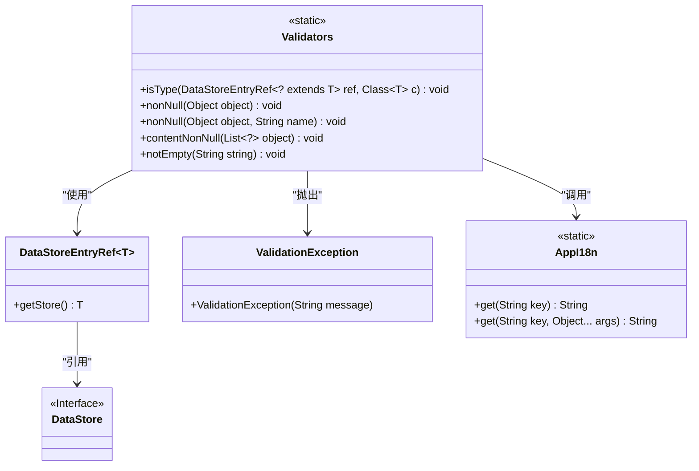
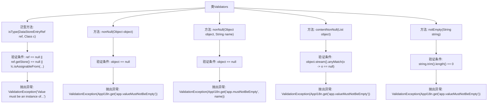

# 基础信息

|      |      |
|------|------|
| 名称 | Validators |
| 编码语言 | .java |
| 代码路径 | xpipe/app/src/main/java/io/xpipe/app/util/Validators.java |
| 包名 | io.xpipe.app.util |
| 依赖项 | ['io.xpipe.app.core.AppI18n', 'io.xpipe.app.storage.DataStoreEntryRef', 'io.xpipe.core.store.DataStore', 'io.xpipe.core.util.ValidationException', 'java.util.List'] |
| 概述说明 | 验证工具类，检查类型、非空及非空字符串。 |

# 说明

Validators类包含五个静态方法用于数据验证。isType方法检查DataStoreEntryRef对象是否为指定类型，否则抛出异常。nonNull方法有两个重载版本，分别检查对象是否为null，可自定义异常信息中的名称。contentNonNull方法检查列表中是否存在null元素。notEmpty方法验证字符串是否为空或仅含空白字符。所有方法在验证失败时抛出ValidationException，部分错误信息通过AppI18n获取国际化文本。

# 类列表 Class Summary

| 名称   | 类型  | 说明 |
|-------|------|-------------|
| Validators | class | 验证工具类，检查类型、非空及非空字符串。 |

## 类 Validators

|      |      |
|------|------|
| 访问范围 | public |
| 类型 | class |
| 名称 | Validators |
| 说明 | 验证工具类，检查类型、非空及非空字符串。 |

### UML类图

这段类图展示了Validators工具类的静态验证方法及其关联关系。Validators提供5种参数校验方法，包括类型检查(isType)、非空校验(nonNull)、集合内容非空检查(contentNonNull)和字符串非空校验(notEmpty)。该校验器通过DataStoreEntryRef泛型类访问DataStore接口实现，校验失败时抛出ValidationException，并使用AppI18n进行国际化错误消息处理。所有方法均为静态工具方法，不维护实例状态。

### 内部方法调用关系图

该流程图展示了Validators类中的五个静态验证方法。每个方法都包含一个验证条件和对应的异常抛出逻辑。isType方法通过泛型检查类型匹配，nonNull的两个重载版本分别检查对象空值和带名称提示的空值，contentNonNull检查集合元素空值，notEmpty检查字符串空白。所有验证失败时都会抛出带有本地化错误信息的ValidationException。

### 字段列表 Field List

| 名称  | 类型  | 说明 |
|-------|-------|------|

### 方法列表 Method List

| 名称  | 类型  | 说明 |
|-------|-------|------|
| nonNull | void | 检查对象非空，否则抛出验证异常。 |
| contentNonNull | void | 检查列表元素非空，否则抛出验证异常。 |
| isType | void | 检查引用是否为指定类型，否则抛出异常。 |
| notEmpty | void | 检查字符串非空，空则抛验证异常。 |
| nonNull | void | 静态方法检查对象非空，为空则抛验证异常。 |

