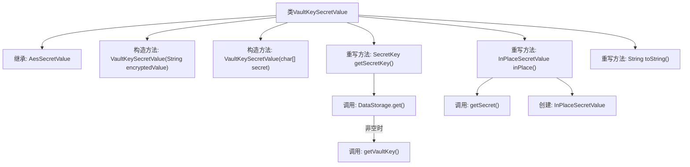

# 基础信息

|      |      |
|------|------|
| 名称 | VaultKeySecretValue |
| 编码语言 | .java |
| 代码路径 | xpipe/app/src/main/java/io/xpipe/app/util/VaultKeySecretValue.java |
| 包名 | io.xpipe.app.util |
| 依赖项 | ['io.xpipe.app.storage.DataStorage', 'io.xpipe.core.util.AesSecretValue', 'io.xpipe.core.util.InPlaceSecretValue', 'com.fasterxml.jackson.annotation.JsonTypeName', 'lombok.EqualsAndHashCode', 'lombok.experimental.SuperBuilder', 'lombok.extern.jackson.Jacksonized', 'javax.crypto.SecretKey'] |
| 概述说明 | VaultKeySecretValue类继承AesSecretValue，提供加密值存储和密钥管理功能。 |

# 说明

这是一个名为VaultKeySecretValue的Java类，继承自AesSecretValue类。它使用Lombok注解实现建造者模式、JSON序列化和值比较功能。类提供了两种构造方法：一种接收加密字符串，另一种接收字符数组。核心方法getSecretKey从DataStorage获取密钥，inPlace方法返回新的InPlaceSecretValue实例。toString方法返回固定字符串表示。该类主要用于处理保险库密钥的加密值操作。

# 类列表 Class Summary

| 名称   | 类型  | 说明 |
|-------|------|-------------|
| VaultKeySecretValue | class | VaultKeySecretValue类继承AesSecretValue，提供加密存储和密钥管理功能。 |


## 类 VaultKeySecretValue

|      |      |
|------|------|
| 访问范围 | @JsonTypeName("vault");@SuperBuilder;@Jacksonized;@EqualsAndHashCode(callSuper = true);public |
| 类型 | class |
| 名称 | VaultKeySecretValue |
| 说明 | VaultKeySecretValue类继承AesSecretValue，提供加密存储和密钥管理功能。 |


### UML类图

```mermaid
classDiagram
    class AesSecretValue {
        <<Abstract>>
        +String encryptedValue
        +AesSecretValue(String encryptedValue)
        +AesSecretValue(char[] secret)
        #SecretKey getSecretKey()*
        +InPlaceSecretValue inPlace()
        +String toString()
    }

    class VaultKeySecretValue {
        +VaultKeySecretValue(String encryptedValue)
        +VaultKeySecretValue(char[] secret)
        #SecretKey getSecretKey()
        +InPlaceSecretValue inPlace()
        +String toString()
    }

    class DataStorage {
        <<Singleton>>
        +SecretKey getVaultKey()
    }

    class InPlaceSecretValue {
        +InPlaceSecretValue(char[] secret)
    }

    AesSecretValue <|-- VaultKeySecretValue : 继承
    VaultKeySecretValue --> DataStorage : 调用 : getVaultKey()
    VaultKeySecretValue --> InPlaceSecretValue : 创建实例
```

类图描述：该图展示了VaultKeySecretValue类继承自抽象类AesSecretValue，并实现了其抽象方法getSecretKey()。VaultKeySecretValue通过DataStorage单例获取密钥，并能创建InPlaceSecretValue实例。类结构体现了加密值处理的核心逻辑，包含构造方法重载、密钥获取和类型转换等关键操作，同时通过toString()方法实现了安全敏感信息的保护性输出。


### 内部方法调用关系图



这段代码展示了一个名为VaultKeySecretValue的类，继承自AesSecretValue，主要用于处理保险库密钥的加密值。类中包含两个构造方法分别接受加密字符串和字符数组，重写了getSecretKey()方法从DataStorage获取密钥，inPlace()方法转换秘密值为就地存储格式，以及toString()方法返回固定标识。流程图清晰呈现了类结构、继承关系和关键方法调用链，特别突出了与DataStorage组件的交互过程。

### 字段列表 Field List

| 名称  | 类型  | 说明 |
|-------|-------|------|

### 方法列表 Method List

| 名称  | 类型  | 说明 |
|-------|-------|------|
| getSecretKey | SecretKey | 获取密钥：若数据存储存在则返回密钥，否则返回空。 |
| inPlace | InPlaceSecretValue | 重写方法，返回包含当前密钥的InPlaceSecretValue实例。 |
| toString | String | 重写toString方法，返回固定字符串"<vault secret>"。 |


