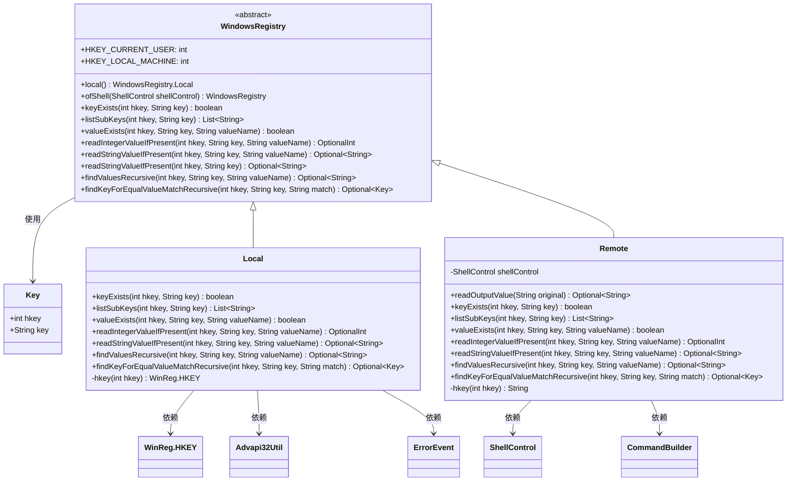
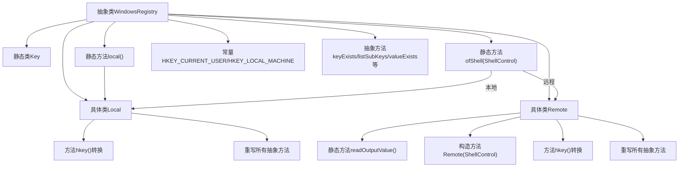

# 基础信息

|      |      |
|------|------|
| 名称 | WindowsRegistry |
| 编码语言 | .java |
| 代码路径 | xpipe/app/src/main/java/io/xpipe/app/util/WindowsRegistry.java |
| 包名 | io.xpipe.app.util |
| 依赖项 | ['io.xpipe.app.issue.ErrorEvent', 'io.xpipe.core.process.CommandBuilder', 'io.xpipe.core.process.ShellControl', 'com.sun.jna.platform.win32.Advapi32Util', 'com.sun.jna.platform.win32.WinReg', 'lombok.Value', 'java.util'] |
| 概述说明 | WindowsRegistry类提供本地和远程注册表操作，包括查询键值、递归搜索等功能。 |

# 说明

WindowsRegistry是一个抽象类，提供操作Windows注册表的功能。它包含两个实现类：Local和Remote。Local类通过本地JNA库访问注册表，支持检查键是否存在、列出子键、检查值是否存在、读取整型和字符串值等功能。Remote类通过远程Shell执行reg命令实现相同功能。类中定义了HKEY_CURRENT_USER和HKEY_LOCAL_MACHINE常量，以及一个静态Key内部类表示注册表键。抽象方法包括递归查找键值、精确匹配键等高级操作。两个实现类都处理了异常情况，确保操作失败时返回安全默认值。

# 类列表 Class Summary

| 名称   | 类型  | 说明 |
|-------|------|-------------|
| WindowsRegistry | class | WindowsRegistry类提供本地和远程注册表操作，包括查询键值、递归查找等功能。 |

## 类 WindowsRegistry

|      |      |
|------|------|
| 访问范围 | public abstract |
| 类型 | class |
| 名称 | WindowsRegistry |
| 说明 | WindowsRegistry类提供本地和远程注册表操作，包括查询键值、递归查找等功能。 |

### UML类图

这段代码定义了一个抽象类WindowsRegistry及其两个实现类Local和Remote，用于操作Windows注册表。Local类通过JNA本地调用实现注册表操作，Remote类通过Shell命令实现远程注册表操作。Key类作为值对象存储注册表键信息。类图展示了它们之间的继承关系和依赖关系，包括对ShellControl、Advapi32Util等外部组件的依赖。该设计提供了本地和远程两种注册表访问方式，支持查询键值、读取数据等常见操作。

### 内部方法调用关系图

这段代码实现了一个Windows注册表操作的抽象层，包含本地(Local)和远程(Remote)两种实现方式。流程图展示了核心类结构：抽象基类WindowsRegistry定义了注册表操作接口，内嵌Key值类；Local类通过JNA调用本地API实现功能，包含错误处理；Remote类通过Shell命令实现远程操作，包含输出解析逻辑。两个具体类都实现了键值查询、递归查找等核心功能，通过ofShell工厂方法自动选择实现方式。

### 字段列表 Field List

| 名称  | 类型  | 说明 |
|-------|-------|------|
| HKEY_LOCAL_MACHINE = 0x80000002 | int | 定义常量HKEY_LOCAL_MACHINE，值为0x80000002。 |
| HKEY_CURRENT_USER = 0x80000001 | int | Windows注册表常量，表示当前用户配置根键。 |

### 方法列表 Method List

| 名称  | 类型  | 说明 |
|-------|-------|------|
| local | WindowsRegistry.Local | 公开静态方法返回本地Windows注册表实例。 |
| readIntegerValueIfPresent | OptionalInt | 读取指定注册表键的整数值（若存在）。 |
| findKeyForEqualValueMatchRecursive | Optional<Key> | 递归查找匹配键值对的可选键方法 |
| readStringValueIfPresent | Optional<String> | 读取注册表字符串值，可选返回，可能抛异常。 |
| listSubKeys | List<String> | 列出指定注册表键下的子键名列表。 |
| keyExists | boolean | 检查指定注册表键是否存在 |
| ofShell | WindowsRegistry | 静态方法`ofShell`根据`shellControl`是否为本地返回本地或远程`WindowsRegistry`实例。 |
| valueExists | boolean | 检查注册表键值是否存在 |
| readStringValueIfPresent | Optional<String> | 读取指定键的字符串值，若存在则返回，否则返回空。 |
| findValuesRecursive | Optional<String> | 抽象方法：递归查找注册表键值，返回Optional<String>，可能抛异常。 |

