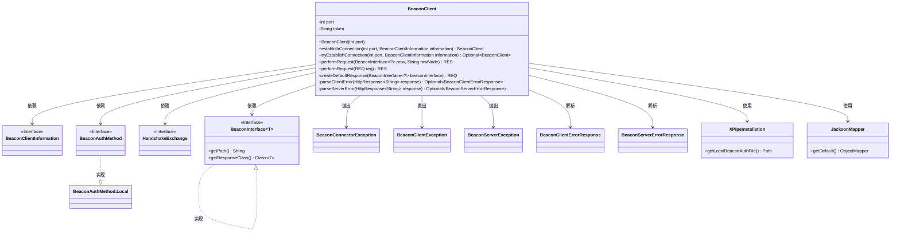
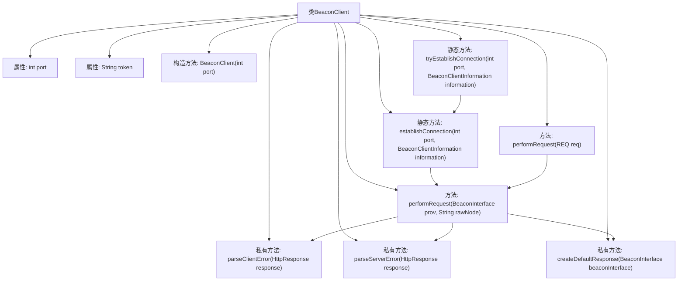
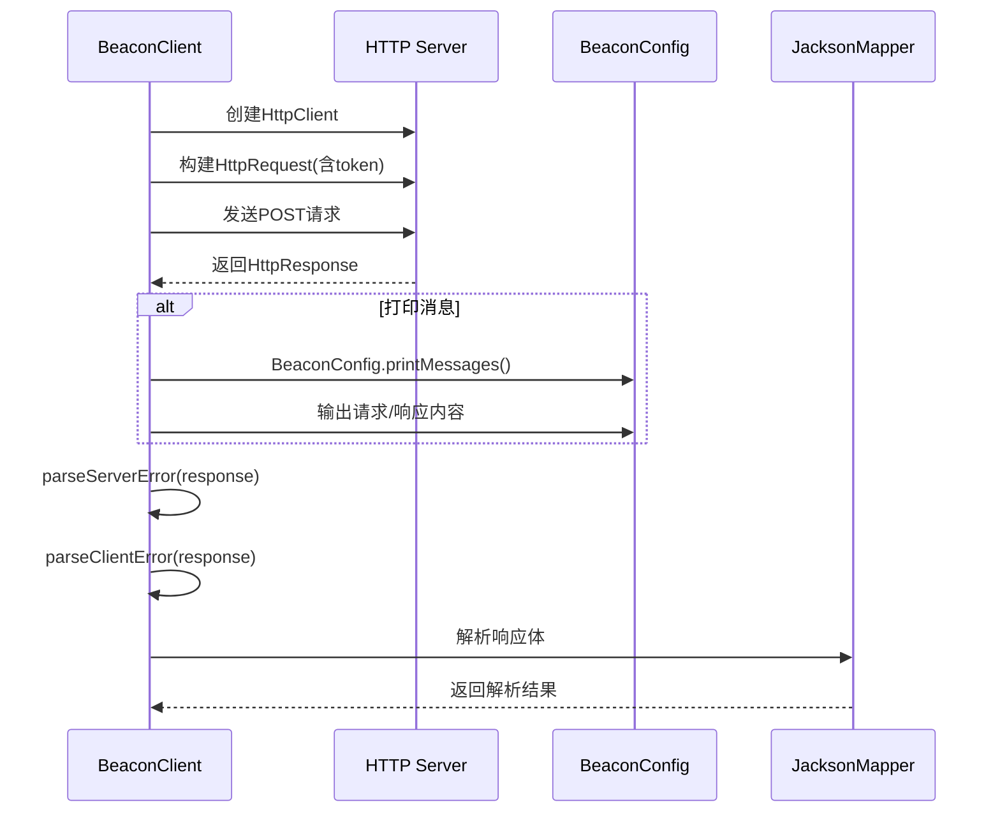

# 基础信息

|      |      |
|------|------|
| 名称 | BeaconClient |
| 编码语言 | .java |
| 代码路径 | xpipe/beacon/src/main/java/io/xpipe/beacon/BeaconClient.java |
| 包名 | io.xpipe.beacon |
| 依赖项 | ['io.xpipe.beacon.api.HandshakeExchange', 'io.xpipe.core.util.JacksonMapper', 'io.xpipe.core.util.XPipeInstallation', 'com.fasterxml.jackson.databind.node.ObjectNode', 'lombok.SneakyThrows', 'java.io.IOException', 'java.net.URI', 'java.net.http.HttpClient', 'java.net.http.HttpRequest', 'java.net.http.HttpResponse', 'java.nio.file.Files', 'java.util.Optional'] |
| 概述说明 | BeaconClient类用于建立连接并发送请求，支持错误处理和响应解析。 |

# 说明

BeaconClient是一个用于建立和管理与Beacon服务通信的客户端类。它通过指定端口初始化，提供两种连接方式：establishConnection会抛出异常，tryEstablishConnection返回Optional。客户端使用HTTP协议与本地服务通信，支持Bearer令牌认证。performRequest方法处理请求和响应，包括错误解析（客户端错误400-499，服务端错误500-599）、请求日志打印以及JSON数据序列化/反序列化。类内部使用Jackson处理JSON，通过BeaconInterface匹配请求类型，并包含创建默认响应的工具方法。整个流程包含请求发送、响应接收、错误处理和结果解析。

# 类列表 Class Summary

| 名称   | 类型  | 说明 |
|-------|------|-------------|
| BeaconClient | class | Beacon客户端类，用于建立连接、发送请求和处理响应，支持错误解析和本地认证。 |

## 类 BeaconClient

|      |      |
|------|------|
| 访问范围 | public |
| 类型 | class |
| 名称 | BeaconClient |
| 说明 | Beacon客户端类，用于建立连接、发送请求和处理响应，支持错误解析和本地认证。 |

### UML类图

这段代码描述了一个BeaconClient类，用于与Beacon服务器建立连接并发送请求。该类通过端口和认证令牌管理连接，提供两种建立连接方式（直接和尝试式），并实现了请求发送、响应解析和错误处理功能。核心功能包括执行HTTP请求、处理服务器/客户端错误、构建默认响应等，依赖多个辅助类和接口如BeaconInterface、HandshakeExchange等，使用Jackson进行JSON序列化。

### 内部方法调用关系图

这段代码实现了一个Beacon客户端，用于与Beacon服务端建立连接并进行HTTP通信。主要功能包括：通过establishConnection方法建立带认证的连接，通过performRequest方法发送请求并处理响应，包含错误处理、消息打印和JSON解析等功能。流程图展示了类结构和主要方法调用关系，时序图详细描述了请求发送和响应处理的完整过程。代码设计考虑了多种异常情况，如连接错误、客户端/服务端错误以及空响应处理。

### 字段列表 Field List

| 名称  | 类型  | 说明 |
|-------|-------|------|
| port | int | 私有整型端口变量 |
| token | String | 私有字符串变量token |

### 方法列表 Method List

| 名称  | 类型  | 说明 |
|-------|-------|------|
| parseClientError | Optional<BeaconClientErrorResponse> | 解析HTTP响应中的客户端错误，状态码非4xx返回空，解析失败抛异常。 |
| parseServerError | Optional<BeaconServerErrorResponse> | 解析HTTP响应中的服务器错误，状态码500-599时返回错误信息，否则返回空。解析失败抛出异常。 |
| establishConnection | BeaconClient | 建立BeaconClient连接，验证后返回带令牌的客户端。 |
| tryEstablishConnection | Optional<BeaconClient> | 尝试建立连接，成功返回客户端，失败返回空。 |
| createDefaultResponse | REQ | 反射创建默认响应对象 |
| performRequest | RES | 方法performRequest处理Beacon请求，验证请求类型并发送至服务器，可能抛出异常。 |
| performRequest | RES | 发送HTTP请求并处理响应，包含错误处理和JSON解析。 |

