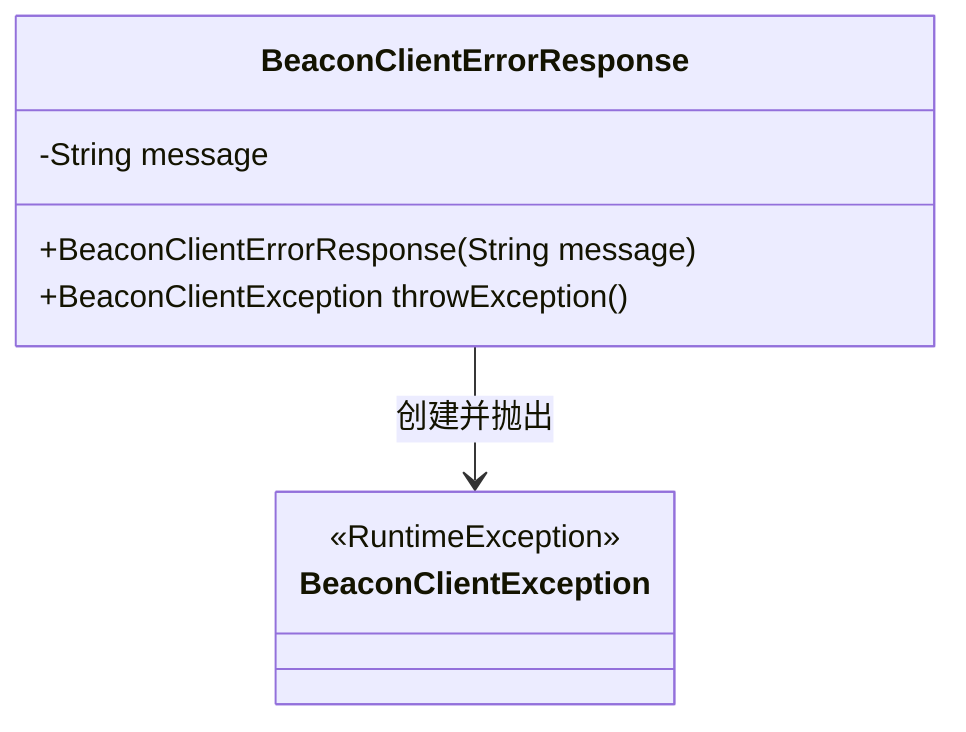
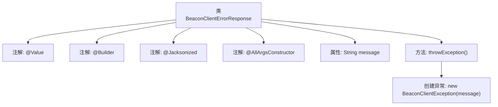

# 基础信息

|      |      |
|------|------|
| 名称 | BeaconClientErrorResponse |
| 编码语言 | .java |
| 代码路径 | xpipe/beacon/src/main/java/io/xpipe/beacon/BeaconClientErrorResponse.java |
| 包名 | io.xpipe.beacon |
| 依赖项 | ['lombok.AllArgsConstructor', 'lombok.Builder', 'lombok.Value', 'lombok.extern.jackson.Jacksonized'] |
| 概述说明 | BeaconClientErrorResponse类包含消息字段和异常抛出方法。 |

# 说明

该内容描述了一个名为BeaconClientErrorResponse的Java类，使用了多个注解进行配置。类中包含一个字符串类型的message字段，并提供了一个throwException方法，该方法返回一个BeaconClientException异常实例。注解包括@SuppressWarnings、@Value、@Builder、@Jacksonized和@AllArgsConstructor，表明该类设计为不可变、支持构建器模式、可序列化且包含全参构造函数。

# 类列表 Class Summary

| 名称   | 类型  | 说明 |
|-------|------|-------------|
| BeaconClientErrorResponse | class | BeaconClientErrorResponse类：包含message字段和throwException方法，用于抛出BeaconClientException异常。 |

## 类 BeaconClientErrorResponse

|      |      |
|------|------|
| 访问范围 | @SuppressWarnings("ClassCanBeRecord");@Value;@Builder;@Jacksonized;@AllArgsConstructor;public |
| 类型 | class |
| 名称 | BeaconClientErrorResponse |
| 说明 | BeaconClientErrorResponse类：包含message字段和throwException方法，用于抛出BeaconClientException异常。 |

### UML类图

这段类图展示了BeaconClientErrorResponse类的结构及其与BeaconClientException的关系。BeaconClientErrorResponse是一个不可变的值对象（由@Value注解标记），包含一个message属性和一个构造器，主要功能是通过throwException()方法创建并抛出BeaconClientException异常。BeaconClientException继承自RuntimeException，两者构成简单的依赖关系，体现了错误响应到异常转换的设计模式。

### 内部方法调用关系图

该流程图展示了BeaconClientErrorResponse类的结构，这是一个使用Lombok注解的不可变类。类包含message属性和throwException()方法，后者会创建并返回BeaconClientException异常实例。注解@Value、@Builder、@Jacksonized和@AllArgsConstructor分别用于自动生成不可变属性、建造者模式、Jackson反序列化支持和全参构造函数。整个设计用于标准化客户端错误响应处理流程。

### 字段列表 Field List

| 名称  | 类型  | 说明 |
|-------|-------|------|
| message | String | 声明字符串变量message。 |

### 方法列表 Method List

| 名称  | 类型  | 说明 |
|-------|-------|------|
| throwException | BeaconClientException | 方法抛出BeaconClientException异常，返回包含message的新实例。 |

