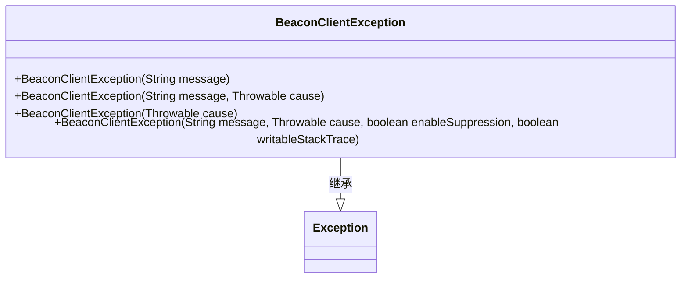
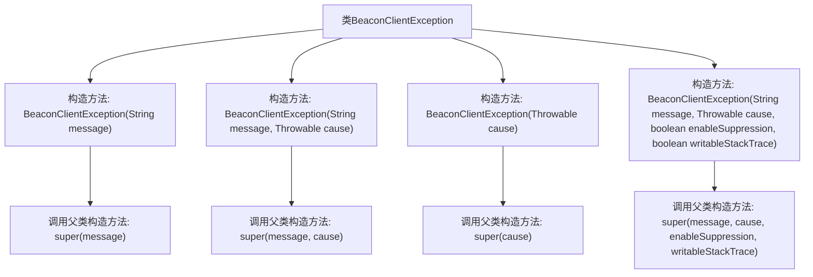

# 基础信息

|      |      |
|------|------|
| 名称 | BeaconClientException |
| 编码语言 | .java |
| 代码路径 | xpipe/beacon/src/main/java/io/xpipe/beacon/BeaconClientException.java |
| 包名 | io.xpipe.beacon |
| 依赖项 | [] |
| 概述说明 | 自定义异常类BeaconClientException，继承Exception，提供多种构造方法。 |

# 说明

BeaconClientException是一个自定义异常类，继承自Java的Exception类。它提供了四种构造方法：第一种接受字符串消息参数；第二种接受消息和Throwable原因参数；第三种仅接受Throwable原因参数；第四种是最完整的构造方法，接受消息、原因、是否启用抑制以及是否可写堆栈跟踪四个参数。这些构造方法都调用了父类的相应构造方法。

# 类列表 Class Summary

| 名称   | 类型  | 说明 |
|-------|------|-------------|
| BeaconClientException | class | 自定义异常类BeaconClientException，继承Exception，提供多种构造方法。 |

## 类 BeaconClientException

|      |      |
|------|------|
| 访问范围 | public |
| 类型 | class |
| 名称 | BeaconClientException |
| 说明 | 自定义异常类BeaconClientException，继承Exception，提供多种构造方法。 |

### UML类图

这段代码定义了一个名为`BeaconClientException`的自定义异常类，它继承自Java标准库中的`Exception`类。该类提供了四种构造方法，分别支持：仅包含错误消息、包含错误消息和原因、仅包含原因、以及包含完整异常配置（消息、原因、抑制启用标志和可写堆栈跟踪标志）。这种设计模式是Java异常处理的典型实现，提供了灵活的异常构造方式，便于在不同场景下创建异常对象并携带上下文信息。

### 内部方法调用关系图

这段代码定义了一个名为BeaconClientException的自定义异常类，继承自Exception类。该类提供了四个重载的构造方法，分别处理不同场景下的异常初始化：仅包含错误消息、包含错误消息和原因、仅包含原因、以及包含完整异常配置（消息、原因、抑制启用标志和可写堆栈跟踪标志）。每个构造方法都通过super关键字调用父类对应的构造方法，实现了异常对象的标准化构建流程。

### 字段列表 Field List

| 名称  | 类型  | 说明 |
|-------|-------|------|

### 方法列表 Method List

| 名称  | 类型  | 说明 |
|-------|-------|------|

