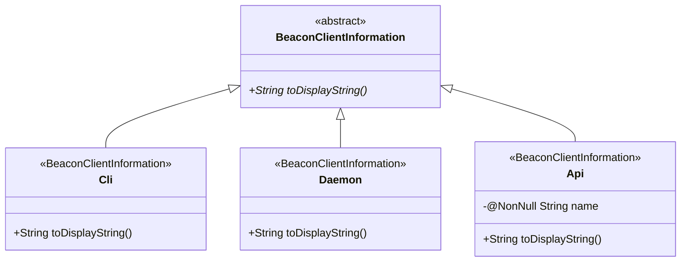
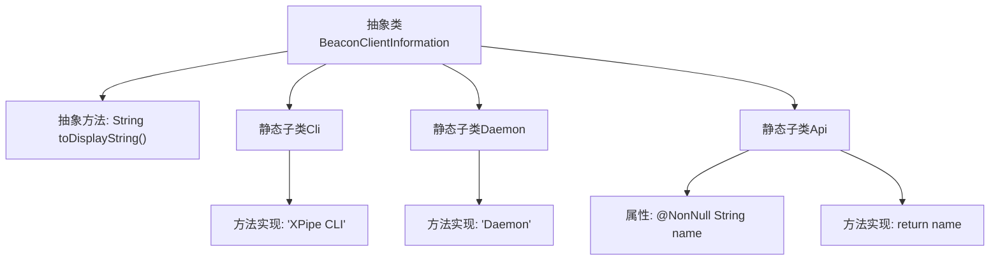

# 基础信息

|      |      |
|------|------|
| 名称 | BeaconClientInformation |
| 编码语言 | .java |
| 代码路径 | xpipe/beacon/src/main/java/io/xpipe/beacon/BeaconClientInformation.java |
| 包名 | io.xpipe.beacon |
| 依赖项 | ['com.fasterxml.jackson.annotation.JsonTypeInfo', 'com.fasterxml.jackson.annotation.JsonTypeName', 'lombok.Builder', 'lombok.EqualsAndHashCode', 'lombok.NonNull', 'lombok.Value', 'lombok.extern.jackson.Jacksonized'] |
| 概述说明 | 抽象类BeaconClientInformation定义客户端信息，包含Cli、Daemon、Api三个子类，分别返回不同显示字符串。 |

# 说明

这段内容描述了一个抽象基类BeaconClientInformation及其三个子类Cli、Daemon和Api。基类使用JsonTypeInfo注解实现多态JSON序列化，要求子类通过type属性区分。Cli子类固定返回"XPipe CLI"字符串，Daemon子类返回"Daemon"，Api子类包含name字段并返回该字段值。所有子类都使用@JsonTypeName定义类型标识，并采用@Value、@Builder等注解实现不可变对象和构建器模式。

# 类列表 Class Summary

| 名称   | 类型  | 说明 |
|-------|------|-------------|
| BeaconClientInformation | class | 抽象类BeaconClientInformation定义客户端信息，包含Cli、Daemon、Api三个子类，分别返回不同显示字符串。 |

## 类 BeaconClientInformation

|      |      |
|------|------|
| 访问范围 | @JsonTypeInfo(use = JsonTypeInfo.Id.NAME, property = "type");public abstract |
| 类型 | class |
| 名称 | BeaconClientInformation |
| 说明 | 抽象类BeaconClientInformation定义客户端信息，包含Cli、Daemon、Api三个子类，分别返回不同显示字符串。 |

### UML类图

这段代码展示了一个抽象基类BeaconClientInformation及其三个具体实现类（Cli、Daemon、Api）的类图结构。抽象类定义了toDisplayString()抽象方法，三个子类分别实现该方法：Cli和Daemon返回固定字符串，Api则使用其name字段作为返回值。类图清晰地反映了继承关系和每个类的核心结构，其中Api类额外包含一个非空的name字段。所有子类都通过注解标记为JSON序列化的特定类型。

### 内部方法调用关系图

这段代码展示了一个使用Jackson注解实现多态JSON序列化的抽象类结构。抽象类BeaconClientInformation定义了客户端信息的基类，通过@JsonTypeInfo注解实现运行时类型识别。包含三个具体实现子类：Cli返回固定字符串"XPIPE CLI"，Daemon返回"Daemon"，Api则动态返回其name字段值。每个子类都通过@JsonTypeName指定类型标识符，并使用Lombok的@Value和@Builder等注解简化代码。该设计允许通过JSON的type字段区分不同客户端类型进行反序列化。

### 字段列表 Field List

| 名称  | 类型  | 说明 |
|-------|-------|------|

### 方法列表 Method List

| 名称  | 类型  | 说明 |
|-------|-------|------|
| toDisplayString | String | 抽象方法：返回显示字符串。 |

