# 基础信息

|      |      |
|------|------|
| 名称 | BeaconConfig |
| 编码语言 | .java |
| 代码路径 | xpipe/beacon/src/main/java/io/xpipe/beacon/BeaconConfig.java |
| 包名 | io.xpipe.beacon |
| 依赖项 | ['io.xpipe.core.util.XPipeInstallation', 'lombok.experimental.UtilityClass'] |
| 概述说明 | BeaconConfig类提供信标端口、守护进程参数及调试相关配置的静态方法。 |

# 说明

BeaconConfig类是一个工具类，包含多个静态属性和方法，用于管理信标配置。主要属性包括端口号、守护进程参数、调试模式开关等。方法用于获取系统属性值，如是否打印消息、是否以调试模式启动守护进程、是否附加调试器、是否输出守护进程日志、自定义守护进程命令及参数等。还提供了获取默认端口号的功能。所有方法均通过检查系统属性或环境变量来返回相应配置值，未设置时返回默认值或null。

# 类列表 Class Summary

| 名称   | 类型  | 说明 |
|-------|------|-------------|
| BeaconConfig | class | BeaconConfig类提供信标端口、守护进程参数及调试相关配置的静态方法。 |


## 类 BeaconConfig

|      |      |
|------|------|
| 访问范围 | @UtilityClass;public |
| 类型 | class |
| 名称 | BeaconConfig |
| 说明 | BeaconConfig类提供信标端口、守护进程参数及调试相关配置的静态方法。 |


### UML类图

```mermaid
classDiagram
    class BeaconConfig {
        <<UtilityClass>>
        +String BEACON_PORT_PROP
        +String DAEMON_ARGUMENTS_PROP
        -String PRINT_MESSAGES_PROPERTY
        -String LAUNCH_DAEMON_IN_DEBUG_PROP
        -String ATTACH_DEBUGGER_PROP
        -String EXEC_DEBUG_PROP
        -String EXEC_PROCESS_PROP
        +boolean printMessages()
        +boolean launchDaemonInDebugMode()
        +boolean attachDebuggerToDaemon()
        +boolean printDaemonOutput()
        +int getUsedPort()
        +String getCustomDaemonCommand()
        +String getDaemonArguments()
    }

    // BeaconConfig 依赖系统环境变量和属性配置
    BeaconConfig --> System : "读取环境变量\n和系统属性"
    BeaconConfig --> XPipeInstallation : "获取默认端口"
```

这段代码展示了一个名为`BeaconConfig`的工具类，主要用于管理与Beacon相关的配置参数。该类通过系统属性和环境变量来控制Beacon守护进程的行为，包括调试模式、端口设置、输出控制等。所有方法均为静态方法，符合工具类的设计模式。类中定义了多个静态常量作为属性键名，并提供了对应的读取方法，这些方法会优先检查系统属性，若未设置则返回默认值或null。特别地，`getUsedPort`方法还会检查环境变量作为备选值来源。


### 内部方法调用关系图

```mermaid
graph TD
    A["类BeaconConfig"]
    B["常量: BEACON_PORT_PROP"]
    C["常量: DAEMON_ARGUMENTS_PROP"]
    D["常量: PRINT_MESSAGES_PROPERTY"]
    E["常量: LAUNCH_DAEMON_IN_DEBUG_PROP"]
    F["常量: ATTACH_DEBUGGER_PROP"]
    G["常量: EXEC_DEBUG_PROP"]
    H["常量: EXEC_PROCESS_PROP"]
    I["方法: printMessages()"]
    J["方法: launchDaemonInDebugMode()"]
    K["方法: attachDebuggerToDaemon()"]
    L["方法: printDaemonOutput()"]
    M["方法: getUsedPort()"]
    N["方法: getCustomDaemonCommand()"]
    O["方法: getDaemonArguments()"]

    A --> B
    A --> C
    A --> D
    A --> E
    A --> F
    A --> G
    A --> H
    A --> I
    A --> J
    A --> K
    A --> L
    A --> M
    A --> N
    A --> O
```



这段代码定义了一个名为BeaconConfig的工具类，主要用于管理和配置与信标（beacon）相关的参数。类中包含多个静态常量，用于定义系统属性的键名，以及多个静态方法，用于获取这些属性的值。这些方法包括检查是否打印消息、是否以调试模式启动守护进程、是否附加调试器、是否打印守护进程输出、获取使用的端口号、获取自定义守护进程命令和获取守护进程参数等。每个方法都会检查相应的系统属性或环境变量，并根据情况返回默认值或配置的值。

### 字段列表 Field List

| 名称  | 类型  | 说明 |
|-------|-------|------|
| DAEMON_ARGUMENTS_PROP = "io.xpipe.beacon.daemonArgs" | String | 静态字符串常量，用于存储守护进程参数属性键。 |
| BEACON_PORT_PROP = "io.xpipe.beacon.port" | String | 定义静态常量BEACON_PORT_PROP，值为"io.xpipe.beacon.port"。 |
| EXEC_PROCESS_PROP = "io.xpipe.beacon.customDaemonCommand" | String | 私有静态常量字符串，属性名为自定义守护命令。 |
| EXEC_DEBUG_PROP = "io.xpipe.beacon.printDaemonOutput" | String | 私有静态常量字符串EXEC_DEBUG_PROP，值为"io.xpipe.beacon.printDaemonOutput"。 |
| PRINT_MESSAGES_PROPERTY = "io.xpipe.beacon.printMessages" | String | 私有静态终态字符串，属性名为"io.xpipe.beacon.printMessages"。 |
| ATTACH_DEBUGGER_PROP = "io.xpipe.beacon.attachDebuggerToDaemon" | String | 私有静态常量字符串，用于调试器附加属性配置。 |
| LAUNCH_DAEMON_IN_DEBUG_PROP = "io.xpipe.beacon.launchDebugDaemon" | String | 私有静态字符串常量，用于调试守护进程启动标志。 |

### 方法列表 Method List

| 名称  | 类型  | 说明 |
|-------|-------|------|
| getCustomDaemonCommand | String | 检查系统属性EXEC_PROCESS_PROP，存在则返回其值，否则返回null。 |
| launchDaemonInDebugMode | boolean | 检查系统属性决定是否以调试模式启动守护进程。 |
| printMessages | boolean | 检查系统属性决定是否打印消息，默认不打印。 |
| printDaemonOutput | boolean | 检查系统属性EXEC_DEBUG_PROP是否为真，否则返回假。 |
| attachDebuggerToDaemon | boolean | 检查系统属性决定是否附加调试器，默认返回false。 |
| getDaemonArguments | String | 静态方法获取守护进程参数，无则返回空。 |
| getUsedPort | int | 获取BEACON_PORT环境变量或系统属性，否则返回默认端口。 |


