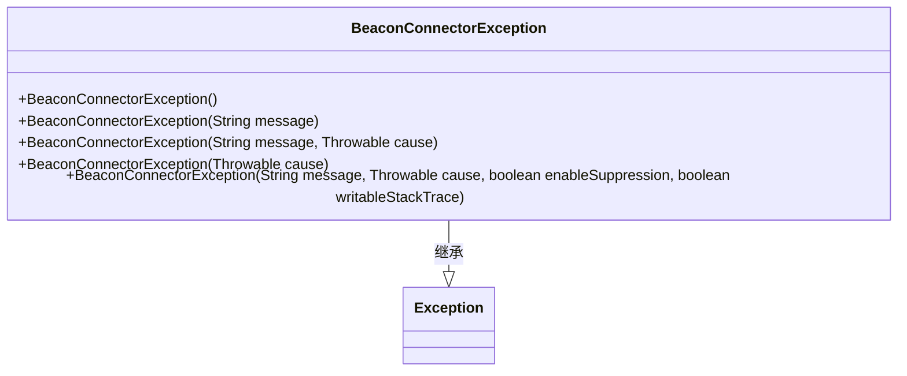
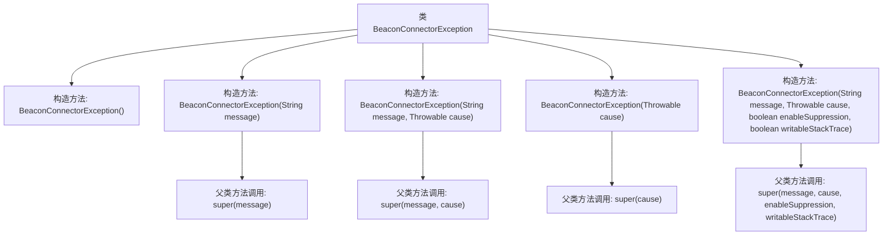

# 基础信息

|      |      |
|------|------|
| 名称 | BeaconConnectorException |
| 编码语言 | .java |
| 代码路径 | xpipe/beacon/src/main/java/io/xpipe/beacon/BeaconConnectorException.java |
| 包名 | io.xpipe.beacon |
| 依赖项 | [] |
| 概述说明 | 自定义Beacon连接异常类，提供多种构造方法支持异常信息传递。 |

# 说明

这是一个名为BeaconConnectorException的自定义异常类，继承自Java的Exception基类。该类提供了五种构造函数：默认无参构造函数；接受错误消息的构造函数；同时接受错误消息和原因的构造函数；仅接受异常原因的构造函数；以及一个全功能构造函数，可指定错误消息、原因、是否启用抑制和是否可写堆栈跟踪。这些构造函数通过调用父类Exception的对应构造函数实现，用于处理与信标连接器相关的异常情况。

# 类列表 Class Summary

| 名称   | 类型  | 说明 |
|-------|------|-------------|
| BeaconConnectorException | class | Beacon连接异常类，继承Exception，提供多种构造方法。 |

## 类 BeaconConnectorException

|      |      |
|------|------|
| 访问范围 | public |
| 类型 | class |
| 名称 | BeaconConnectorException |
| 说明 | Beacon连接异常类，继承Exception，提供多种构造方法。 |

### UML类图

这段代码定义了一个名为BeaconConnectorException的自定义异常类，它继承自Java标准库中的Exception类。该类提供了五种不同的构造函数，分别支持无参构造、仅包含消息、消息和原因、仅包含原因，以及最完整的包含消息、原因、抑制启用标志和可写堆栈跟踪标志的构造方式。这种设计模式是Java异常处理的典型实现，允许调用方根据不同的异常场景选择合适的构造方式，为蓝牙信标连接相关的错误处理提供了灵活性和可扩展性。

### 内部方法调用关系图

这段代码定义了一个名为BeaconConnectorException的自定义异常类，继承自Java的Exception类。该类提供了5个不同参数的构造方法，分别对应不同的异常初始化场景：无参构造、仅消息构造、消息和原因构造、仅原因构造，以及全参数构造（包含消息、原因、抑制标志和可写堆栈跟踪标志）。每个构造方法都通过super关键字调用了父类Exception对应的构造方法，实现了异常信息的完整传递。这种设计模式是Java异常处理的典型实现方式，提供了灵活的异常创建选项。

### 字段列表 Field List

| 名称  | 类型  | 说明 |
|-------|-------|------|

### 方法列表 Method List

| 名称  | 类型  | 说明 |
|-------|-------|------|

