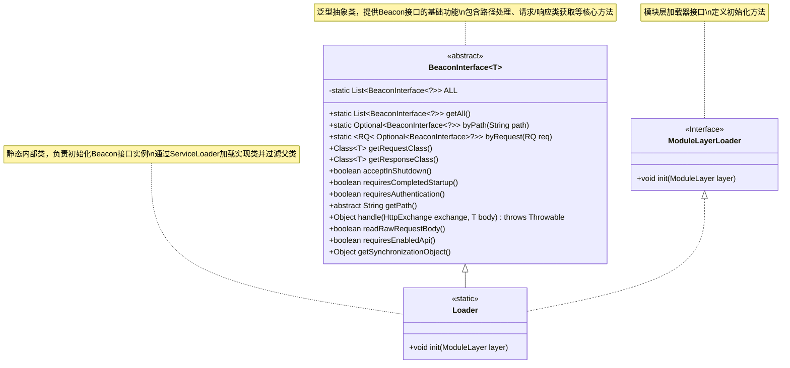

# 基础信息

|      |      |
|------|------|
| 名称 | BeaconInterface |
| 编码语言 | .java |
| 代码路径 | xpipe/beacon/src/main/java/io/xpipe/beacon/BeaconInterface.java |
| 包名 | io.xpipe.beacon |
| 依赖项 | ['io.xpipe.core.util.ModuleLayerLoader', 'com.sun.net.httpserver.HttpExchange', 'lombok.SneakyThrows', 'java.util.List', 'java.util.Optional', 'java.util.ServiceLoader', 'java.util.stream.Collectors'] |
| 概述说明 | 抽象类BeaconInterface提供API接口管理功能，支持路径匹配、请求处理及服务加载，包含请求响应类获取方法。 |

# 说明

这是一个抽象类BeaconInterface的完整实现，用于管理信标接口。主要功能包括：静态方法getAll获取所有接口实例，byPath和byRequest通过路径或请求类查找接口。内部类Loader通过ServiceLoader初始化接口列表并过滤父类。提供获取请求/响应类、路径、认证要求、启动要求等方法，以及处理HTTP交换的抽象方法。包含关闭接受、原始请求读取、API启用要求等配置选项。

# 类列表 Class Summary

| 名称   | 类型  | 说明 |
|-------|------|-------------|
| BeaconInterface | class | 抽象类BeaconInterface管理接口列表，提供查找、加载及请求响应处理功能。 |

## 类 BeaconInterface

|      |      |
|------|------|
| 访问范围 | public abstract |
| 类型 | class |
| 名称 | BeaconInterface |
| 说明 | 抽象类BeaconInterface管理接口列表，提供查找、加载及请求响应处理功能。 |

### UML类图

这段代码描述了一个泛型抽象类`BeaconInterface<T>`，它作为Beacon接口的基础框架，提供了请求/响应处理、路径匹配、服务加载等核心功能。静态内部类`Loader`实现了`ModuleLayerLoader`接口，负责通过Java的ServiceLoader机制加载所有实现类并过滤掉父类实现。类图中清晰地展示了抽象类与实现类之间的继承关系，以及接口与实现类之间的实现关系，完整呈现了该框架的核心结构和扩展机制。

### 内部方法调用关系图

```mermaid
graph TD
    A["抽象类BeaconInterface<T>"]
    B["静态字段: List<BeaconInterface<?>> ALL"]
    C["静态方法: getAll()"]
    D["静态方法: byPath(String path)"]
    E["静态方法: byRequest(RQ req)"]
    F["静态内部类: Loader"]
    G["方法: getRequestClass()"]
    H["方法: getResponseClass()"]
    I["方法: acceptInShutdown()"]
    J["方法: requiresCompletedStartup()"]
    K["方法: requiresAuthentication()"]
    L["抽象方法: getPath()"]
    M["方法: handle(HttpExchange, T)"]
    N["方法: readRawRequestBody()"]
    O["方法: requiresEnabledApi()"]
    P["方法: getSynchronizationObject()"]
    Q["Loader方法: init(ModuleLayer)"]

    A --> B
    A --> C
    A --> D
    A --> E
    A --> F
    A --> G
    A --> H
    A --> I
    A --> J
    A --> K
    A --> L
    A --> M
    A --> N
    A --> O
    A --> P
    F --> Q
```

这段代码展示了一个抽象类BeaconInterface的完整结构，它作为接口框架的核心，提供了服务发现、请求处理和类型安全等机制。流程图清晰地呈现了类的主要组成部分：静态字段ALL用于存储所有实例，静态方法用于服务查询，Loader内部类负责初始化加载，以及各种配置方法和抽象路径定义。特别值得注意的是getRequestClass()和getResponseClass()方法通过反射动态获取类型信息，而handle()方法为子类提供了请求处理的扩展点。

### 字段列表 Field List

| 名称  | 类型  | 说明 |
|-------|-------|------|
| ALL | List<BeaconInterface<?>> | 私有静态BeaconInterface列表ALL |

### 方法列表 Method List

| 名称  | 类型  | 说明 |
|-------|-------|------|
| requiresCompletedStartup | boolean | 方法返回true，表示需要完成启动。 |
| acceptInShutdown | boolean | 方法返回false，表示不接受关闭操作。 |
| getPath | String | 获取路径的抽象方法。 |
| getSynchronizationObject | Object | 方法返回空同步对象。 |
| readRawRequestBody | boolean | 方法返回false，不读取原始请求体。 |
| requiresAuthentication | boolean | 方法返回真，表示需要认证。 |
| byPath | Optional<BeaconInterface<?>> | 静态方法byPath通过路径匹配查找BeaconInterface实例，返回Optional结果。 |
| getResponseClass | Class<T> | 获取响应类名并返回对应Class对象 |
| byRequest | Optional<BeaconInterface<?>> | 静态方法byRequest通过请求类匹配返回对应BeaconInterface实例。 |
| getAll | List<BeaconInterface<?>> | 获取所有BeaconInterface对象的静态列表。 |
| requiresEnabledApi | boolean | 方法返回true，表示需要启用API。 |
| handle | Object | 方法handle抛出UnsupportedOperationException异常。 |
| getRequestClass | Class<T> | 获取请求类名并返回对应Class对象。 |

