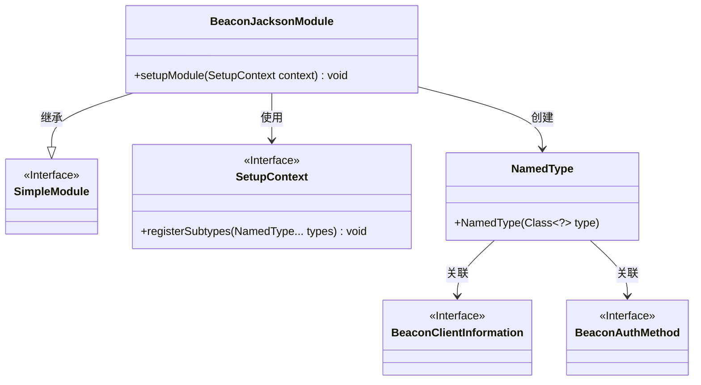
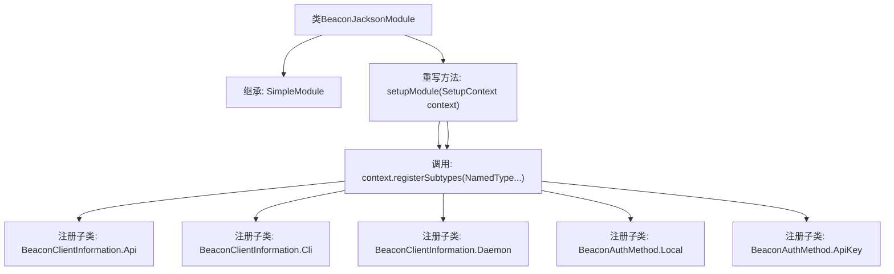

# 基础信息

|      |      |
|------|------|
| 名称 | BeaconJacksonModule |
| 编码语言 | .java |
| 代码路径 | xpipe/beacon/src/main/java/io/xpipe/beacon/BeaconJacksonModule.java |
| 包名 | io.xpipe.beacon |
| 依赖项 | ['com.fasterxml.jackson.databind.jsontype.NamedType', 'com.fasterxml.jackson.databind.module.SimpleModule'] |
| 概述说明 | BeaconJacksonModule注册BeaconClientInformation和BeaconAuthMethod的子类型。 |

# 说明

这段内容描述了一个名为BeaconJacksonModule的类，继承自SimpleModule。该类重写了setupModule方法，用于注册多个子类型。具体注册了两组子类型：第一组包含BeaconClientInformation的三个内部类（Api、Cli、Daemon），第二组包含BeaconAuthMethod的两个内部类（Local、ApiKey）。这些注册操作通过SetupContext的registerSubtypes方法完成。

# 类列表 Class Summary

| 名称   | 类型  | 说明 |
|-------|------|-------------|
| BeaconJacksonModule | class | BeaconJacksonModule注册BeaconClientInformation和BeaconAuthMethod的子类型。 |

## 类 BeaconJacksonModule

|      |      |
|------|------|
| 访问范围 | public |
| 类型 | class |
| 名称 | BeaconJacksonModule |
| 说明 | BeaconJacksonModule注册BeaconClientInformation和BeaconAuthMethod的子类型。 |

### UML类图

这段代码展示了一个BeaconJacksonModule类，它继承自SimpleModule接口，主要用于配置Jackson的序列化/反序列化模块。该类重写了setupModule方法，通过SetupContext注册了BeaconClientInformation和BeaconAuthMethod的子类型（Api、Cli、Daemon、Local、ApiKey）。类图清晰地展示了继承关系、接口实现以及类之间的依赖关系，核心功能是通过NamedType动态注册子类型以便Jackson能够正确处理多态类型。

### 内部方法调用关系图

这段代码是BeaconJacksonModule类的实现，继承自SimpleModule，主要用于配置Jackson模块的子类型注册。通过重写setupModule方法，分两次调用registerSubtypes注册了BeaconClientInformation和BeaconAuthMethod的多个子类，包括Api、Cli、Daemon以及Local和ApiKey。这些注册操作使得Jackson能够正确识别和处理这些子类的序列化与反序列化。

### 字段列表 Field List

| 名称  | 类型  | 说明 |
|-------|-------|------|

### 方法列表 Method List

| 名称  | 类型  | 说明 |
|-------|-------|------|
| setupModule | void | 注册BeaconClientInformation和BeaconAuthMethod的子类型。 |

