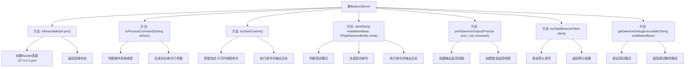

# 基础信息

|      |      |
|------|------|
| 名称 | BeaconServer |
| 编码语言 | .java |
| 代码路径 | xpipe/beacon/src/main/java/io/xpipe/beacon/BeaconServer.java |
| 包名 | io.xpipe.beacon |
| 依赖项 | ['io.xpipe.beacon.api.DaemonStopExchange', 'io.xpipe.core.process.OsType', 'io.xpipe.core.store.FileNames', 'io.xpipe.core.util.XPipeDaemonMode', 'io.xpipe.core.util.XPipeInstallation', 'java.io.BufferedReader', 'java.io.InputStreamReader', 'java.net.Inet4Address', 'java.net.InetSocketAddress', 'java.net.Socket', 'java.util.List'] |
| 概述说明 | BeaconServer类提供守护进程管理功能，包括启动、停止、调试及输出处理。 |

# 说明

BeaconServer类提供了管理守护进程的核心功能。主要方法包括：isReachable检查端口可达性；toProcessCommand根据操作系统生成进程命令；tryStartCustom执行自定义守护进程命令；start根据配置启动守护进程，支持调试模式；printDaemonOutput处理并打印进程输出流；tryStop通过客户端请求停止守护进程；getDaemonDebugExecutable获取调试模式下的可执行文件路径。类还包含处理守护进程输入输出流的线程逻辑。

# 类列表 Class Summary

| 名称   | 类型  | 说明 |
|-------|------|-------------|
| BeaconServer | class | BeaconServer类提供端口检测、进程启动停止及输出打印功能。 |


## 类 BeaconServer

|      |      |
|------|------|
| 访问范围 | public |
| 类型 | class |
| 名称 | BeaconServer |
| 说明 | BeaconServer类提供端口检测、进程启动停止及输出打印功能。 |


### UML类图

```mermaid
classDiagram
    class BeaconServer {
        +isReachable(int port) boolean
        -toProcessCommand(String toExec) List~String~
        +tryStartCustom() Process
        +start(String installationBase, XPipeDaemonMode mode) Process
        -printDaemonOutput(Process proc, List~String~ command) void
        +tryStop(BeaconClient client) boolean
        +getDaemonDebugExecutable(String installationBase) String
    }

    class XPipeDaemonMode {
        <<Enumeration>>
    }

    class OsType {
        <<Enumeration>>
        +getLocal() OsType
    }

    class BeaconConfig {
        <<Utility>>
        +getCustomDaemonCommand() String
        +getDaemonArguments() String
        +printDaemonOutput() boolean
        +launchDaemonInDebugMode() boolean
        +attachDebuggerToDaemon() boolean
    }

    class XPipeInstallation {
        <<Utility>>
        +createExternalAsyncLaunchCommand(String installationBase, XPipeDaemonMode mode, String args, boolean b) String
        +createExternalLaunchCommand(String debugExecutable, String args, XPipeDaemonMode mode) String
        +getDaemonDebugScriptPath(OsType osType) String
        +getDaemonDebugAttachScriptPath(OsType osType) String
    }

    class FileNames {
        <<Utility>>
        +join(String... paths) String
    }

    class BeaconClient {
        +performRequest(DaemonStopExchange$Request req) DaemonStopExchange$Response
    }

    class DaemonStopExchange {
        <<InnerClass>>
        class Request {
            +builder() Builder
        }
        class Response {
            +isSuccess() boolean
        }
    }

    BeaconServer --> XPipeDaemonMode : 使用
    BeaconServer --> OsType : 查询系统类型
    BeaconServer --> BeaconConfig : 读取配置
    BeaconServer --> XPipeInstallation : 构建命令
    BeaconServer --> FileNames : 路径拼接
    BeaconServer --> BeaconClient : 停止请求
    BeaconClient --> DaemonStopExchange : 发起请求/响应
    XPipeInstallation --> OsType : 获取脚本路径
```

类图描述：该图展示了BeaconServer的核心功能及其协作关系。BeaconServer通过XPipeInstallation和FileNames工具类构建进程启动命令，依赖BeaconConfig读取配置参数，使用OsType处理跨平台差异。通过BeaconClient与DaemonStopExchange进行停止交互，printDaemonOutput方法异步处理进程输出流。整体实现了守护进程的生命周期管理功能，包括启动、状态检测和停止操作。


### 内部方法调用关系图



这段代码是BeaconServer的实现，主要功能包括检查端口可达性、处理进程命令、启动/停止守护进程、监控进程输出等。核心流程涉及跨平台命令生成、异步进程管理、双线程输出监控，并通过配置驱动调试模式行为。所有方法都围绕守护进程的生命周期管理展开，具有完善的错误处理和日志输出机制。

### 字段列表 Field List

| 名称  | 类型  | 说明 |
|-------|-------|------|

### 方法列表 Method List

| 名称  | 类型  | 说明 |
|-------|-------|------|
| start | Process | 启动XPipe守护进程，根据调试模式选择命令并执行。 |
| tryStartCustom | Process | 尝试启动自定义守护进程，成功返回进程对象，失败返回空。 |
| printDaemonOutput | void | 启动守护进程并打印输出和错误流。 |
| isReachable | boolean | 检查本地端口是否可达，超时5秒，返回布尔结果。 |
| toProcessCommand | List<String> | 根据操作系统执行命令，Windows用cmd，其他用sh。 |
| tryStop | boolean | 静态方法tryStop通过BeaconClient发送停止请求并返回结果状态。 |
| getDaemonDebugExecutable | String | 获取调试守护进程执行路径，根据配置返回附加调试或普通调试脚本路径。 |


