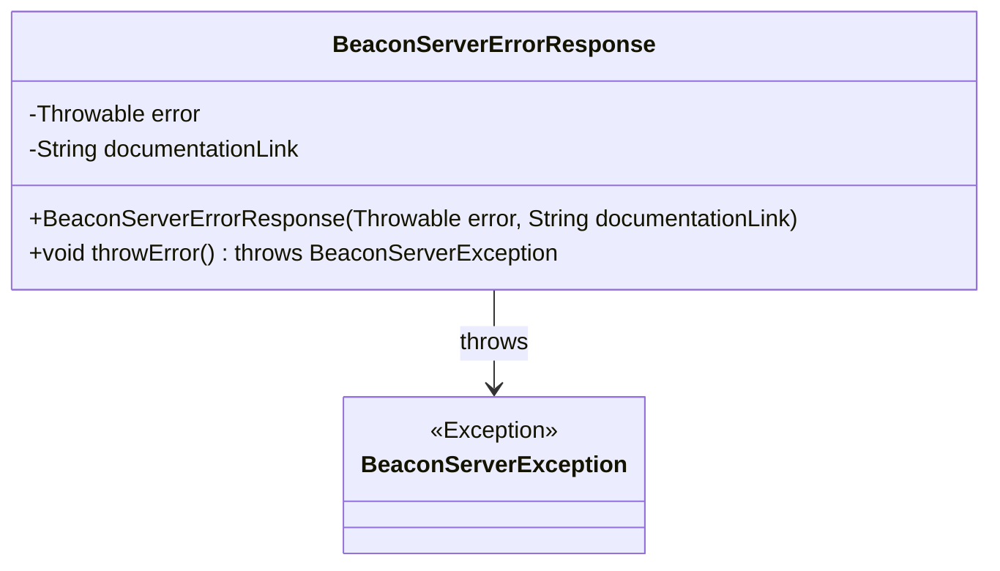
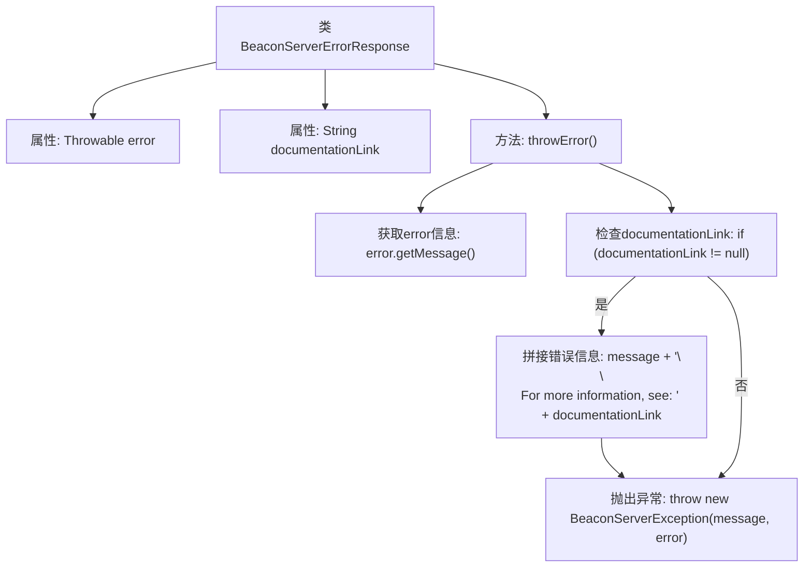

# 基础信息

|      |      |
|------|------|
| 名称 | BeaconServerErrorResponse |
| 编码语言 | .java |
| 代码路径 | xpipe/beacon/src/main/java/io/xpipe/beacon/BeaconServerErrorResponse.java |
| 包名 | io.xpipe.beacon |
| 依赖项 | ['lombok.AllArgsConstructor', 'lombok.Builder', 'lombok.Value', 'lombok.extern.jackson.Jacksonized'] |
| 概述说明 | BeaconServerErrorResponse类封装错误和文档链接，可抛出带详细信息的异常。 |

# 说明

这是一个名为BeaconServerErrorResponse的Java类，用于封装错误响应信息。类中包含两个字段：error（Throwable类型，存储异常信息）和documentationLink（String类型，存储相关文档链接）。类提供了throwError方法，该方法会构造错误消息（包含异常信息和可选的文档链接），并抛出BeaconServerException异常。类使用了Lombok注解简化代码：@Value使类不可变，@Builder提供建造者模式支持，@Jacksonized支持Jackson反序列化，@AllArgsConstructor生成全参构造函数。

# 类列表 Class Summary

| 名称   | 类型  | 说明 |
|-------|------|-------------|
| BeaconServerErrorResponse | class | BeaconServerErrorResponse类封装错误和文档链接，抛出带详细信息的异常。 |

## 类 BeaconServerErrorResponse

|      |      |
|------|------|
| 访问范围 | @SuppressWarnings("ClassCanBeRecord");@Value;@Builder;@Jacksonized;@AllArgsConstructor;public |
| 类型 | class |
| 名称 | BeaconServerErrorResponse |
| 说明 | BeaconServerErrorResponse类封装错误和文档链接，抛出带详细信息的异常。 |

### UML类图

这段代码展示了一个不可变的错误响应类`BeaconServerErrorResponse`，使用Lombok注解自动生成构造器、getter和builder模式。该类封装了异常对象和文档链接，提供了`throwError()`方法将当前错误包装为`BeaconServerException`抛出，并在异常消息中附加文档链接（如果存在）。类图清晰地表现了类结构与异常依赖关系，符合错误处理组件的设计模式。

### 内部方法调用关系图

该流程图展示了BeaconServerErrorResponse类的结构和主要方法逻辑。类包含两个属性（error和documentationLink）和一个核心方法throwError()。该方法首先获取error的原始信息，然后检查是否存在文档链接，若有则拼接附加信息，最终抛出包含完整错误信息的BeaconServerException。整个流程清晰展现了错误处理的逻辑分支和数据转换过程，特别突出了条件判断和异常抛出的关键节点。

### 字段列表 Field List

| 名称  | 类型  | 说明 |
|-------|-------|------|
| documentationLink | String | 文档链接 |
| error | Throwable | 抛出异常错误 |

### 方法列表 Method List

| 名称  | 类型  | 说明 |
|-------|-------|------|
| throwError | void | 方法throwError抛出BeaconServerException，附带错误信息及可选文档链接。 |

