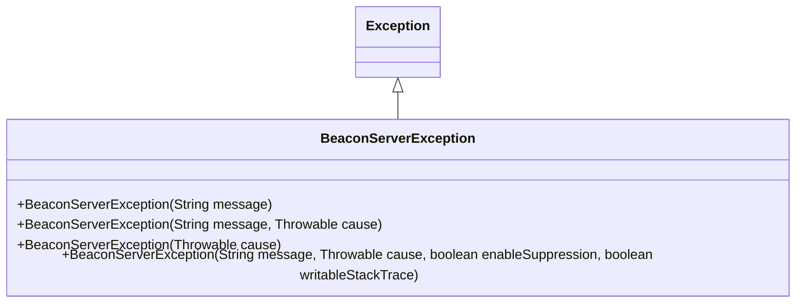
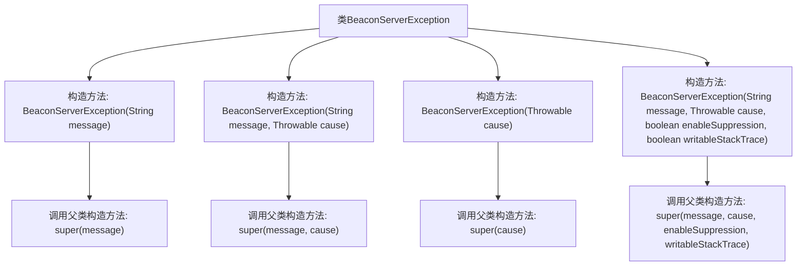

# 基础信息

|      |      |
|------|------|
| 名称 | BeaconServerException |
| 编码语言 | .java |
| 代码路径 | xpipe/beacon/src/main/java/io/xpipe/beacon/BeaconServerException.java |
| 包名 | io.xpipe.beacon |
| 依赖项 | [] |
| 概述说明 | 自定义异常类BeaconServerException，继承Exception，提供多种构造方法。 |

# 说明

这段内容描述了一个名为BeaconServerException的自定义异常类，它继承自Java的Exception类。该类提供了四种不同的构造函数，用于处理不同的异常场景。第一个构造函数仅接受异常消息字符串；第二个构造函数接受消息字符串和导致异常的Throwable对象；第三个构造函数仅接受Throwable对象；第四个构造函数是最完整的，除了消息和Throwable对象外，还支持控制异常抑制和堆栈跟踪可写性的布尔参数。这些构造函数都调用了父类Exception的相应构造函数。

# 类列表 Class Summary

| 名称   | 类型  | 说明 |
|-------|------|-------------|
| BeaconServerException | class | 自定义异常类BeaconServerException，继承Exception，提供多种构造方法。 |

## 类 BeaconServerException

|      |      |
|------|------|
| 访问范围 | public |
| 类型 | class |
| 名称 | BeaconServerException |
| 说明 | 自定义异常类BeaconServerException，继承Exception，提供多种构造方法。 |

### UML类图

这段类图展示了BeaconServerException继承自Exception类，是一个自定义异常类。它提供了四种构造方法：支持仅消息、消息和原因、仅原因，以及完整的异常配置（包括抑制启用和可写堆栈跟踪标志）。这种设计提供了灵活的异常创建方式，便于在不同场景下传递错误信息，同时保留了Java异常的全部功能特性。继承关系表明它具备标准异常的所有行为，适用于需要明确区分服务器错误的场景。

### 内部方法调用关系图

这段代码定义了一个名为BeaconServerException的自定义异常类，继承自Exception类。该类提供了四个重载的构造方法，分别用于不同的异常场景：仅包含错误消息、包含错误消息和原因、仅包含原因、以及包含完整配置参数（消息、原因、抑制启用标志和可写堆栈跟踪标志）。每个构造方法都通过super关键字调用了父类Exception对应的构造方法，实现了异常信息的初始化。这种设计提供了灵活的异常创建方式，适用于不同层级的错误处理需求。

### 字段列表 Field List

| 名称  | 类型  | 说明 |
|-------|-------|------|

### 方法列表 Method List

| 名称  | 类型  | 说明 |
|-------|-------|------|

