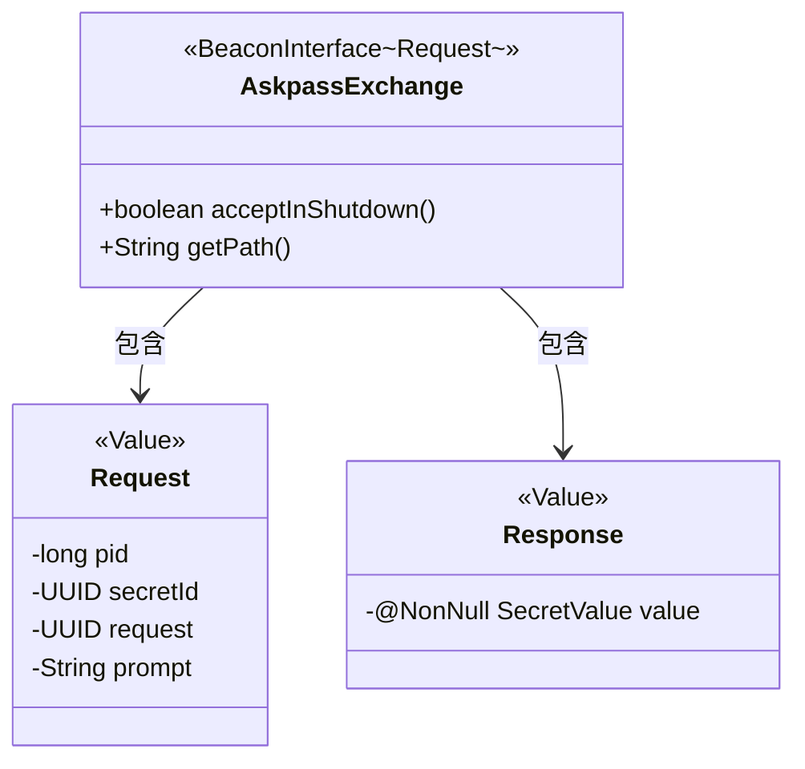
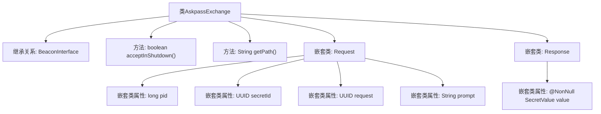

# 基础信息

|      |      |
|------|------|
| 名称 | AskpassExchange |
| 编码语言 | .java |
| 代码路径 | xpipe/beacon/src/main/java/io/xpipe/beacon/api/AskpassExchange.java |
| 包名 | io.xpipe.beacon.api |
| 依赖项 | ['io.xpipe.beacon.BeaconInterface', 'io.xpipe.core.util.SecretValue', 'lombok.Builder', 'lombok.NonNull', 'lombok.Value', 'lombok.extern.jackson.Jacksonized', 'java.util.UUID'] |
| 概述说明 | AskpassExchange类处理密码请求，包含请求和响应结构。 |

# 说明

AskpassExchange是一个BeaconInterface的实现类，用于处理请求类型为AskpassExchange.Request的交互。该类在关闭时允许接受请求，并定义了路径为/askpass。Request类包含四个字段：长整型pid、UUID类型的secretId和request，以及字符串prompt。Response类包含一个非空的SecretValue类型字段value。两个内部类均使用了Jacksonized、Builder和Value注解。

# 类列表 Class Summary

| 名称   | 类型  | 说明 |
|-------|------|-------------|
| AskpassExchange | class | AskpassExchange类处理密码请求，包含请求和响应结构。 |

## 类 AskpassExchange

|      |      |
|------|------|
| 访问范围 | public |
| 类型 | class |
| 名称 | AskpassExchange |
| 说明 | AskpassExchange类处理密码请求，包含请求和响应结构。 |

### UML类图

这段类图展示了AskpassExchange类继承自泛型接口BeaconInterface<Request>，包含两个静态内部类Request和Response。Request类封装了pid、secretId等认证请求参数，Response类则包含一个非空的SecretValue返回值。AskpassExchange重写了接口的acceptInShutdown()和getPath()方法，表明该接口在系统关闭时仍可接收请求，并定义了/askpass的服务路径。所有类均采用@Value注解实现不可变性。

### 内部方法调用关系图

该流程图展示了AskpassExchange类的结构，它是一个继承自BeaconInterface的泛型类，包含两个重写方法和两个嵌套静态类。Request嵌套类包含四个属性字段（pid、secretId、request、prompt），Response嵌套类包含一个非空SecretValue属性。类通过acceptInShutdown()和getPath()方法提供特定功能，整体设计用于处理带安全验证的请求响应交互场景。

### 字段列表 Field List

| 名称  | 类型  | 说明 |
|-------|-------|------|

### 方法列表 Method List

| 名称  | 类型  | 说明 |
|-------|-------|------|
| getPath | String | 重写getPath方法，返回路径"/askpass"。 |
| acceptInShutdown | boolean | 重写方法，关闭时允许接受请求。 |

