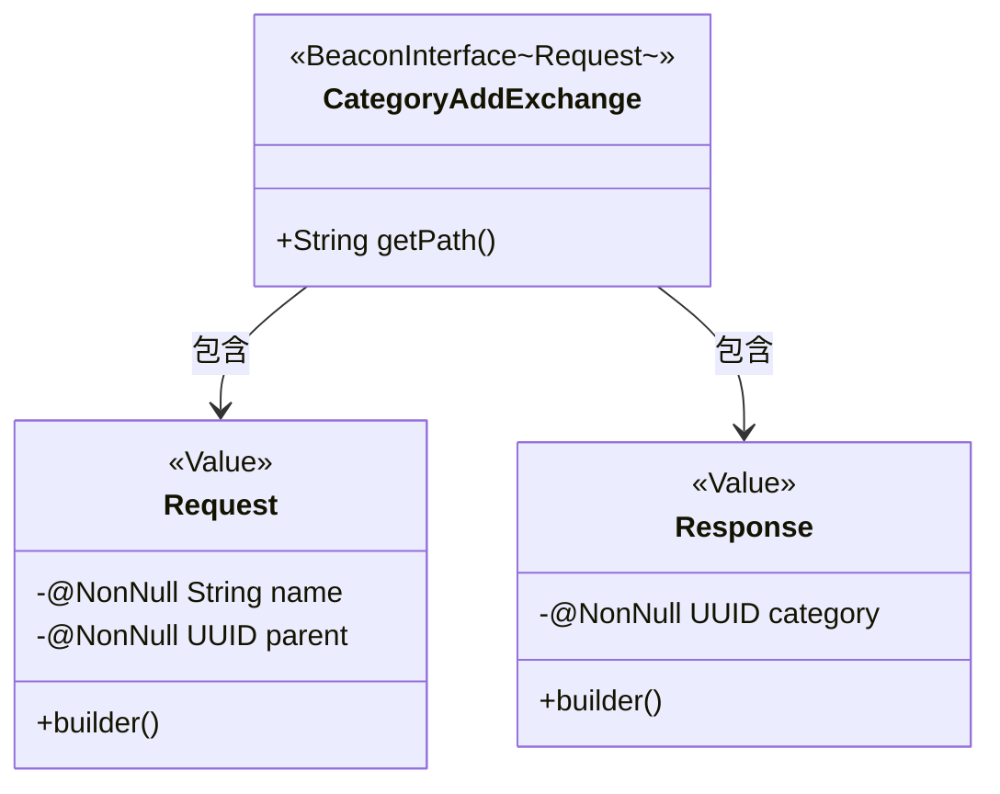
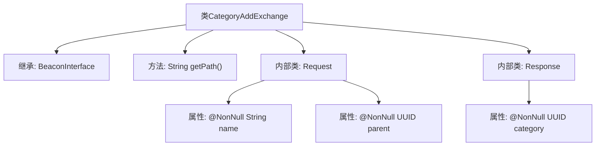

# 基础信息

|      |      |
|------|------|
| 名称 | CategoryAddExchange |
| 编码语言 | .java |
| 代码路径 | xpipe/beacon/src/main/java/io/xpipe/beacon/api/CategoryAddExchange.java |
| 包名 | io.xpipe.beacon.api |
| 依赖项 | ['io.xpipe.beacon.BeaconInterface', 'lombok.Builder', 'lombok.NonNull', 'lombok.Value', 'lombok.extern.jackson.Jacksonized', 'java.util.UUID'] |
| 概述说明 | Java类定义分类添加接口，包含请求和响应数据结构。 |

# 说明

这是一个名为CategoryAddExchange的Java类，实现了BeaconInterface接口，泛型类型为内部类Request。该类定义了一个返回路径为"/category/add"的getPath方法。包含两个静态内部类：Request和Response，均使用@Jacksonized、@Builder和@Value注解。Request类包含两个非空字段：name（字符串类型）和parent（UUID类型）。Response类包含一个非空字段category（UUID类型）。整个结构用于处理分类添加的请求和响应。

# 类列表 Class Summary

| 名称   | 类型  | 说明 |
|-------|------|-------------|
| CategoryAddExchange | class | Java类CategoryAddExchange，包含请求/响应结构，路径为/category/add。 |

## 类 CategoryAddExchange

|      |      |
|------|------|
| 访问范围 | public |
| 类型 | class |
| 名称 | CategoryAddExchange |
| 说明 | Java类CategoryAddExchange，包含请求/响应结构，路径为/category/add。 |

### UML类图

这段代码描述了一个用于添加分类的交换类`CategoryAddExchange`，它继承自泛型接口`BeaconInterface`，指定请求类型为内部类`Request`。类中包含两个静态内部类：`Request`用于封装分类名称和父分类ID的请求参数，使用`@Value`和`@Builder`实现不可变对象；`Response`用于返回新创建的分类ID。整个结构采用建造者模式，通过Jackson实现JSON序列化，体现了清晰的请求-响应模型和类型安全的设计理念。

### 内部方法调用关系图

这段代码定义了一个名为`CategoryAddExchange`的类，继承自泛型类`BeaconInterface<Request>`，主要用于处理分类添加的请求和响应。类中包含一个返回路径字符串的方法`getPath()`，以及两个静态内部类`Request`和`Response`，分别用于封装请求参数（分类名称和父级UUID）和响应数据（新创建的分类UUID）。代码结构清晰，通过注解实现了建造者模式和JSON序列化支持。

### 字段列表 Field List

| 名称  | 类型  | 说明 |
|-------|-------|------|

### 方法列表 Method List

| 名称  | 类型  | 说明 |
|-------|-------|------|
| getPath | String | 重写getPath方法，返回路径"/category/add"。 |

