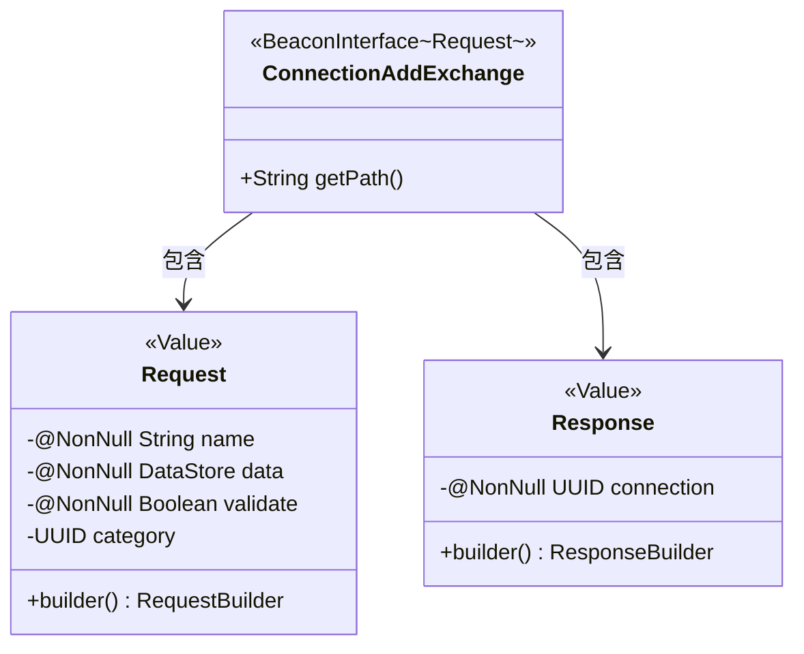
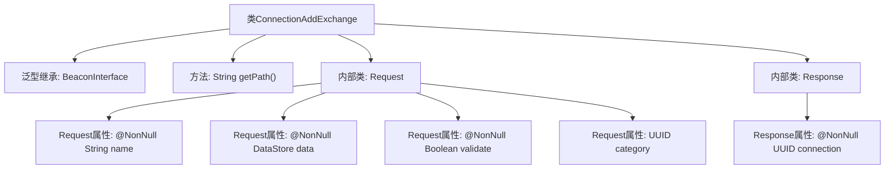

# 基础信息

|      |      |
|------|------|
| 名称 | ConnectionAddExchange |
| 编码语言 | .java |
| 代码路径 | xpipe/beacon/src/main/java/io/xpipe/beacon/api/ConnectionAddExchange.java |
| 包名 | io.xpipe.beacon.api |
| 依赖项 | ['io.xpipe.beacon.BeaconInterface', 'io.xpipe.core.store.DataStore', 'lombok.Builder', 'lombok.NonNull', 'lombok.Value', 'lombok.extern.jackson.Jacksonized', 'java.util.UUID'] |
| 概述说明 | 类ConnectionAddExchange处理连接添加请求，包含请求路径和请求响应结构。请求需名称、数据和验证，响应返回连接ID。 |

# 说明

ConnectionAddExchange是一个BeaconInterface的实现类，处理连接添加请求。其路径设置为/connection/add。包含一个静态Request类，使用Lombok注解生成构造器和不可变对象，包含必填字段name、data、validate和可选字段category。Response类同样使用Lombok注解，包含必填字段connection，类型为UUID。整个结构用于处理连接添加的请求和响应。

# 类列表 Class Summary

| 名称   | 类型  | 说明 |
|-------|------|-------------|
| ConnectionAddExchange | class | Java类ConnectionAddExchange处理连接添加请求，含请求和响应结构。 |

## 类 ConnectionAddExchange

|      |      |
|------|------|
| 访问范围 | public |
| 类型 | class |
| 名称 | ConnectionAddExchange |
| 说明 | Java类ConnectionAddExchange处理连接添加请求，含请求和响应结构。 |

### UML类图

该类图展示了ConnectionAddExchange及其嵌套类Request和Response的结构。ConnectionAddExchange继承自泛型接口BeaconInterface<Request>，包含获取路径的公有方法。Request和Response均为不可变值对象（标记为@Value），使用建造者模式构建。Request包含必填字段name、data、validate和可选字段category；Response仅包含必填字段connection。箭头表示类之间的包含关系。

### 内部方法调用关系图

该流程图展示了ConnectionAddExchange类的结构，它是一个继承自BeaconInterface泛型类的实现，包含getPath()方法和两个静态内部类Request/Response。Request类包含四个带注解的属性（三个非空字段和一个可选UUID），Response类则包含一个非空UUID属性。整体结构清晰地反映了类之间的包含关系和属性约束条件。

### 字段列表 Field List

| 名称  | 类型  | 说明 |
|-------|-------|------|

### 方法列表 Method List

| 名称  | 类型  | 说明 |
|-------|-------|------|
| getPath | String | 重写getPath方法，返回路径"/connection/add"。 |

