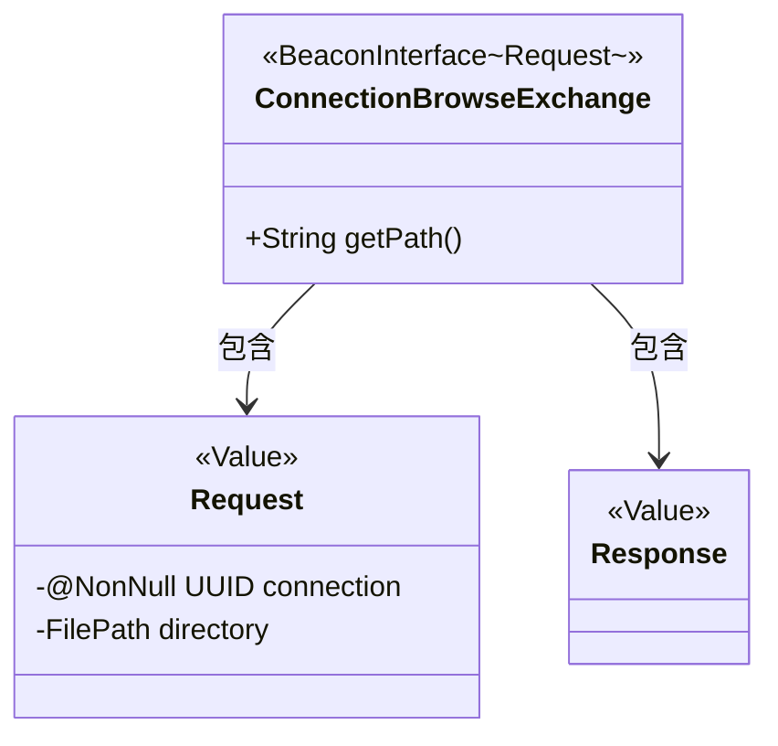
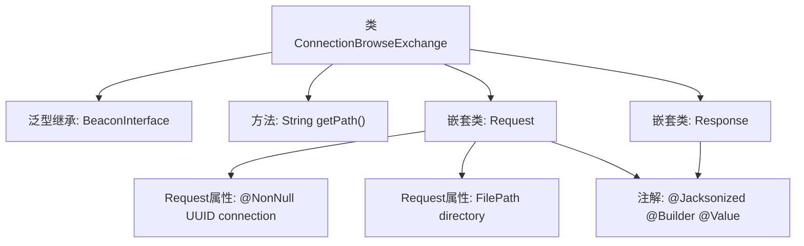

# 基础信息

|      |      |
|------|------|
| 名称 | ConnectionBrowseExchange |
| 编码语言 | .java |
| 代码路径 | xpipe/beacon/src/main/java/io/xpipe/beacon/api/ConnectionBrowseExchange.java |
| 包名 | io.xpipe.beacon.api |
| 依赖项 | ['io.xpipe.beacon.BeaconInterface', 'io.xpipe.core.store.FilePath', 'lombok.Builder', 'lombok.NonNull', 'lombok.Value', 'lombok.extern.jackson.Jacksonized', 'java.util.UUID'] |
| 概述说明 | Java类ConnectionBrowseExchange处理连接浏览请求，路径为/connection/browse，包含请求和响应结构。 |

# 说明

该代码定义了一个名为ConnectionBrowseExchange的类，继承自BeaconInterface泛型类，其泛型参数为内部类Request。类中包含一个返回固定路径/connection/browse的getPath方法。Request内部类使用Lombok注解标记为不可变值对象，包含必填的UUID类型connection字段和可选的FilePath类型directory字段。Response内部类同样被标记为不可变值对象，但未定义任何字段。整个结构用于处理连接浏览相关的请求响应交互。

# 类列表 Class Summary

| 名称   | 类型  | 说明 |
|-------|------|-------------|
| ConnectionBrowseExchange | class | Java类ConnectionBrowseExchange处理连接浏览请求，路径为/connection/browse，包含请求和响应结构。 |

## 类 ConnectionBrowseExchange

|      |      |
|------|------|
| 访问范围 | public |
| 类型 | class |
| 名称 | ConnectionBrowseExchange |
| 说明 | Java类ConnectionBrowseExchange处理连接浏览请求，路径为/connection/browse，包含请求和响应结构。 |

### UML类图

这段代码展示了一个基于泛型的网络连接浏览交换类结构。ConnectionBrowseExchange继承自BeaconInterface泛型类，指定Request作为类型参数，包含获取路径的公共方法。内部嵌套了Request和Response两个静态值类，使用Lombok注解实现建造者模式和JSON序列化。Request类包含必需的非空连接ID和可选目录路径，Response类为空结构体。整体设计体现了清晰的请求-响应模式，适合用于API交互场景。

### 内部方法调用关系图

该流程图展示了ConnectionBrowseExchange类的结构，它是一个继承自BeaconInterface泛型类的子类，主要功能是处理"/connection/browse"路径的请求。包含两个嵌套静态类Request和Response，其中Request类使用Lombok注解标记，包含connection和directory两个属性，Response类为空结构。整体设计符合API接口的数据传输对象模式，通过注解简化了样板代码的编写。

### 字段列表 Field List

| 名称  | 类型  | 说明 |
|-------|-------|------|

### 方法列表 Method List

| 名称  | 类型  | 说明 |
|-------|-------|------|
| getPath | String | 重写getPath方法，返回路径"/connection/browse"。 |

