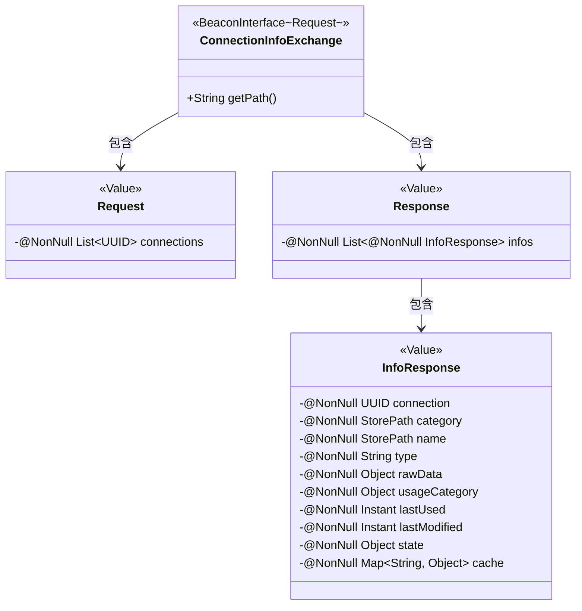

# 基础信息

|      |      |
|------|------|
| 名称 | ConnectionInfoExchange |
| 编码语言 | .java |
| 代码路径 | xpipe/beacon/src/main/java/io/xpipe/beacon/api/ConnectionInfoExchange.java |
| 包名 | io.xpipe.beacon.api |
| 依赖项 | ['io.xpipe.beacon.BeaconInterface', 'io.xpipe.core.store.StorePath', 'lombok.Builder', 'lombok.NonNull', 'lombok.Value', 'lombok.extern.jackson.Jacksonized', 'java.time.Instant', 'java.util.List', 'java.util.Map', 'java.util.UUID'] |
| 概述说明 | ConnectionInfoExchange类处理连接信息交换，包含请求、响应及信息响应的数据结构。 |

# 说明

ConnectionInfoExchange是一个Beacon接口，路径为/connection/info。包含Request和Response两个静态类。Request类包含非空UUID列表connections。Response类包含非空InfoResponse列表infos。InfoResponse类包含非空字段：connection（UUID）、category（StorePath）、name（StorePath）、type（字符串）、rawData（对象）、usageCategory（对象）、lastUsed（Instant）、lastModified（Instant）、state（对象）和cache（字符串到对象的映射）。所有类均使用Jacksonized、Builder和Value注解。

# 类列表 Class Summary

| 名称   | 类型  | 说明 |
|-------|------|-------------|
| ConnectionInfoExchange | class | ConnectionInfoExchange类处理连接信息交换，包含请求和响应数据结构。 |

## 类 ConnectionInfoExchange

|      |      |
|------|------|
| 访问范围 | public |
| 类型 | class |
| 名称 | ConnectionInfoExchange |
| 说明 | ConnectionInfoExchange类处理连接信息交换，包含请求和响应数据结构。 |

### UML类图

这段类图展示了ConnectionInfoExchange及其嵌套类的结构。ConnectionInfoExchange继承自泛型接口BeaconInterface<Request>，包含三个静态内部类：Request、Response和InfoResponse。Request类包含UUID列表，Response类包含InfoResponse对象列表，InfoResponse则存储连接详细信息，包括路径、类型、时间戳等字段。所有嵌套类都使用了Lombok的@Value、@Builder和@Jacksonized注解，表明它们是不可变的数据传输对象。

### 内部方法调用关系图

```mermaid
graph TD
    A["类ConnectionInfoExchange"]
    B["泛型继承: BeaconInterface<Request>"]
    C["方法: String getPath()"]
    D["嵌套类: Request"]
    E["Request属性: @NonNull List<UUID> connections"]
    F["嵌套类: Response"]
    G["Response属性: @NonNull List<@NonNull InfoResponse> infos"]
    H["嵌套类: InfoResponse"]
    I["InfoResponse属性: @NonNull UUID connection"]
    J["InfoResponse属性: @NonNull StorePath category"]
    K["InfoResponse属性: @NonNull StorePath name"]
    L["InfoResponse属性: @NonNull String type"]
    M["InfoResponse属性: @NonNull Object rawData"]
    N["InfoResponse属性: @NonNull Object usageCategory"]
    O["InfoResponse属性: @NonNull Instant lastUsed"]
    P["InfoResponse属性: @NonNull Instant lastModified"]
    Q["InfoResponse属性: @NonNull Object state"]
    R["InfoResponse属性: @NonNull Map<String, Object> cache"]

    A --> B
    A --> C
    A --> D
    D --> E
    A --> F
    F --> G
    A --> H
    H --> I
    H --> J
    H --> K
    H --> L
    H --> M
    H --> N
    H --> O
    H --> P
    H --> Q
    H --> R
```

这段代码定义了一个名为ConnectionInfoExchange的类，该类继承自泛型类BeaconInterface<Request>。主要功能包括：1) 重写getPath()方法返回固定路径；2) 包含三个嵌套静态类：Request（包含连接UUID列表）、Response（包含InfoResponse列表）和InfoResponse（包含连接信息的多维度属性）。所有嵌套类均使用Lombok注解实现不可变性和JSON序列化支持，核心数据结构通过@NonNull强制非空约束，适用于需要严格类型检查的连接信息交换场景。

### 字段列表 Field List

| 名称  | 类型  | 说明 |
|-------|-------|------|

### 方法列表 Method List

| 名称  | 类型  | 说明 |
|-------|-------|------|
| getPath | String | 重写getPath方法，返回路径"/connection/info"。 |

