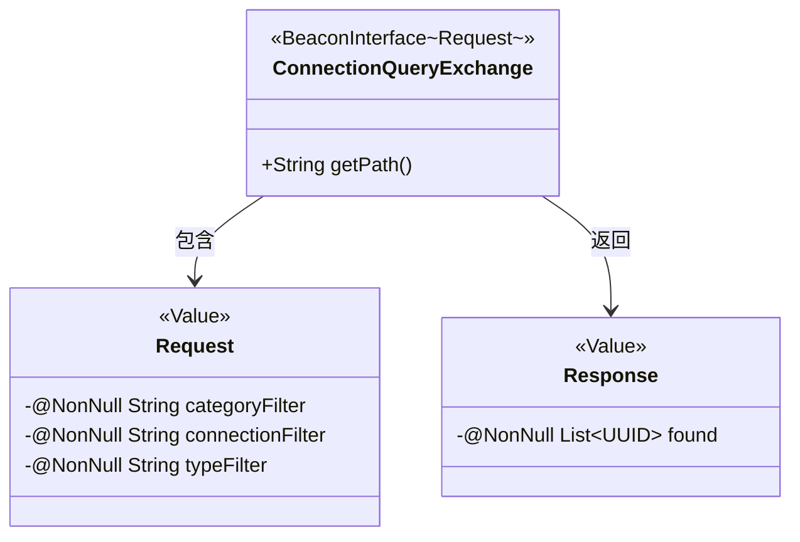
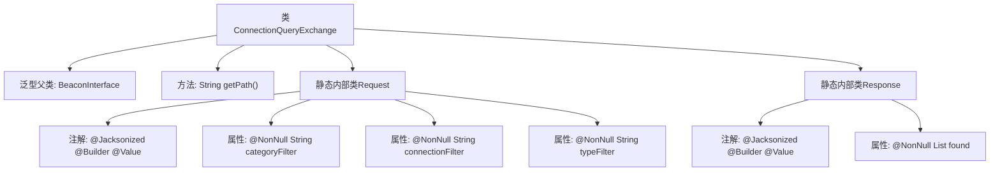

# 基础信息

|      |      |
|------|------|
| 名称 | ConnectionQueryExchange |
| 编码语言 | .java |
| 代码路径 | xpipe/beacon/src/main/java/io/xpipe/beacon/api/ConnectionQueryExchange.java |
| 包名 | io.xpipe.beacon.api |
| 依赖项 | ['io.xpipe.beacon.BeaconInterface', 'lombok.Builder', 'lombok.NonNull', 'lombok.Value', 'lombok.extern.jackson.Jacksonized', 'java.util.List', 'java.util.UUID'] |
| 概述说明 | ConnectionQueryExchange类处理连接查询，包含请求和响应数据结构。请求含三个过滤字段，响应返回UUID列表。 |

# 说明

ConnectionQueryExchange是一个继承自BeaconInterface的类，处理连接查询请求。其路径设置为"/connection/query"。包含一个静态内部类Request，使用Lombok注解标记为不可变，包含三个非空字符串字段：categoryFilter、connectionFilter和typeFilter。另一个静态内部类Response同样不可变，包含一个非空的UUID列表字段found。两者均使用Jackson和Builder模式支持序列化和构造。

# 类列表 Class Summary

| 名称   | 类型  | 说明 |
|-------|------|-------------|
| ConnectionQueryExchange | class | ConnectionQueryExchange类处理连接查询，包含请求和响应数据结构。请求含三个过滤字段，响应返回UUID列表。 |

## 类 ConnectionQueryExchange

|      |      |
|------|------|
| 访问范围 | public |
| 类型 | class |
| 名称 | ConnectionQueryExchange |
| 说明 | ConnectionQueryExchange类处理连接查询，包含请求和响应数据结构。请求含三个过滤字段，响应返回UUID列表。 |

### UML类图

这段类图展示了`ConnectionQueryExchange`继承自泛型接口`BeaconInterface`，并包含两个静态内部类`Request`和`Response`。主类通过`getPath()`方法提供API路径，其中`Request`类用三个非空字符串字段构造查询参数，`Response`类则封装查询结果（UUID列表）。注解标记显示所有类均支持Jackson序列化和Builder模式，体现了清晰的请求-响应数据交换结构。

### 内部方法调用关系图

这段代码展示了一个ConnectionQueryExchange类，继承自泛型父类BeaconInterface，包含getPath方法返回固定路径。核心是定义了两个静态内部类：Request包含三个非空字符串过滤条件字段，Response包含非空UUID列表字段，均使用Jacksonized、Builder和Value注解实现不可变对象构建和JSON序列化。流程图清晰呈现了类继承关系、方法定义和嵌套类的注解-属性结构。

### 字段列表 Field List

| 名称  | 类型  | 说明 |
|-------|-------|------|

### 方法列表 Method List

| 名称  | 类型  | 说明 |
|-------|-------|------|
| getPath | String | 重写getPath方法，返回路径"/connection/query"。 |

