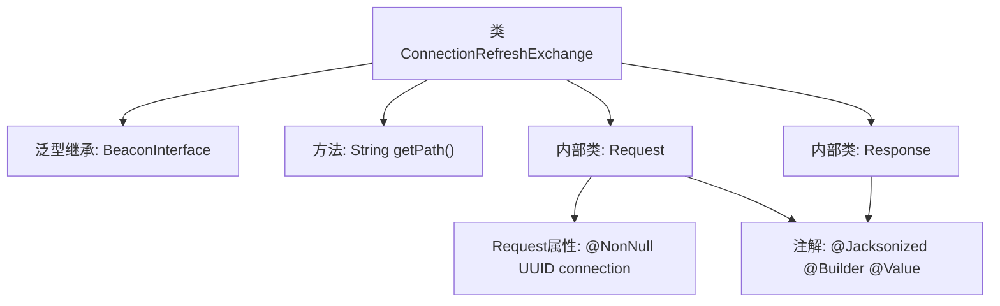

# 基础信息

|      |      |
|------|------|
| 名称 | ConnectionRefreshExchange |
| 编码语言 | .java |
| 代码路径 | xpipe/beacon/src/main/java/io/xpipe/beacon/api/ConnectionRefreshExchange.java |
| 包名 | io.xpipe.beacon.api |
| 依赖项 | ['io.xpipe.beacon.BeaconInterface', 'lombok.Builder', 'lombok.NonNull', 'lombok.Value', 'lombok.extern.jackson.Jacksonized', 'java.util.UUID'] |
| 概述说明 | ConnectionRefreshExchange类，路径/connection/refresh，包含Request和Response静态类。 |

# 说明

ConnectionRefreshExchange类继承自BeaconInterface，处理泛型Request类。其getPath方法返回固定路径/connection/refresh。Request类使用Lombok注解标记为不可变值对象，包含非空UUID类型的connection字段。Response类同样为Lombok生成的无字段值对象。整个结构用于定义连接刷新的API端点及数据模型。

# 类列表 Class Summary

| 名称   | 类型  | 说明 |
|-------|------|-------------|
| ConnectionRefreshExchange | class | Java类ConnectionRefreshExchange，路径/connection/refresh，含Request和Response静态类。 |


## 类 ConnectionRefreshExchange

|      |      |
|------|------|
| 访问范围 | public |
| 类型 | class |
| 名称 | ConnectionRefreshExchange |
| 说明 | Java类ConnectionRefreshExchange，路径/connection/refresh，含Request和Response静态类。 |


### UML类图

```mermaid
classDiagram
    class ConnectionRefreshExchange {
        <<BeaconInterface~Request~>>
        +String getPath()
    }
    
    class Request {
        <<Value>>
        <<Builder>>
        <<Jacksonized>>
        -@NonNull UUID connection
    }
    
    class Response {
        <<Value>>
        <<Builder>>
        <<Jacksonized>>
    }
    
    ConnectionRefreshExchange --> Request : 包含
    ConnectionRefreshExchange --> Response : 返回

    // Request和Response是ConnectionRefreshExchange的内部静态类
    // ConnectionRefreshExchange继承自泛型接口BeaconInterface~Request~
```

这段代码描述了一个用于连接刷新的交换类`ConnectionRefreshExchange`，它继承自泛型接口`BeaconInterface<Request>`。类中包含两个静态内部类：`Request`（包含非空的UUID连接标识）和`Response`（空响应体），两者都使用了Lombok的`@Value`、`@Builder`和`@Jacksonized`注解。主类实现了`getPath()`方法返回固定路径，展示了典型的请求-响应模式实现，适用于处理连接刷新操作的网络通信场景。


### 内部方法调用关系图



这段代码定义了一个名为ConnectionRefreshExchange的类，继承自泛型类BeaconInterface<Request>。主要功能是处理连接刷新请求，包含三个关键部分：1) 重写getPath()方法返回固定路径；2) 定义静态内部类Request，使用Lombok注解自动生成构建器和访问器，包含一个非空的UUID类型connection字段；3) 定义空的静态内部类Response用于响应数据。类结构通过@Jacksonized、@Builder和@Value注解实现了JSON序列化和不可变对象模式。

### 字段列表 Field List

| 名称  | 类型  | 说明 |
|-------|-------|------|

### 方法列表 Method List

| 名称  | 类型  | 说明 |
|-------|-------|------|
| getPath | String | 重写getPath方法，返回路径"/connection/refresh"。 |


