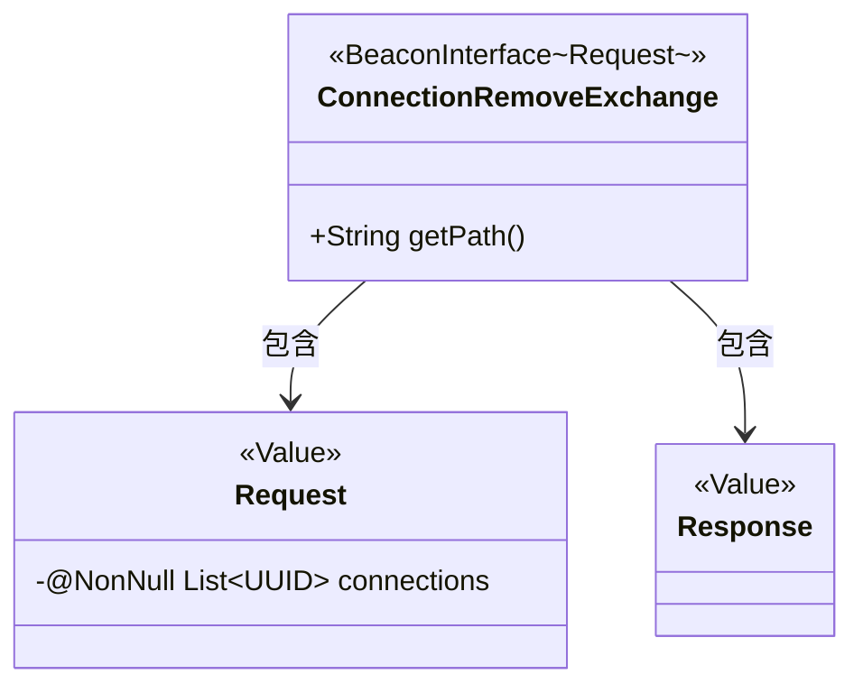
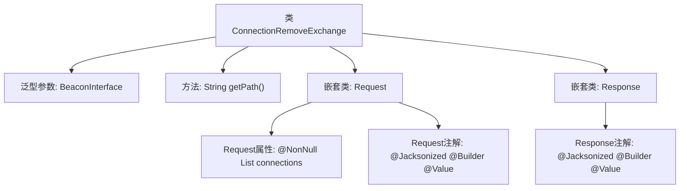

# 基础信息

|      |      |
|------|------|
| 名称 | ConnectionRemoveExchange |
| 编码语言 | .java |
| 代码路径 | xpipe/beacon/src/main/java/io/xpipe/beacon/api/ConnectionRemoveExchange.java |
| 包名 | io.xpipe.beacon.api |
| 依赖项 | ['io.xpipe.beacon.BeaconInterface', 'lombok.Builder', 'lombok.NonNull', 'lombok.Value', 'lombok.extern.jackson.Jacksonized', 'java.util.List', 'java.util.UUID'] |
| 概述说明 | Java类ConnectionRemoveExchange处理连接移除请求，路径为/connection/remove，包含请求和响应结构。 |

# 说明

这是一个名为ConnectionRemoveExchange的Java类，继承自BeaconInterface泛型类，其泛型类型为内部定义的Request类。该类实现了getPath方法，返回固定路径字符串"/connection/remove"。内部包含两个静态嵌套类：Request和Response，均使用了Lombok注解@Jacksonized、@Builder和@Value。Request类包含一个非空List<UUID>类型的connections字段，Response类为空结构。整个类设计用于处理连接移除的请求响应交互。

# 类列表 Class Summary

| 名称   | 类型  | 说明 |
|-------|------|-------------|
| ConnectionRemoveExchange | class | 类ConnectionRemoveExchange处理连接移除请求，路径为/connection/remove，包含请求和响应结构。 |

## 类 ConnectionRemoveExchange

|      |      |
|------|------|
| 访问范围 | public |
| 类型 | class |
| 名称 | ConnectionRemoveExchange |
| 说明 | 类ConnectionRemoveExchange处理连接移除请求，路径为/connection/remove，包含请求和响应结构。 |

### UML类图

这段类图展示了ConnectionRemoveExchange继承自泛型BeaconInterface，其泛型参数为内部类Request。包含两个静态内部类Request和Response，均使用了Lombok的@Value、@Builder和@Jacksonized注解。Request类包含一个非空的UUID列表字段，而Response为空结构体。整体设计用于处理"/connection/remove"端点的请求响应交互，体现了典型的命令模式数据结构。

### 内部方法调用关系图

该流程图展示了ConnectionRemoveExchange类的结构，它是一个继承自BeaconInterface的泛型类，指定Request作为类型参数。类中包含getPath方法返回固定路径，以及两个嵌套静态类Request和Response。Request类包含非空的UUID列表属性和三个注解标记，Response类则仅包含相同的三个注解标记。整体结构体现了API接口的请求/响应模式设计。

### 字段列表 Field List

| 名称  | 类型  | 说明 |
|-------|-------|------|

### 方法列表 Method List

| 名称  | 类型  | 说明 |
|-------|-------|------|
| getPath | String | 重写getPath方法，返回路径"/connection/remove"。 |

