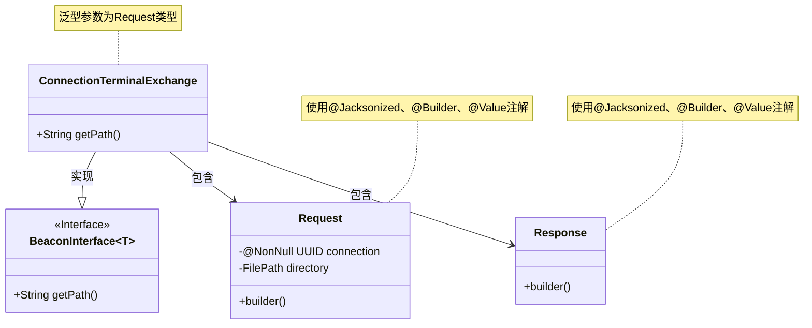
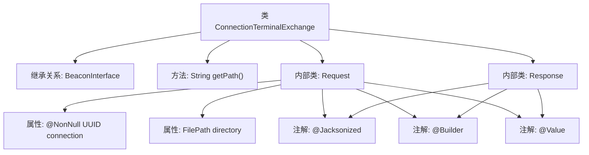

# 基础信息

|      |      |
|------|------|
| 名称 | ConnectionTerminalExchange |
| 编码语言 | .java |
| 代码路径 | xpipe/beacon/src/main/java/io/xpipe/beacon/api/ConnectionTerminalExchange.java |
| 包名 | io.xpipe.beacon.api |
| 依赖项 | ['io.xpipe.beacon.BeaconInterface', 'io.xpipe.core.store.FilePath', 'lombok.Builder', 'lombok.NonNull', 'lombok.Value', 'lombok.extern.jackson.Jacksonized', 'java.util.UUID'] |
| 概述说明 | 连接终端交换接口类，含请求响应结构。 |

# 说明

该代码定义了一个名为ConnectionTerminalExchange的类，继承自BeaconInterface泛型类，其泛型类型为内部类Request。该类重写了getPath方法，返回固定路径字符串。包含两个静态内部类：Request和Response，均使用Lombok注解实现构造器模式和数据不可变性。Request类包含两个字段：必填的UUID类型connection和可选的FilePath类型directory。Response类为空结构。整个类设计用于处理终端连接相关的请求响应交互。

# 类列表 Class Summary

| 名称   | 类型  | 说明 |
|-------|------|-------------|
| ConnectionTerminalExchange | class | 连接终端交换接口类，含请求响应结构。 |

## 类 ConnectionTerminalExchange

|      |      |
|------|------|
| 访问范围 | public |
| 类型 | class |
| 名称 | ConnectionTerminalExchange |
| 说明 | 连接终端交换接口类，含请求响应结构。 |

### UML类图

这段代码展示了一个连接终端交换系统，包含核心接口和嵌套数据结构。ConnectionTerminalExchange类实现了泛型接口BeaconInterface，指定Request作为泛型参数，并重写了getPath方法返回固定路径。内部定义了两个静态值对象Request和Response，均采用建造者模式构建，其中Request包含必填的连接UUID和可选目录路径，Response为空结构体。整个设计体现了清晰的层次关系和类型安全的数据传输。

### 内部方法调用关系图

这段代码定义了一个名为ConnectionTerminalExchange的类，继承自泛型类BeaconInterface<Request>。主要包含一个返回路径字符串的方法getPath()，以及两个用@Jacksonized、@Builder和@Value注解标记的静态内部类Request和Response。Request类包含两个属性：非空的UUID类型connection和FilePath类型的directory，而Response类是一个空值对象。该结构主要用于处理终端连接请求和响应的数据封装。

### 字段列表 Field List

| 名称  | 类型  | 说明 |
|-------|-------|------|

### 方法列表 Method List

| 名称  | 类型  | 说明 |
|-------|-------|------|
| getPath | String | 重写getPath方法，返回路径"/connection/terminal"。 |

