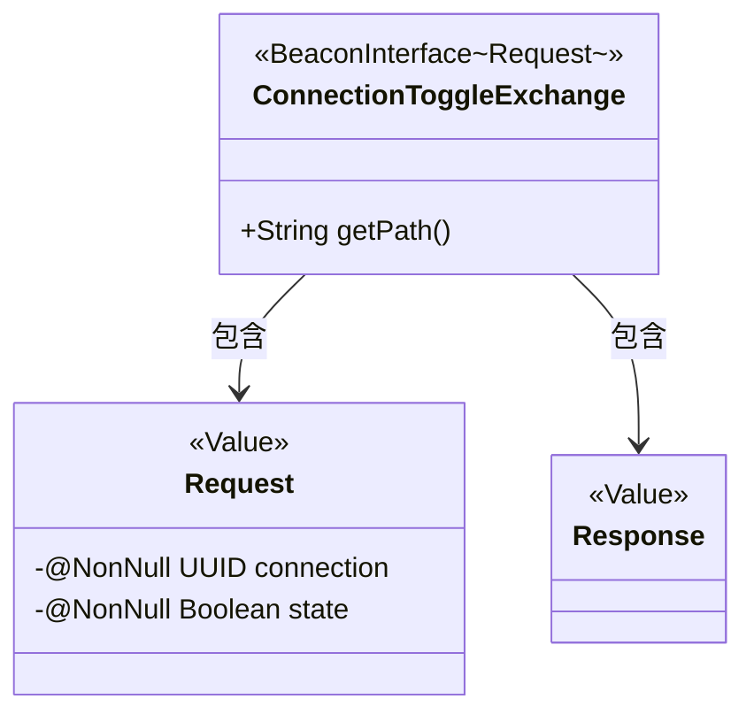
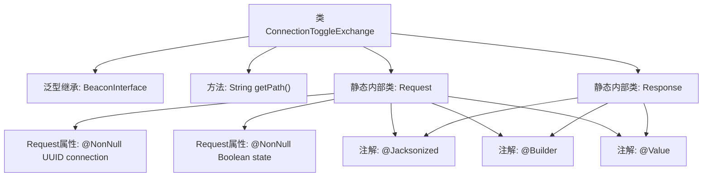

# 基础信息

|      |      |
|------|------|
| 名称 | ConnectionToggleExchange |
| 编码语言 | .java |
| 代码路径 | xpipe/beacon/src/main/java/io/xpipe/beacon/api/ConnectionToggleExchange.java |
| 包名 | io.xpipe.beacon.api |
| 依赖项 | ['io.xpipe.beacon.BeaconInterface', 'lombok.Builder', 'lombok.NonNull', 'lombok.Value', 'lombok.extern.jackson.Jacksonized', 'java.util.UUID'] |
| 概述说明 | Java类实现连接切换接口，含请求和响应结构。 |

# 说明

ConnectionToggleExchange是一个BeaconInterface的实现类，用于处理连接状态切换请求。其路径定义为"/connection/toggle"。包含一个静态内部类Request，包含两个非空字段：connection（UUID类型）和state（布尔类型）。另有一个静态内部类Response，无具体字段。使用了Lombok的注解简化代码结构。

# 类列表 Class Summary

| 名称   | 类型  | 说明 |
|-------|------|-------------|
| ConnectionToggleExchange | class | 连接切换接口类，含请求参数和空响应。 |

## 类 ConnectionToggleExchange

|      |      |
|------|------|
| 访问范围 | public |
| 类型 | class |
| 名称 | ConnectionToggleExchange |
| 说明 | 连接切换接口类，含请求参数和空响应。 |

### UML类图

这段代码展示了一个用于连接状态切换的交换类结构。ConnectionToggleExchange继承自泛型化的BeaconInterface基类，指定Request作为泛型参数。包含两个静态内部类：Request携带连接ID和状态值的不可变数据，使用Lombok的@Value、@Builder和@Jacksonized注解；Response作为空响应体存在，同样采用相同注解配置。类图清晰地反映了主类与内部数据类的组合关系，以及通过注解实现的序列化/构建模式。

### 内部方法调用关系图

这段代码定义了一个名为ConnectionToggleExchange的类，继承自泛型类BeaconInterface，并指定泛型类型为内部类Request。主要功能包括：实现getPath()方法返回固定路径，定义Request内部类（包含connection和state两个非空字段）和空Response内部类。两个内部类均使用@Jacksonized、@Builder和@Value注解，表明它们是不可变的数据传输对象，支持JSON序列化和建造者模式。整体结构体现了REST API端点与DTO的典型设计模式。

### 字段列表 Field List

| 名称  | 类型  | 说明 |
|-------|-------|------|

### 方法列表 Method List

| 名称  | 类型  | 说明 |
|-------|-------|------|
| getPath | String | 重写getPath方法，返回路径"/connection/toggle"。 |

