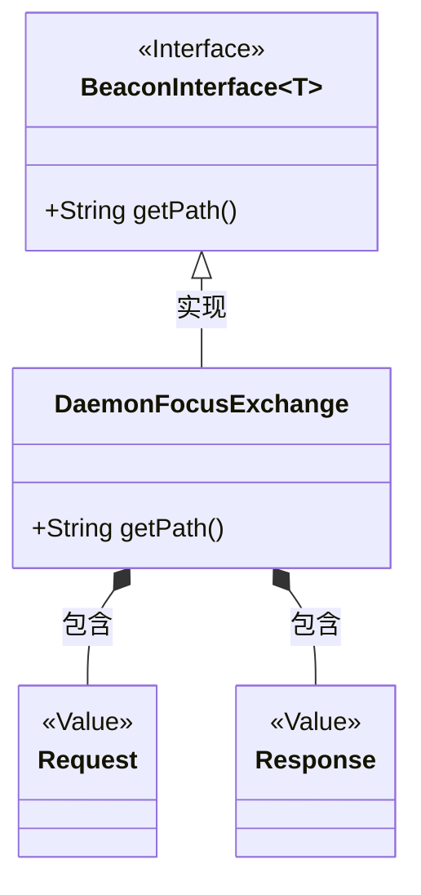
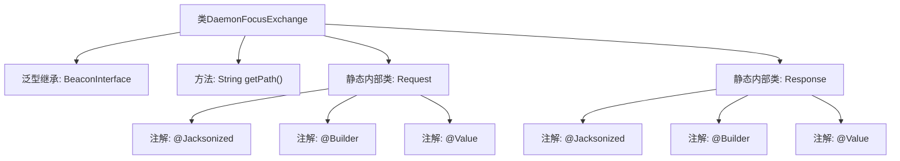

# 基础信息

|      |      |
|------|------|
| 名称 | DaemonFocusExchange |
| 编码语言 | .java |
| 代码路径 | xpipe/beacon/src/main/java/io/xpipe/beacon/api/DaemonFocusExchange.java |
| 包名 | io.xpipe.beacon.api |
| 依赖项 | ['io.xpipe.beacon.BeaconInterface', 'lombok.Builder', 'lombok.Value', 'lombok.extern.jackson.Jacksonized'] |
| 概述说明 | DaemonFocusExchange类继承BeaconInterface，路径为/daemon/focus，包含空的Request和Response静态类。 |

# 说明

该代码定义了一个名为DaemonFocusExchange的类，继承自BeaconInterface泛型类，泛型类型为内部类Request。该类重写了getPath方法，返回固定路径字符串"/daemon/focus"。包含两个静态内部类Request和Response，均使用了Lombok注解@Jacksonized、@Builder和@Value，表明它们是不可变的数据类，支持Jackson序列化和建造者模式。整个结构用于处理守护进程焦点交换的请求和响应。

# 类列表 Class Summary

| 名称   | 类型  | 说明 |
|-------|------|-------------|
| DaemonFocusExchange | class | DaemonFocusExchange类，路径/daemon/focus，包含Request和Response静态类。 |

## 类 DaemonFocusExchange

|      |      |
|------|------|
| 访问范围 | public |
| 类型 | class |
| 名称 | DaemonFocusExchange |
| 说明 | DaemonFocusExchange类，路径/daemon/focus，包含Request和Response静态类。 |

### UML类图

这段类图展示了DaemonFocusExchange类及其相关结构。DaemonFocusExchange实现了泛型接口BeaconInterface<Request>，并包含两个静态嵌套类Request和Response（均标记为@Value类型）。其中Request作为泛型参数传递给父接口，DaemonFocusExchange重写了getPath()方法返回特定路径"/daemon/focus"。整个设计采用了建造者模式（@Builder）和值对象模式（@Value），通过Jackson实现序列化支持（@Jacksonized）。类之间的关系清晰展示了接口实现、泛型参数传递和组合关系。

### 内部方法调用关系图

该流程图展示了DaemonFocusExchange类的结构，它是一个继承自泛型BeaconInterface的类，包含getPath()方法和两个静态内部类Request/Response。每个内部类都标注了@Jacksonized、@Builder和@Value注解，表明它们是不可变的数据传输对象(DTO)，用于JSON序列化和建造者模式。整体设计简洁，符合微服务间通信的数据封装规范。

### 字段列表 Field List

| 名称  | 类型  | 说明 |
|-------|-------|------|

### 方法列表 Method List

| 名称  | 类型  | 说明 |
|-------|-------|------|
| getPath | String | 重写getPath方法，返回路径"/daemon/focus"。 |

