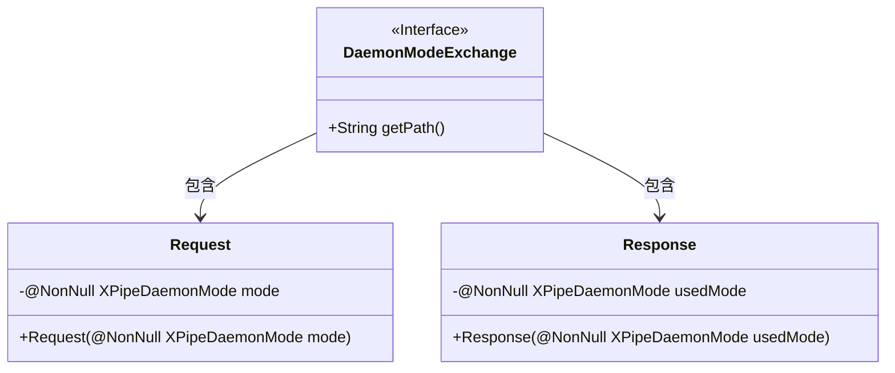
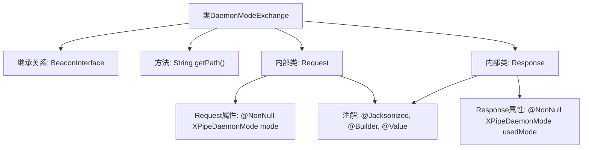

# 基础信息

|      |      |
|------|------|
| 名称 | DaemonModeExchange |
| 编码语言 | .java |
| 代码路径 | xpipe/beacon/src/main/java/io/xpipe/beacon/api/DaemonModeExchange.java |
| 包名 | io.xpipe.beacon.api |
| 依赖项 | ['io.xpipe.beacon.BeaconInterface', 'io.xpipe.core.util.XPipeDaemonMode', 'lombok.Builder', 'lombok.NonNull', 'lombok.Value', 'lombok.extern.jackson.Jacksonized'] |
| 概述说明 | DaemonModeExchange类处理守护进程模式请求和响应。 |

# 说明

这是一个名为DaemonModeExchange的Java类，继承自BeaconInterface泛型类，泛型类型为内部类Request。该类定义了一个返回路径为"/daemon/mode"的getPath方法。包含两个静态内部类：Request和Response，均使用了@Jacksonized、@Builder和@Value注解。Request类有一个非空XPipeDaemonMode类型的mode字段，Response类有一个非空XPipeDaemonMode类型的usedMode字段。这些类用于处理守护进程模式交换的请求和响应。

# 类列表 Class Summary

| 名称   | 类型  | 说明 |
|-------|------|-------------|
| DaemonModeExchange | class | DaemonModeExchange类处理守护进程模式请求，包含请求和响应数据结构。 |

## 类 DaemonModeExchange

|      |      |
|------|------|
| 访问范围 | public |
| 类型 | class |
| 名称 | DaemonModeExchange |
| 说明 | DaemonModeExchange类处理守护进程模式请求，包含请求和响应数据结构。 |

### UML类图

这段类图展示了DaemonModeExchange接口及其内部静态类Request和Response的结构。DaemonModeExchange是一个泛型接口，定义了获取路径的方法；Request类用于封装非空的XPipeDaemonMode模式参数，通过建造者模式创建；Response类则包含非空的usedMode字段，同样采用建造者模式。两个内部类都使用了Lombok注解实现不可变性和简化代码。

### 内部方法调用关系图

这段代码流程图展示了DaemonModeExchange类的结构，它是一个继承自BeaconInterface的泛型类，包含getPath方法路径配置和两个静态内部类Request/Response。内部类使用Lombok注解实现建造者模式和JSON序列化，Request类包含非空的mode字段，Response类包含非空的usedMode字段，两者都标记为不可变值对象。整体设计用于处理守护进程模式交换的请求响应数据封装。

### 字段列表 Field List

| 名称  | 类型  | 说明 |
|-------|-------|------|

### 方法列表 Method List

| 名称  | 类型  | 说明 |
|-------|-------|------|
| getPath | String | 重写getPath方法，返回路径"/daemon/mode"。 |

