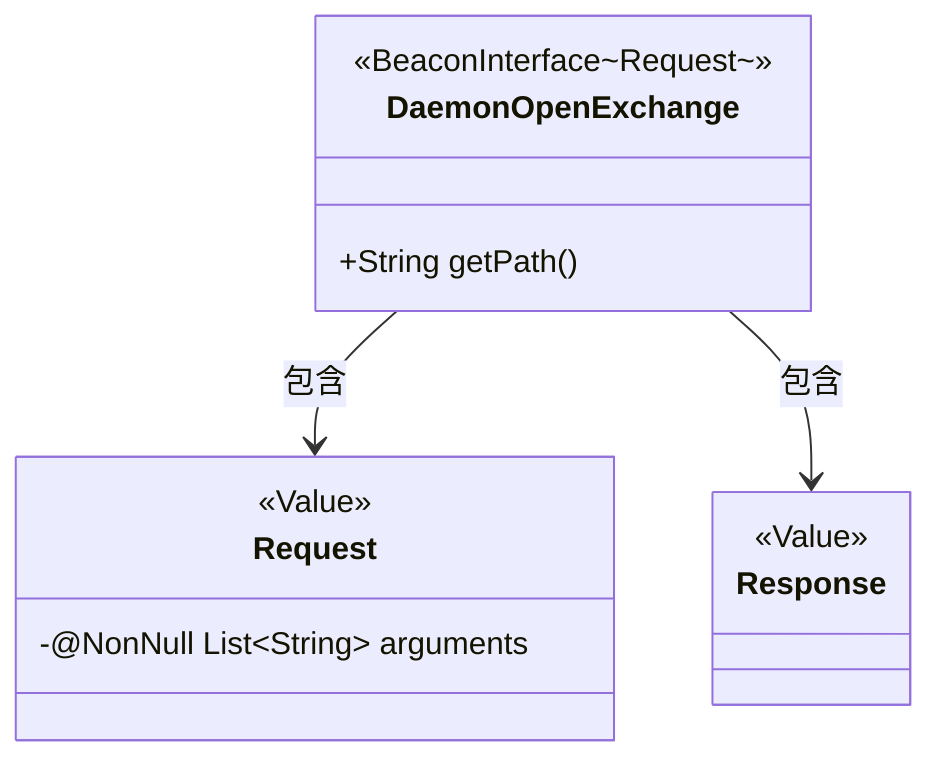
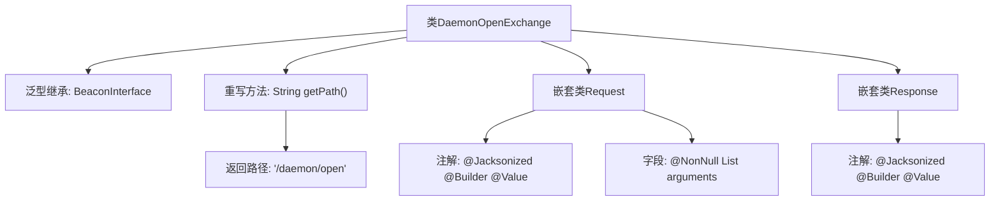

# 基础信息

|      |      |
|------|------|
| 名称 | DaemonOpenExchange |
| 编码语言 | .java |
| 代码路径 | xpipe/beacon/src/main/java/io/xpipe/beacon/api/DaemonOpenExchange.java |
| 包名 | io.xpipe.beacon.api |
| 依赖项 | ['io.xpipe.beacon.BeaconInterface', 'lombok.Builder', 'lombok.NonNull', 'lombok.Value', 'lombok.extern.jackson.Jacksonized', 'java.util.List'] |
| 概述说明 | DaemonOpenExchange类处理守护进程请求，包含请求和响应结构。 |

# 说明

这段代码描述了一个名为DaemonOpenExchange的类，它继承自BeaconInterface泛型类，泛型类型为内部类Request。该类重写了getPath方法，返回路径字符串"/daemon/open"。内部定义了两个静态嵌套类：Request和Response，都使用了Lombok注解@Jacksonized、@Builder和@Value。Request类包含一个非空的字符串列表arguments，而Response类为空结构。整个结构用于处理守护进程开放交换的请求和响应。

# 类列表 Class Summary

| 名称   | 类型  | 说明 |
|-------|------|-------------|
| DaemonOpenExchange | class | DaemonOpenExchange类继承BeaconInterface，路径为/daemon/open，包含Request和Response静态类。 |

## 类 DaemonOpenExchange

|      |      |
|------|------|
| 访问范围 | public |
| 类型 | class |
| 名称 | DaemonOpenExchange |
| 说明 | DaemonOpenExchange类继承BeaconInterface，路径为/daemon/open，包含Request和Response静态类。 |

### UML类图

这段类图展示了DaemonOpenExchange类及其嵌套的Request和Response类的结构。DaemonOpenExchange继承自泛型接口BeaconInterface，指定Request作为泛型类型参数。Request类使用Lombok注解标记为不可变值对象，包含非空的字符串列表参数；Response类同样是空的值对象。两个嵌套类都支持Jackson序列化和建造者模式，体现了清晰的请求-响应模式设计。

### 内部方法调用关系图

该流程图展示了DaemonOpenExchange类的结构，它是一个继承自BeaconInterface泛型类的实现，主要包含路径获取方法和两个嵌套静态类。Request类用于封装非空的参数列表，Response类作为空结构体，两者均采用Lombok注解实现不可变性和JSON序列化支持。类设计简洁，职责明确，适用于守护进程的开放接口场景。

### 字段列表 Field List

| 名称  | 类型  | 说明 |
|-------|-------|------|

### 方法列表 Method List

| 名称  | 类型  | 说明 |
|-------|-------|------|
| getPath | String | 重写getPath方法，返回路径"/daemon/open"。 |

