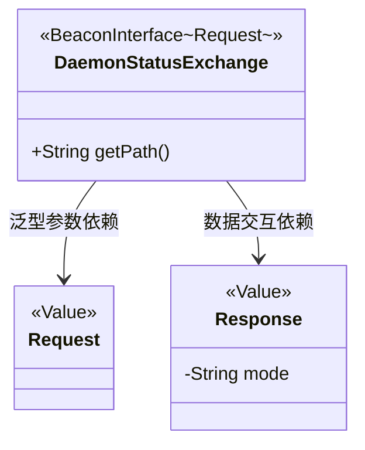
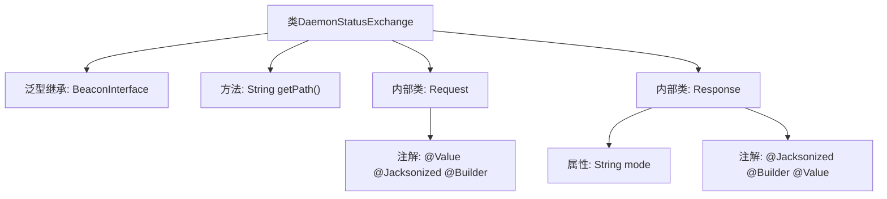

# 基础信息

|      |      |
|------|------|
| 名称 | DaemonStatusExchange |
| 编码语言 | .java |
| 代码路径 | xpipe/beacon/src/main/java/io/xpipe/beacon/api/DaemonStatusExchange.java |
| 包名 | io.xpipe.beacon.api |
| 依赖项 | ['io.xpipe.beacon.BeaconInterface', 'lombok.Builder', 'lombok.Value', 'lombok.extern.jackson.Jacksonized'] |
| 概述说明 | DaemonStatusExchange类处理守护进程状态请求，路径为/daemon/status，响应包含mode字段。 |

# 说明

DaemonStatusExchange是一个继承自BeaconInterface的类，用于处理守护进程状态交换。它定义了访问路径为"/daemon/status"。包含两个静态内部类：Request和Response。Request类为空，使用了@Value、@Jacksonized和@Builder注解。Response类包含一个字符串类型的mode字段，同样使用了@Jacksonized、@Builder和@Value注解。这些注解表明该类用于JSON序列化/反序列化，并支持构建器模式。

# 类列表 Class Summary

| 名称   | 类型  | 说明 |
|-------|------|-------------|
| DaemonStatusExchange | class | DaemonStatusExchange类用于获取守护进程状态，包含空请求和带mode字段的响应。 |

## 类 DaemonStatusExchange

|      |      |
|------|------|
| 访问范围 | public |
| 类型 | class |
| 名称 | DaemonStatusExchange |
| 说明 | DaemonStatusExchange类用于获取守护进程状态，包含空请求和带mode字段的响应。 |

### UML类图

这段类图展示了DaemonStatusExchange类及其嵌套类Request和Response的结构。DaemonStatusExchange继承自泛型接口BeaconInterface<Request>，实现了getPath()方法。Request是一个空的数据传输对象，带有Value、Jacksonized和Builder注解；Response包含一个mode字符串字段，同样具有这三个注解。这个结构主要用于实现守护进程状态查询的API交互，其中Request作为请求参数，Response封装返回的状态模式信息。

### 内部方法调用关系图

这段代码展示了一个名为DaemonStatusExchange的类，它继承自泛型类BeaconInterface并指定Request作为类型参数。类中包含一个返回固定路径的getPath方法，以及两个静态内部类Request和Response。Request类为空但带有三个注解标记，Response类则包含一个mode字符串属性和相同的三个注解。该结构主要用于定义与守护进程状态交互的数据模型和API端点。

### 字段列表 Field List

| 名称  | 类型  | 说明 |
|-------|-------|------|

### 方法列表 Method List

| 名称  | 类型  | 说明 |
|-------|-------|------|
| getPath | String | 重写getPath方法，返回路径"/daemon/status"。 |

