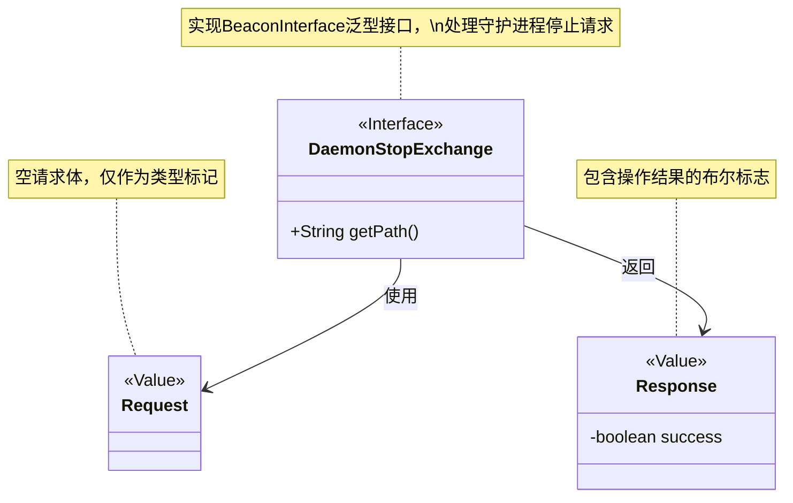
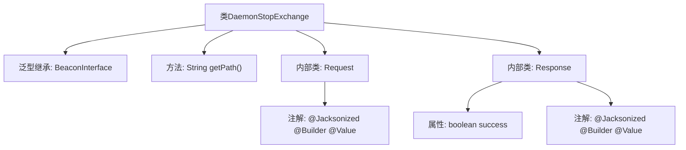

# 基础信息

|      |      |
|------|------|
| 名称 | DaemonStopExchange |
| 编码语言 | .java |
| 代码路径 | xpipe/beacon/src/main/java/io/xpipe/beacon/api/DaemonStopExchange.java |
| 包名 | io.xpipe.beacon.api |
| 依赖项 | ['io.xpipe.beacon.BeaconInterface', 'lombok.Builder', 'lombok.Value', 'lombok.extern.jackson.Jacksonized'] |
| 概述说明 | DaemonStopExchange类处理守护进程停止请求，路径为/daemon/stop，包含空请求体和带success字段的响应体。 |

# 说明

这是一个名为DaemonStopExchange的Java类，继承自BeaconInterface泛型类，泛型类型为内部类Request。该类定义了访问路径为"/daemon/stop"。包含两个静态内部类：Request和Response。Request类为空结构，使用Jacksonized、Builder和Value注解。Response类包含一个布尔类型的success字段，同样使用上述三个注解。整个类结构用于处理守护进程停止的请求和响应。

# 类列表 Class Summary

| 名称   | 类型  | 说明 |
|-------|------|-------------|
| DaemonStopExchange | class | DaemonStopExchange类，路径/daemon/stop，包含空请求类和带success的响应类。 |

## 类 DaemonStopExchange

|      |      |
|------|------|
| 访问范围 | public |
| 类型 | class |
| 名称 | DaemonStopExchange |
| 说明 | DaemonStopExchange类，路径/daemon/stop，包含空请求类和带success的响应类。 |

### UML类图

这段代码描述了一个处理守护进程停止请求的接口`DaemonStopExchange`，它实现了泛型接口`BeaconInterface<Request>`。包含两个静态内部类：空请求体`Request`（使用Lombok注解实现值对象模式）和响应体`Response`（包含操作状态标志）。类图展示了三者间的依赖关系，其中主接口负责定义API路径并处理特定类型的请求/响应交互。

### 内部方法调用关系图

这段代码展示了一个名为DaemonStopExchange的类，它继承自泛型类BeaconInterface，并指定了Request作为泛型参数。类中包含一个返回固定路径的getPath方法，以及两个静态内部类Request和Response。这两个内部类都使用了@Jacksonized、@Builder和@Value注解，其中Response类还包含一个boolean类型的success属性。整个结构清晰地展示了类之间的继承关系和内部类的组成。

### 字段列表 Field List

| 名称  | 类型  | 说明 |
|-------|-------|------|

### 方法列表 Method List

| 名称  | 类型  | 说明 |
|-------|-------|------|
| getPath | String | 重写getPath方法，返回路径"/daemon/stop"。 |

