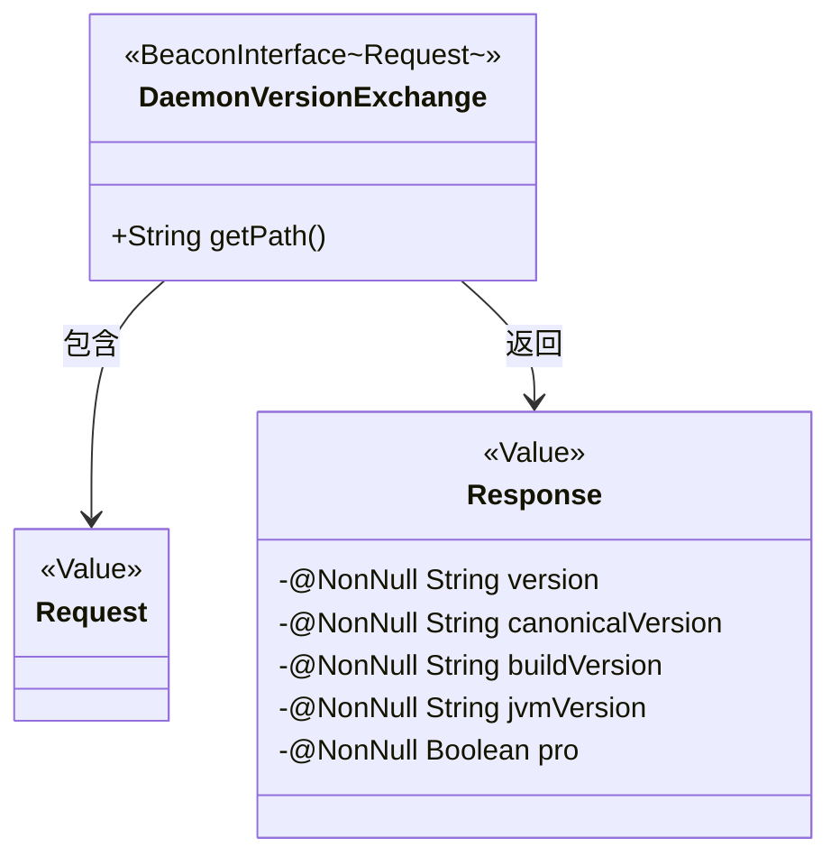
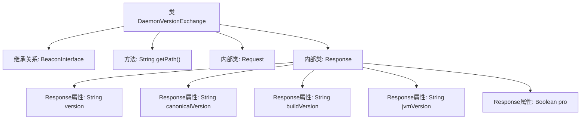

# 基础信息

|      |      |
|------|------|
| 名称 | DaemonVersionExchange |
| 编码语言 | .java |
| 代码路径 | xpipe/beacon/src/main/java/io/xpipe/beacon/api/DaemonVersionExchange.java |
| 包名 | io.xpipe.beacon.api |
| 依赖项 | ['io.xpipe.beacon.BeaconInterface', 'lombok.Builder', 'lombok.NonNull', 'lombok.Value', 'lombok.extern.jackson.Jacksonized'] |
| 概述说明 | 守护进程版本交换接口，包含请求和响应结构，响应含版本信息。 |

# 说明

该内容描述了一个名为DaemonVersionExchange的类，继承自BeaconInterface泛型类，指定Request类型。类中包含getPath方法返回固定路径字符串。定义了静态内部类Request，使用Jacksonized、Builder和Value注解标记，无字段。另一个静态内部类Response同样使用上述注解，包含五个非空字段：version、canonicalVersion、buildVersion、jvmVersion和pro布尔值，分别表示不同版本信息及专业版标识。整个结构用于处理守护进程版本信息的请求与响应交互。

# 类列表 Class Summary

| 名称   | 类型  | 说明 |
|-------|------|-------------|
| DaemonVersionExchange | class | 守护进程版本交换接口，含请求和响应类，响应包含版本信息。 |

## 类 DaemonVersionExchange

|      |      |
|------|------|
| 访问范围 | public |
| 类型 | class |
| 名称 | DaemonVersionExchange |
| 说明 | 守护进程版本交换接口，含请求和响应类，响应包含版本信息。 |

### UML类图

这段代码展示了一个用于版本交换的守护进程通信结构。DaemonVersionExchange类继承自泛型BeaconInterface接口，指定Request作为泛型参数，包含获取路径的方法和两个静态内部类。Request是空的数据传输对象，Response则包含5个非空字段，分别记录不同版本信息和专业版标志。类间关系通过注解和泛型实现，使用Lombok的@Value、@Builder和@Jacksonized简化代码。整个设计用于处理守护进程版本信息的请求和响应交互。

### 内部方法调用关系图

该流程图展示了DaemonVersionExchange类的结构，它是一个继承自BeaconInterface的泛型类，包含一个返回固定路径的getPath方法。内部定义了两个静态类：Request（空结构）和Response（包含5个非空字段的不可变数据类）。Response类通过Lombok注解实现了构建器模式和JSON序列化支持，用于封装守护进程的版本相关信息。

### 字段列表 Field List

| 名称  | 类型  | 说明 |
|-------|-------|------|

### 方法列表 Method List

| 名称  | 类型  | 说明 |
|-------|-------|------|
| getPath | String | 重写getPath方法，返回路径"/daemon/version"。 |

