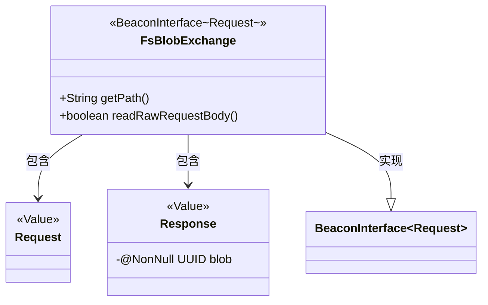
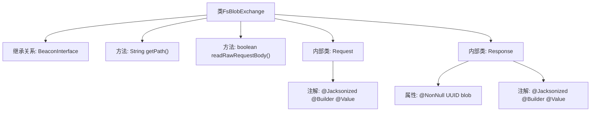

# 基础信息

|      |      |
|------|------|
| 名称 | FsBlobExchange |
| 编码语言 | .java |
| 代码路径 | xpipe/beacon/src/main/java/io/xpipe/beacon/api/FsBlobExchange.java |
| 包名 | io.xpipe.beacon.api |
| 依赖项 | ['io.xpipe.beacon.BeaconInterface', 'lombok.Builder', 'lombok.NonNull', 'lombok.Value', 'lombok.extern.jackson.Jacksonized', 'java.util.UUID'] |
| 概述说明 | FsBlobExchange类处理文件系统blob请求，路径为/fs/blob，包含请求和响应结构。 |

# 说明

FsBlobExchange是一个继承自BeaconInterface的类，处理FsBlobExchange.Request类型请求。它定义了访问路径为/fs/blob，并启用原始请求体读取功能。包含两个静态内部类：Request和Response。Request类为空结构，Response类包含一个非空的UUID类型blob字段。所有类均采用Lombok注解实现构造器模式及JSON序列化支持。

# 类列表 Class Summary

| 名称   | 类型  | 说明 |
|-------|------|-------------|
| FsBlobExchange | class | FsBlobExchange类处理文件系统blob请求，路径为/fs/blob，支持原始请求体，响应包含blob的UUID。 |

## 类 FsBlobExchange

|      |      |
|------|------|
| 访问范围 | public |
| 类型 | class |
| 名称 | FsBlobExchange |
| 说明 | FsBlobExchange类处理文件系统blob请求，路径为/fs/blob，支持原始请求体，响应包含blob的UUID。 |

### UML类图

这段类图展示了FsBlobExchange继承自泛型接口BeaconInterface，并包含两个静态内部类Request和Response。FsBlobExchange实现了获取路径和读取原始请求体的方法，其中Response类包含一个非空的UUID类型blob字段。所有类都使用了Lombok的注解（@Value、@Builder、@Jacksonized）来简化代码。该结构主要用于处理文件系统二进制大对象交换的请求和响应。

### 内部方法调用关系图

这段代码定义了一个名为FsBlobExchange的类，继承自泛型类BeaconInterface<Request>。主要功能包括：重写getPath()方法返回固定路径"/fs/blob"，设置readRawRequestBody()始终返回true。包含两个静态内部类：Request（空结构体）和Response（包含非空UUID字段），两者都使用了Lombok的@Jacksonized、@Builder和@Value注解来实现不可变对象和JSON序列化支持。流程图清晰展示了类继承关系、方法定义和内部类结构。

### 字段列表 Field List

| 名称  | 类型  | 说明 |
|-------|-------|------|

### 方法列表 Method List

| 名称  | 类型  | 说明 |
|-------|-------|------|
| getPath | String | 重写getPath方法，返回路径"/fs/blob"。 |
| readRawRequestBody | boolean | 覆盖方法，返回true以读取原始请求体。 |

