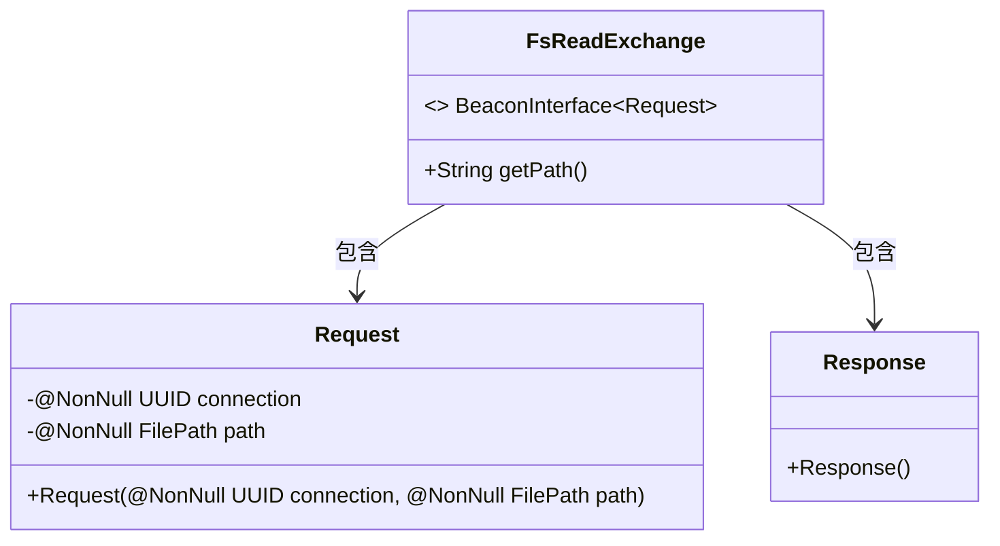
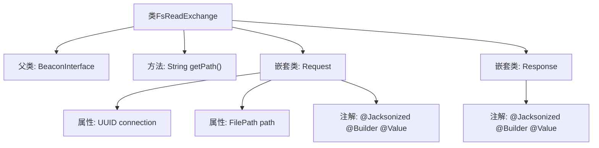

# 基础信息

|      |      |
|------|------|
| 名称 | FsReadExchange |
| 编码语言 | .java |
| 代码路径 | xpipe/beacon/src/main/java/io/xpipe/beacon/api/FsReadExchange.java |
| 包名 | io.xpipe.beacon.api |
| 依赖项 | ['io.xpipe.beacon.BeaconInterface', 'io.xpipe.core.store.FilePath', 'lombok.Builder', 'lombok.NonNull', 'lombok.Value', 'lombok.extern.jackson.Jacksonized', 'java.util.UUID'] |
| 概述说明 | FsReadExchange类处理文件读取请求，包含路径和连接UUID。 |

# 说明

FsReadExchange是一个继承自BeaconInterface的类，泛型参数为内部类Request。它重写了getPath方法，返回路径字符串"/fs/read"。该类包含两个静态内部类：Request和Response，均使用@Jacksonized、@Builder和@Value注解。Request类有两个非空字段：UUID类型的connection和FilePath类型的path。Response类为空结构体。整个类设计用于文件系统读取操作的请求响应交互。

# 类列表 Class Summary

| 名称   | 类型  | 说明 |
|-------|------|-------------|
| FsReadExchange | class | FsReadExchange类处理文件读取请求，包含路径和连接UUID。 |

## 类 FsReadExchange

|      |      |
|------|------|
| 访问范围 | public |
| 类型 | class |
| 名称 | FsReadExchange |
| 说明 | FsReadExchange类处理文件读取请求，包含路径和连接UUID。 |

### UML类图

这段类图展示了FsReadExchange类及其内部静态类Request和Response的结构。FsReadExchange实现了泛型接口BeaconInterface<Request>，包含获取路径的公有方法getPath()。Request类有两个不可为空的字段：connection(UUID类型)和path(FilePath类型)，使用建造者模式构造。Response是一个空值对象。整体设计用于文件系统读取操作的数据交换，通过明确的类型约束和建造者模式确保数据完整性。

### 内部方法调用关系图

这段代码展示了一个名为FsReadExchange的类，继承自泛型类BeaconInterface，并包含两个嵌套静态类Request和Response。主类实现了getPath()方法返回固定路径，Request类用Lombok注解标记，包含非空连接ID和文件路径属性，Response类同样使用Lombok注解但为空结构。流程图清晰呈现了类继承关系、方法定义和嵌套类的注解及属性组成。

### 字段列表 Field List

| 名称  | 类型  | 说明 |
|-------|-------|------|

### 方法列表 Method List

| 名称  | 类型  | 说明 |
|-------|-------|------|
| getPath | String | 重写getPath方法，返回路径"/fs/read"。 |

