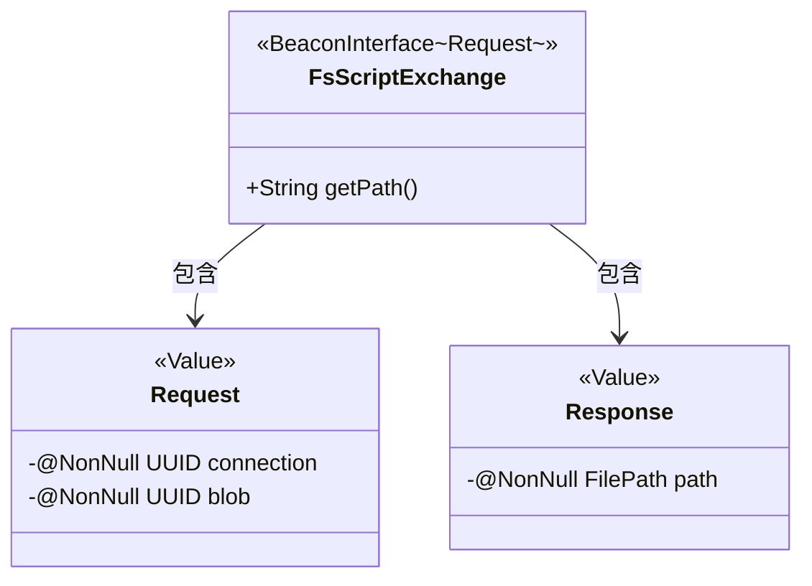
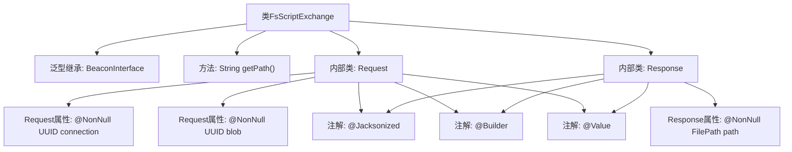

# 基础信息

|      |      |
|------|------|
| 名称 | FsScriptExchange |
| 编码语言 | .java |
| 代码路径 | xpipe/beacon/src/main/java/io/xpipe/beacon/api/FsScriptExchange.java |
| 包名 | io.xpipe.beacon.api |
| 依赖项 | ['io.xpipe.beacon.BeaconInterface', 'io.xpipe.core.store.FilePath', 'lombok.Builder', 'lombok.NonNull', 'lombok.Value', 'lombok.extern.jackson.Jacksonized', 'java.util.UUID'] |
| 概述说明 | FsScriptExchange类处理脚本请求，包含请求和响应数据结构。 |

# 说明

FsScriptExchange类继承自BeaconInterface，处理泛型Request类。其路径定义为/fs/script。Request类包含两个非空字段：connection和blob，均为UUID类型。Response类包含一个非空FilePath类型的path字段。两个内部类均使用Lombok注解实现不可变性和JSON序列化支持。

# 类列表 Class Summary

| 名称   | 类型  | 说明 |
|-------|------|-------------|
| FsScriptExchange | class | FsScriptExchange类处理文件脚本请求，包含请求和响应数据结构。 |

## 类 FsScriptExchange

|      |      |
|------|------|
| 访问范围 | public |
| 类型 | class |
| 名称 | FsScriptExchange |
| 说明 | FsScriptExchange类处理文件脚本请求，包含请求和响应数据结构。 |

### UML类图

该类图展示了FsScriptExchange继承自泛型接口BeaconInterface~Request~，包含两个静态内部类Request和Response。Request类用@Value、@Builder和@Jacksonized注解标记，包含两个非空UUID字段；Response类同样使用这三个注解，包含一个非空FilePath字段。FsScriptExchange重写了getPath方法返回固定路径，并通过依赖关系管理请求和响应数据结构。整体设计体现了类型安全的RPC通信模式，适用于文件系统脚本操作场景。

### 内部方法调用关系图

这段代码定义了一个名为`FsScriptExchange`的类，它继承自泛型类`BeaconInterface<Request>`。类中包含一个重写的`getPath()`方法返回固定路径字符串，以及两个静态内部类`Request`和`Response`。这两个内部类都使用了Lombok的`@Jacksonized`、`@Builder`和`@Value`注解，分别包含不同的非空属性：`Request`类有UUID类型的`connection`和`blob`属性，`Response`类有`FilePath`类型的`path`属性。整个结构展示了典型的API请求-响应模式的数据封装方式。

### 字段列表 Field List

| 名称  | 类型  | 说明 |
|-------|-------|------|

### 方法列表 Method List

| 名称  | 类型  | 说明 |
|-------|-------|------|
| getPath | String | 重写getPath方法，返回路径"/fs/script"。 |

