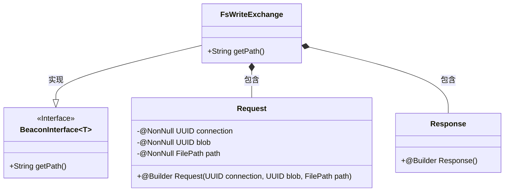
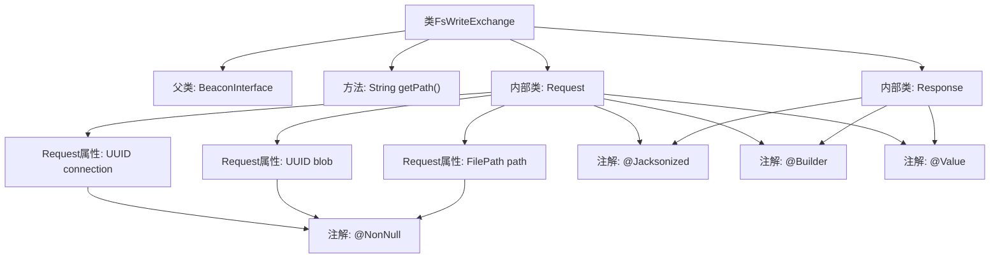

# 基础信息

|      |      |
|------|------|
| 名称 | FsWriteExchange |
| 编码语言 | .java |
| 代码路径 | xpipe/beacon/src/main/java/io/xpipe/beacon/api/FsWriteExchange.java |
| 包名 | io.xpipe.beacon.api |
| 依赖项 | ['io.xpipe.beacon.BeaconInterface', 'io.xpipe.core.store.FilePath', 'lombok.Builder', 'lombok.NonNull', 'lombok.Value', 'lombok.extern.jackson.Jacksonized', 'java.util.UUID'] |
| 概述说明 | FsWriteExchange类处理文件写入请求，包含请求和响应结构。 |

# 说明

FsWriteExchange是一个继承自BeaconInterface的类，处理文件系统写入请求。其路径定义为"/fs/write"。包含一个静态内部类Request，使用Lombok注解构建不可变对象，包含三个非空字段：connection（UUID类型）、blob（UUID类型）和path（FilePath类型）。另有一个静态内部类Response，同样使用Lombok注解但未定义具体字段。整个结构用于封装文件系统写入操作的请求和响应数据。

# 类列表 Class Summary

| 名称   | 类型  | 说明 |
|-------|------|-------------|
| FsWriteExchange | class | FsWriteExchange类处理文件写入请求，包含请求和响应结构。请求需连接ID、blobID和文件路径。 |

## 类 FsWriteExchange

|      |      |
|------|------|
| 访问范围 | public |
| 类型 | class |
| 名称 | FsWriteExchange |
| 说明 | FsWriteExchange类处理文件写入请求，包含请求和响应结构。请求需连接ID、blobID和文件路径。 |

### UML类图

这段类图展示了FsWriteExchange类及其内部结构。FsWriteExchange实现了泛型接口BeaconInterface<Request>，包含两个静态嵌套类：Request和Response。Request类用@Value标注为不可变对象，包含三个非空字段(connection, blob, path)和构建器；Response是空值对象。整体设计符合数据传输对象模式，用于文件系统写入操作的请求/响应封装。

### 内部方法调用关系图

这段代码定义了一个FsWriteExchange类，继承自泛型类BeaconInterface<Request>，包含一个返回路径字符串的getPath方法。内部定义了两个静态嵌套类Request和Response，均使用@Jacksonized、@Builder和@Value注解。Request类包含三个@NonNull标记的属性：connection(UUID类型)、blob(UUID类型)和path(FilePath类型)，Response类为空结构体。该设计用于文件系统写入操作的请求/响应数据封装。

### 字段列表 Field List

| 名称  | 类型  | 说明 |
|-------|-------|------|

### 方法列表 Method List

| 名称  | 类型  | 说明 |
|-------|-------|------|
| getPath | String | 重写getPath方法，返回路径"/fs/write"。 |

