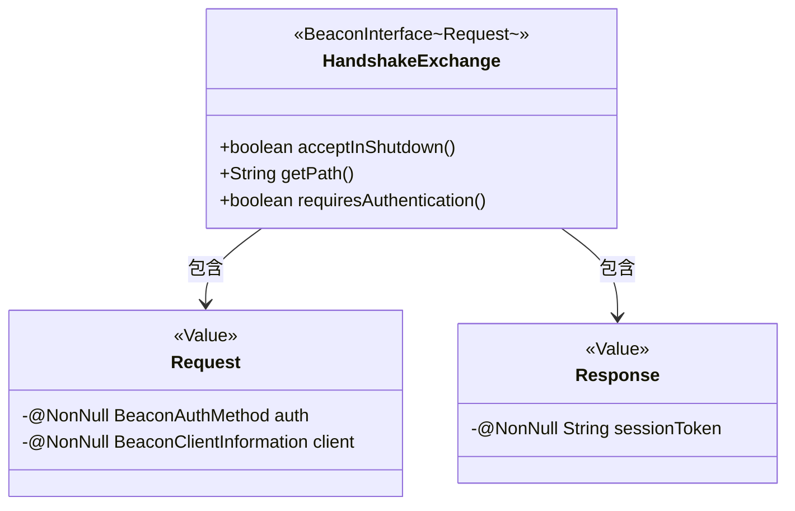

# 基础信息

|      |      |
|------|------|
| 名称 | HandshakeExchange |
| 编码语言 | .java |
| 代码路径 | xpipe/beacon/src/main/java/io/xpipe/beacon/api/HandshakeExchange.java |
| 包名 | io.xpipe.beacon.api |
| 依赖项 | ['io.xpipe.beacon.BeaconAuthMethod', 'io.xpipe.beacon.BeaconClientInformation', 'io.xpipe.beacon.BeaconInterface', 'lombok.Builder', 'lombok.NonNull', 'lombok.Value', 'lombok.extern.jackson.Jacksonized'] |
| 概述说明 | HandshakeExchange类处理握手请求，无需认证，路径为/handshake，含请求和响应结构。 |

# 说明

HandshakeExchange是一个继承自BeaconInterface的类，用于处理握手交换请求。它重写了acceptInShutdown方法，返回true表示在关闭时仍可接受请求。getPath方法返回路径"/handshake"，requiresAuthentication方法返回false表示无需认证。内部类Request包含非空字段auth和client，分别表示认证方法和客户端信息。内部类Response包含非空字段sessionToken，表示会话令牌。两个内部类均使用Jacksonized、Builder和Value注解。

# 类列表 Class Summary

| 名称   | 类型  | 说明 |
|-------|------|-------------|
| HandshakeExchange | class | HandshakeExchange类处理握手请求，路径为/handshake，无需认证，包含请求和响应结构。 |

## 类 HandshakeExchange

|      |      |
|------|------|
| 访问范围 | public |
| 类型 | class |
| 名称 | HandshakeExchange |
| 说明 | HandshakeExchange类处理握手请求，路径为/handshake，无需认证，包含请求和响应结构。 |

### UML类图

这段类图展示了HandshakeExchange类及其嵌套静态类Request和Response的结构。HandshakeExchange实现了泛型接口BeaconInterface<Request>，包含三个公有方法：acceptInShutdown()、getPath()和requiresAuthentication()。Request和Response类都使用了Lombok的@Value、@Builder和@Jacksonized注解，分别包含认证信息和客户端信息(auth/client)以及会话令牌(sessionToken)字段。类之间的关系表现为HandshakeExchange对两个嵌套类的包含关系。

### 内部方法调用关系图

这段代码描述了一个名为HandshakeExchange的类，它继承自泛型类BeaconInterface<Request>。主要功能包括三个重写方法：acceptInShutdown()返回true表示允许在关闭时接受请求，getPath()返回"/handshake"路径，requiresAuthentication()返回false表示无需认证。类内包含两个静态嵌套类：Request（包含认证方法和客户端信息）和Response（包含会话令牌），均使用Lombok注解实现不可变性和构建器模式。整体设计用于处理握手交换协议的网络交互场景。

### 字段列表 Field List

| 名称  | 类型  | 说明 |
|-------|-------|------|

### 方法列表 Method List

| 名称  | 类型  | 说明 |
|-------|-------|------|
| acceptInShutdown | boolean | 重写方法，返回true表示允许在关闭时接受请求。 |
| getPath | String | 重写getPath方法，返回路径"/handshake"。 |
| requiresAuthentication | boolean | 重写方法，设置无需认证。 |

