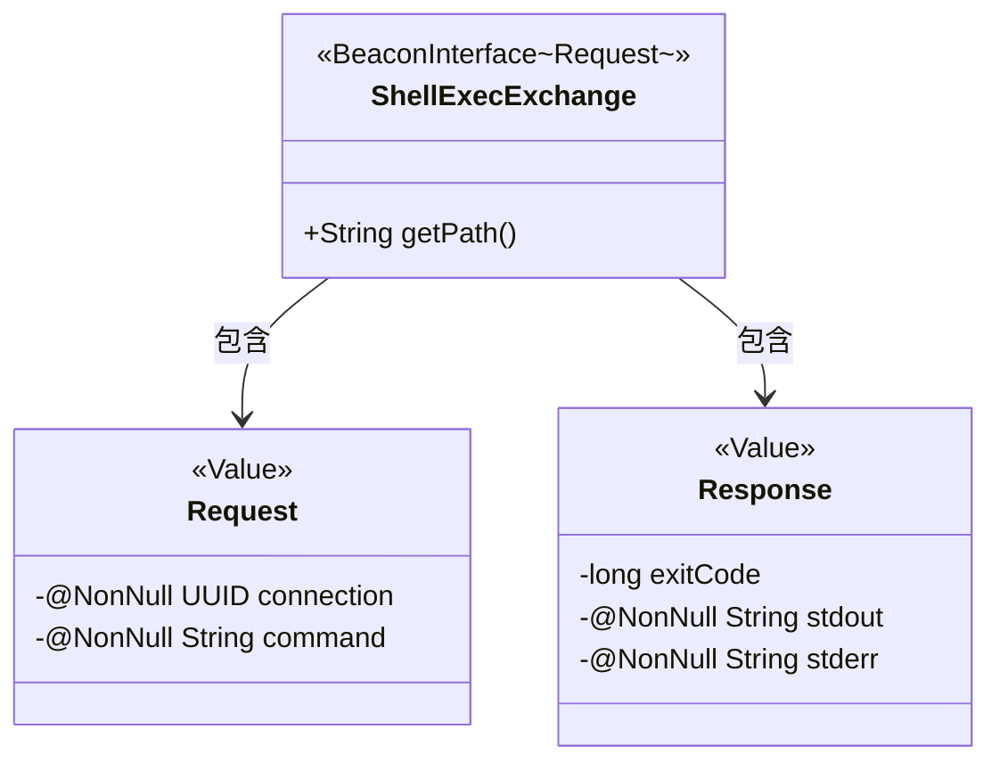
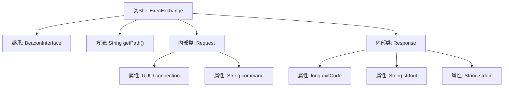

# 基础信息

|      |      |
|------|------|
| 名称 | ShellExecExchange |
| 编码语言 | .java |
| 代码路径 | xpipe/beacon/src/main/java/io/xpipe/beacon/api/ShellExecExchange.java |
| 包名 | io.xpipe.beacon.api |
| 依赖项 | ['io.xpipe.beacon.BeaconInterface', 'lombok.Builder', 'lombok.NonNull', 'lombok.Value', 'lombok.extern.jackson.Jacksonized', 'java.util.UUID'] |
| 概述说明 | ShellExecExchange类定义请求/响应结构，用于执行shell命令。请求含连接ID和命令，响应含退出码、输出和错误信息。 |

# 说明

ShellExecExchange是一个BeaconInterface的实现类，处理shell执行请求。其路径定义为/shell/exec。包含Request和Response两个静态内部类。Request类包含两个非空字段：connection（UUID类型）和command（字符串类型）。Response类包含三个字段：exitCode（长整型）、stdout（非空字符串）和stderr（非空字符串）。所有类均使用Lombok注解实现构建器和值对象特性。

# 类列表 Class Summary

| 名称   | 类型  | 说明 |
|-------|------|-------------|
| ShellExecExchange | class | ShellExecExchange类处理shell命令请求，包含连接UUID和命令字段，返回退出码、标准输出和错误输出。 |

## 类 ShellExecExchange

|      |      |
|------|------|
| 访问范围 | public |
| 类型 | class |
| 名称 | ShellExecExchange |
| 说明 | ShellExecExchange类处理shell命令请求，包含连接UUID和命令字段，返回退出码、标准输出和错误输出。 |

### UML类图

这段类图展示了ShellExecExchange类继承自泛型接口BeaconInterface，并包含两个静态内部类Request和Response。Request类用于封装命令执行的请求参数（连接UUID和命令字符串），Response类用于封装执行结果（退出码、标准输出和错误输出）。所有类都使用了Lombok的@Value、@Builder和@Jacksonized注解，表明它们是不可变的数据类，支持构建器模式和JSON序列化。整个结构设计用于处理Shell命令执行的请求/响应交互。

### 内部方法调用关系图

这段代码定义了一个ShellExecExchange类，继承自泛型类BeaconInterface<Request>，包含一个返回路径字符串的getPath方法。类中嵌套了两个静态内部类：Request（包含UUID类型的connection和String类型的command属性）和Response（包含long类型的exitCode以及String类型的stdout和stderr属性）。整个结构用于封装Shell命令执行的请求和响应数据模型，通过Jackson注解支持JSON序列化。

### 字段列表 Field List

| 名称  | 类型  | 说明 |
|-------|-------|------|

### 方法列表 Method List

| 名称  | 类型  | 说明 |
|-------|-------|------|
| getPath | String | 重写getPath方法，返回路径"/shell/exec"。 |

