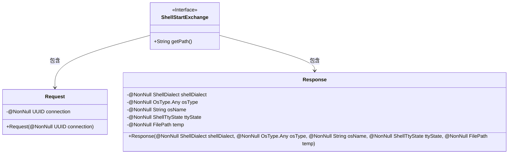
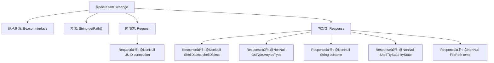

# 基础信息

|      |      |
|------|------|
| 名称 | ShellStartExchange |
| 编码语言 | .java |
| 代码路径 | xpipe/beacon/src/main/java/io/xpipe/beacon/api/ShellStartExchange.java |
| 包名 | io.xpipe.beacon.api |
| 依赖项 | ['io.xpipe.beacon.BeaconInterface', 'io.xpipe.core.process.OsType', 'io.xpipe.core.process.ShellDialect', 'io.xpipe.core.process.ShellTtyState', 'io.xpipe.core.store.FilePath', 'lombok.Builder', 'lombok.NonNull', 'lombok.Value', 'lombok.extern.jackson.Jacksonized', 'java.util.UUID'] |
| 概述说明 | ShellStartExchange类处理shell启动请求，包含请求UUID和响应shell信息。 |

# 说明

ShellStartExchange是一个BeaconInterface的实现类，用于处理shell启动请求。其路径定义为/shell/start。请求体Request包含一个非空的UUID类型connection字段。响应体Response包含五个非空字段：shellDialect表示shell方言类型，osType表示操作系统类型，osName表示操作系统名称，ttyState表示终端状态，temp表示临时文件路径。类使用了Lombok的注解简化代码，包括@Jacksonized、@Builder和@Value。

# 类列表 Class Summary

| 名称   | 类型  | 说明 |
|-------|------|-------------|
| ShellStartExchange | class | ShellStartExchange类处理shell启动请求，包含连接UUID的Request和包含shell信息、OS类型等Response。 |

## 类 ShellStartExchange

|      |      |
|------|------|
| 访问范围 | public |
| 类型 | class |
| 名称 | ShellStartExchange |
| 说明 | ShellStartExchange类处理shell启动请求，包含连接UUID的Request和包含shell信息、OS类型等Response。 |

### UML类图

这段类图展示了一个ShellStartExchange接口及其内部定义的Request和Response类。ShellStartExchange是一个泛型接口，指定了Request作为其类型参数，并包含一个获取路径的抽象方法。Request类封装了必需的连接UUID字段，而Response类则包含多个非空字段，包括shell方言、操作系统类型、名称、TTY状态和临时文件路径。这些类通过注解实现了构建器和JSON序列化功能，整体构成了一个用于Shell启动交互的数据结构。

### 内部方法调用关系图

这段代码展示了一个名为ShellStartExchange的类，它继承自泛型类BeaconInterface<Request>。该类包含一个重写的getPath()方法返回固定路径字符串，以及两个静态内部类Request和Response。Request类用@Jacksonized、@Builder和@Value注解标记，包含一个非空的UUID类型connection属性。Response类同样使用这三个注解，包含五个非空属性：shellDialect、osType、osName、ttyState和temp，分别表示Shell方言、操作系统类型、操作系统名称、TTY状态和临时文件路径。整个结构清晰地定义了Shell启动交换所需的数据模型。

### 字段列表 Field List

| 名称  | 类型  | 说明 |
|-------|-------|------|

### 方法列表 Method List

| 名称  | 类型  | 说明 |
|-------|-------|------|
| getPath | String | 重写getPath方法，返回路径"/shell/start"。 |

