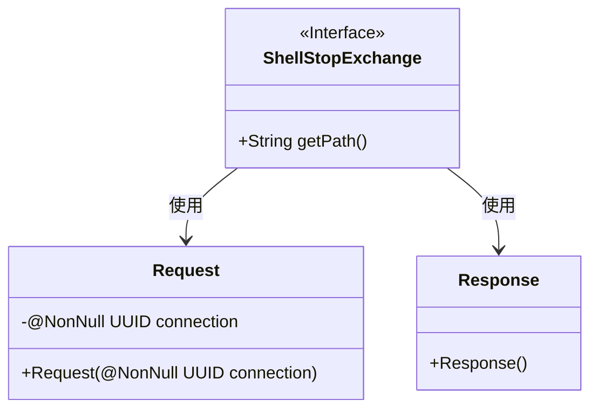
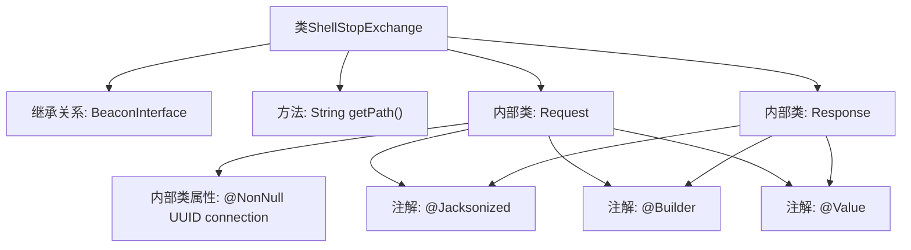

# 基础信息

|      |      |
|------|------|
| 名称 | ShellStopExchange |
| 编码语言 | .java |
| 代码路径 | xpipe/beacon/src/main/java/io/xpipe/beacon/api/ShellStopExchange.java |
| 包名 | io.xpipe.beacon.api |
| 依赖项 | ['io.xpipe.beacon.BeaconInterface', 'lombok.Builder', 'lombok.NonNull', 'lombok.Value', 'lombok.extern.jackson.Jacksonized', 'java.util.UUID'] |
| 概述说明 | ShellStopExchange类处理停止shell请求，路径为/shell/stop，需非空UUID参数。 |

# 说明

ShellStopExchange是一个BeaconInterface的实现类，处理停止shell的请求。它定义了路径为/shell/stop，包含一个静态内部类Request，其中包含一个非空的UUID类型connection字段。还有一个静态内部类Response，用于表示响应，但未定义具体字段。整个类使用了Lombok的注解简化代码，包括@Jacksonized、@Builder和@Value。

# 类列表 Class Summary

| 名称   | 类型  | 说明 |
|-------|------|-------------|
| ShellStopExchange | class | ShellStopExchange类处理停止请求，包含连接UUID的请求体和空响应体。 |

## 类 ShellStopExchange

|      |      |
|------|------|
| 访问范围 | public |
| 类型 | class |
| 名称 | ShellStopExchange |
| 说明 | ShellStopExchange类处理停止请求，包含连接UUID的请求体和空响应体。 |

### UML类图

这段类图展示了一个ShellStopExchange接口及其关联的数据传输对象。ShellStopExchange是一个泛型接口（参数化为Request类型），定义了获取路径的方法。包含两个静态内部类：Request类封装了必需的连接UUID参数，使用@NonNull注解确保非空；Response类作为空的数据载体。整个结构用于处理Shell停止请求的通信协议，体现了典型的命令模式实现。

### 内部方法调用关系图

这段代码展示了一个名为ShellStopExchange的类，它继承自泛型类BeaconInterface<Request>。类中包含一个返回固定路径"/shell/stop"的getPath方法，以及两个静态内部类Request和Response。Request类包含一个非空的UUID类型connection属性，并用@Jacksonized、@Builder和@Value注解标记。Response类为空，但同样使用了相同的三个注解。整个结构主要用于处理Shell停止请求的交互，通过注解实现了序列化和构建模式的支持。

### 字段列表 Field List

| 名称  | 类型  | 说明 |
|-------|-------|------|

### 方法列表 Method List

| 名称  | 类型  | 说明 |
|-------|-------|------|
| getPath | String | 重写getPath方法，返回路径"/shell/stop"。 |

