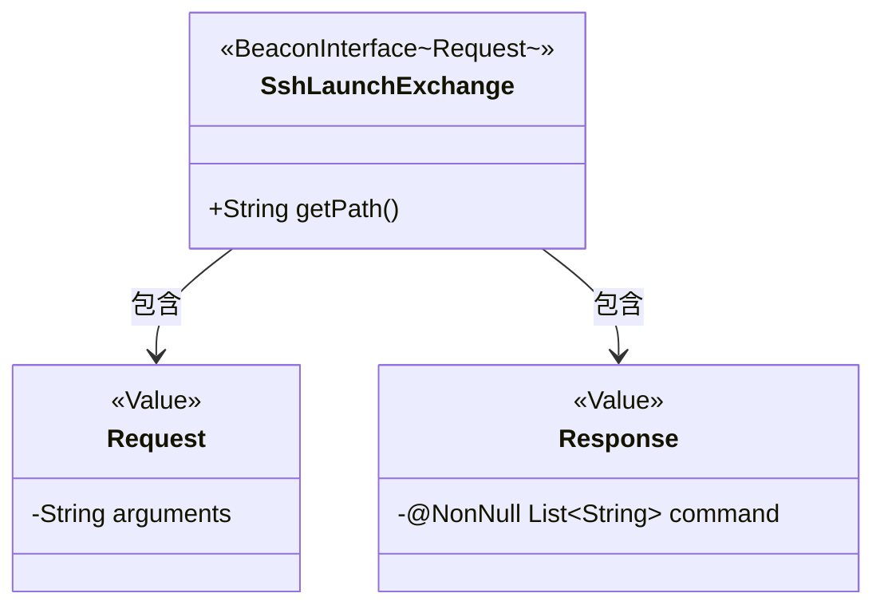
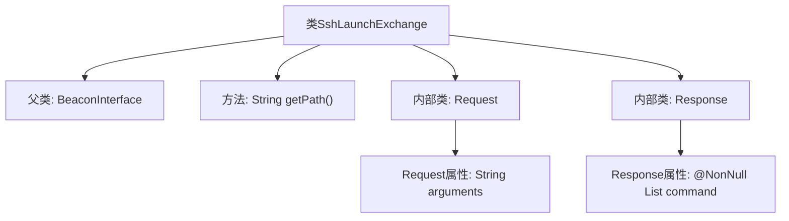

# 基础信息

|      |      |
|------|------|
| 名称 | SshLaunchExchange |
| 编码语言 | .java |
| 代码路径 | xpipe/beacon/src/main/java/io/xpipe/beacon/api/SshLaunchExchange.java |
| 包名 | io.xpipe.beacon.api |
| 依赖项 | ['io.xpipe.beacon.BeaconInterface', 'lombok.Builder', 'lombok.NonNull', 'lombok.Value', 'lombok.extern.jackson.Jacksonized', 'java.util.List'] |
| 概述说明 | SSH启动交换类，含请求参数和响应命令列表。 |

# 说明

这段内容描述了一个名为SshLaunchExchange的Java类，它继承自BeaconInterface泛型类，泛型类型为内部的Request类。该类重写了getPath方法，返回路径字符串/sshLaunch。内部定义了两个静态嵌套类：Request和Response，均使用了Lombok注解@Jacksonized、@Builder和@Value。Request类包含一个字符串类型的arguments字段。Response类包含一个非空的字符串列表command字段，用@NonNull注解标记。整个结构用于处理SSH启动相关的请求和响应数据交换。

# 类列表 Class Summary

| 名称   | 类型  | 说明 |
|-------|------|-------------|
| SshLaunchExchange | class | SSH启动交换类，含请求参数和响应命令列表。 |

## 类 SshLaunchExchange

|      |      |
|------|------|
| 访问范围 | public |
| 类型 | class |
| 名称 | SshLaunchExchange |
| 说明 | SSH启动交换类，含请求参数和响应命令列表。 |

### UML类图

这段代码描述了一个SSH启动交换类`SshLaunchExchange`，它继承自泛型类`BeaconInterface`，泛型参数为内部类`Request`。主要包含三个部分：主类`SshLaunchExchange`定义了SSH启动的API路径，以及两个静态内部类`Request`和`Response`，分别使用Lombok注解实现值对象模式。`Request`包含SSH参数，`Response`包含非空的命令列表。类图清晰地展示了继承关系和内部类的包含关系，体现了SSH命令执行的请求-响应模型。

### 内部方法调用关系图

这段代码展示了一个名为SshLaunchExchange的类，继承自泛型类BeaconInterface，并指定了Request作为类型参数。类中包含一个重写的getPath方法返回固定路径，以及两个静态内部类Request和Response，分别用于封装SSH启动请求的参数和响应命令列表。Request类使用Lombok注解实现构建器模式，Response类则强制要求非空的命令列表字段。整体结构体现了清晰的请求-响应模型设计。

### 字段列表 Field List

| 名称  | 类型  | 说明 |
|-------|-------|------|

### 方法列表 Method List

| 名称  | 类型  | 说明 |
|-------|-------|------|
| getPath | String | 重写getPath方法，返回路径"/sshLaunch"。 |

