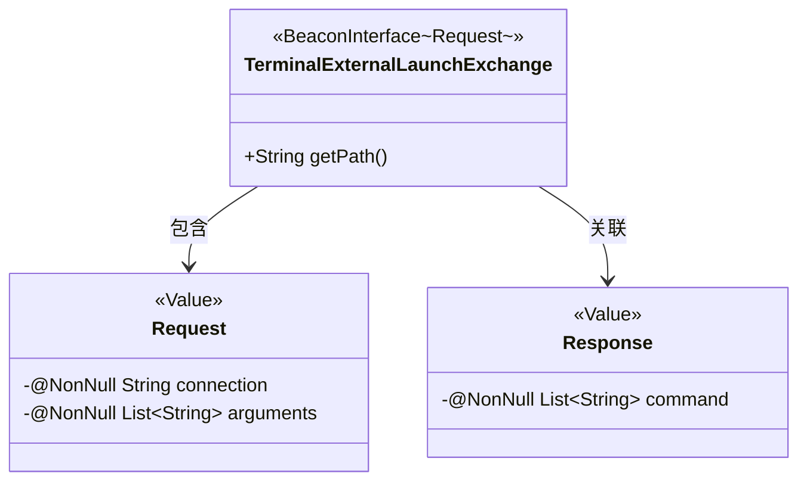
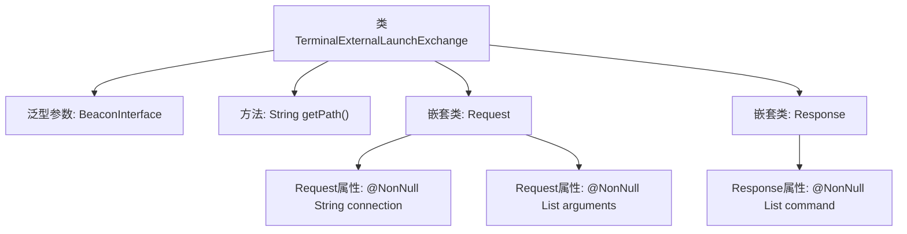

# 基础信息

|      |      |
|------|------|
| 名称 | TerminalExternalLaunchExchange |
| 编码语言 | .java |
| 代码路径 | xpipe/beacon/src/main/java/io/xpipe/beacon/api/TerminalExternalLaunchExchange.java |
| 包名 | io.xpipe.beacon.api |
| 依赖项 | ['io.xpipe.beacon.BeaconInterface', 'lombok.Builder', 'lombok.NonNull', 'lombok.Value', 'lombok.extern.jackson.Jacksonized', 'java.util.List'] |
| 概述说明 | 终端外部启动交换接口，含请求和响应类。请求含连接和参数列表，响应含命令列表。路径为/terminal/externalLaunch。 |

# 说明

这是一个名为TerminalExternalLaunchExchange的Java类，继承自BeaconInterface泛型类，泛型参数为内部类Request。该类重写了getPath方法，返回固定路径字符串。包含两个静态内部类：Request和Response，均使用Lombok注解实现不可变性和构建模式。Request类包含两个非空字段：connection字符串和arguments字符串列表。Response类包含一个非空字段command字符串列表。整个类结构用于处理终端外部启动的请求和响应数据交换。

# 类列表 Class Summary

| 名称   | 类型  | 说明 |
|-------|------|-------------|
| TerminalExternalLaunchExchange | class | 终端外部启动交换类，含请求和响应结构。请求需连接和参数列表，响应返回命令列表。路径为/terminal/externalLaunch。 |

## 类 TerminalExternalLaunchExchange

|      |      |
|------|------|
| 访问范围 | public |
| 类型 | class |
| 名称 | TerminalExternalLaunchExchange |
| 说明 | 终端外部启动交换类，含请求和响应结构。请求需连接和参数列表，响应返回命令列表。路径为/terminal/externalLaunch。 |

### UML类图

这段代码展示了一个终端外部启动交换类TerminalExternalLaunchExchange，它继承自泛型接口BeaconInterface，使用Request作为泛型参数。类中包含两个静态内部类：Request和Response，都使用了Lombok的@Value、@Builder和@Jacksonized注解来简化代码。Request类包含必需的connection字符串和arguments列表，Response类包含必需的command列表。主类通过getPath()方法提供特定路径，整体设计用于处理终端外部启动的请求和响应数据交换。

### 内部方法调用关系图

该流程图展示了TerminalExternalLaunchExchange类的结构，它是一个继承自BeaconInterface的泛型类，包含getPath()方法和两个嵌套静态类Request/Response。Request类包含connection字符串和arguments列表两个非空字段，Response类包含command列表字段。整体结构清晰地反映了类之间的包含关系和属性组成，用于处理终端外部启动的请求响应交互。

### 字段列表 Field List

| 名称  | 类型  | 说明 |
|-------|-------|------|

### 方法列表 Method List

| 名称  | 类型  | 说明 |
|-------|-------|------|
| getPath | String | 重写getPath方法，返回路径"/terminal/externalLaunch"。 |

