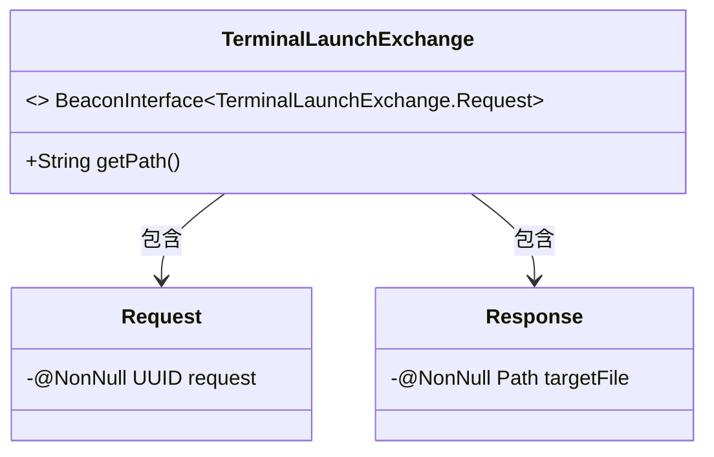
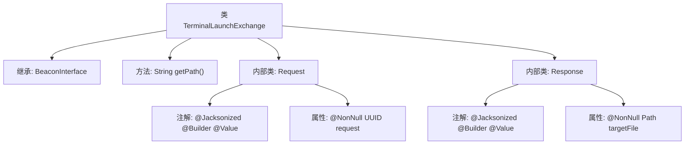

# 基础信息

|      |      |
|------|------|
| 名称 | TerminalLaunchExchange |
| 编码语言 | .java |
| 代码路径 | xpipe/beacon/src/main/java/io/xpipe/beacon/api/TerminalLaunchExchange.java |
| 包名 | io.xpipe.beacon.api |
| 依赖项 | ['io.xpipe.beacon.BeaconInterface', 'lombok.Builder', 'lombok.NonNull', 'lombok.Value', 'lombok.extern.jackson.Jacksonized', 'java.nio.file.Path', 'java.util.UUID'] |
| 概述说明 | 终端启动交换类，含请求和响应结构，路径为/terminal/launch。 |

# 说明

这是一个名为TerminalLaunchExchange的Beacon接口实现类，用于处理终端启动交换请求。该类定义了请求路径为/terminal/launch。包含两个静态内部类：Request和Response。Request类使用UUID作为非空请求标识，Response类包含一个非空的Path类型目标文件路径。两个内部类都使用了Lombok注解实现构建器和值对象功能，并支持Jackson序列化。整个类结构简洁，专注于终端启动时的数据交换需求。

# 类列表 Class Summary

| 名称   | 类型  | 说明 |
|-------|------|-------------|
| TerminalLaunchExchange | class | 终端启动交换类，含请求和响应结构。请求含UUID，响应含目标文件路径。 |

## 类 TerminalLaunchExchange

|      |      |
|------|------|
| 访问范围 | public |
| 类型 | class |
| 名称 | TerminalLaunchExchange |
| 说明 | 终端启动交换类，含请求和响应结构。请求含UUID，响应含目标文件路径。 |

### UML类图

这段类图展示了TerminalLaunchExchange类及其内部静态类Request和Response的结构。TerminalLaunchExchange实现了泛型接口BeaconInterface，其泛型参数为内部类Request类型。Request类包含一个非空的UUID类型字段request，Response类包含一个非空的Path类型字段targetFile。两个内部类都使用了Lombok的@Value、@Builder和@Jacksonized注解，表明它们是不可变的数据类，支持构建器模式和JSON序列化。

### 内部方法调用关系图

这段代码展示了一个名为TerminalLaunchExchange的类，它继承自泛型类BeaconInterface，并指定了Request作为泛型参数。类中包含一个返回固定路径的getPath方法，以及两个静态内部类Request和Response，分别用于封装请求和响应数据。这两个内部类都使用了Lombok的注解来简化代码，其中Request包含一个非空的UUID字段，Response包含一个非空的Path字段。整个结构主要用于处理终端启动相关的数据交换。

### 字段列表 Field List

| 名称  | 类型  | 说明 |
|-------|-------|------|

### 方法列表 Method List

| 名称  | 类型  | 说明 |
|-------|-------|------|
| getPath | String | 重写getPath方法，返回路径"/terminal/launch"。 |

