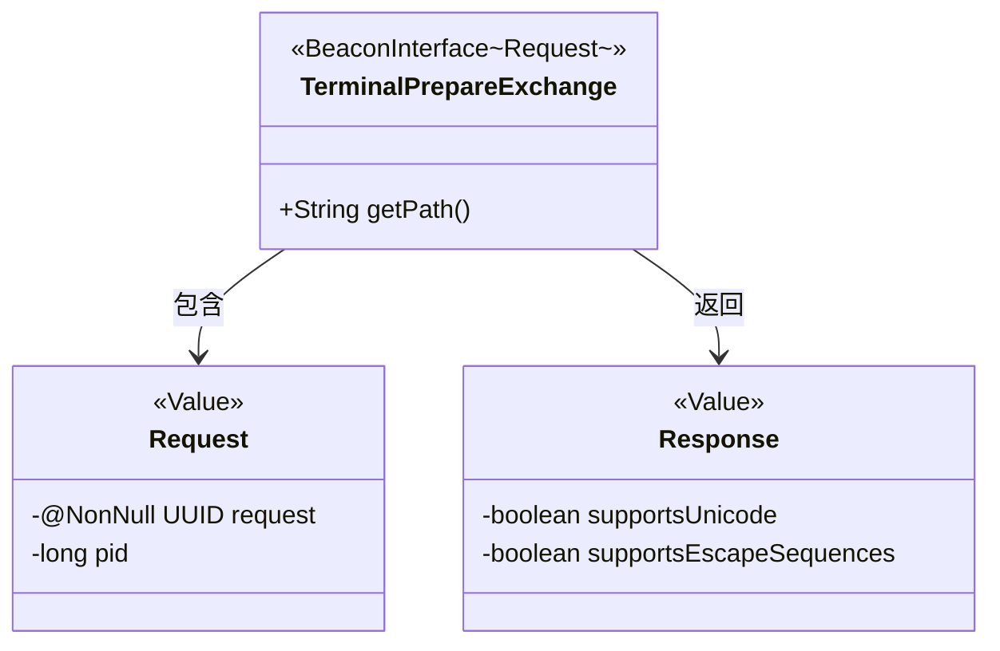
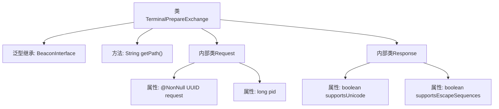

# 基础信息

|      |      |
|------|------|
| 名称 | TerminalPrepareExchange |
| 编码语言 | .java |
| 代码路径 | xpipe/beacon/src/main/java/io/xpipe/beacon/api/TerminalPrepareExchange.java |
| 包名 | io.xpipe.beacon.api |
| 依赖项 | ['io.xpipe.beacon.BeaconInterface', 'lombok.Builder', 'lombok.NonNull', 'lombok.Value', 'lombok.extern.jackson.Jacksonized', 'java.util.UUID'] |
| 概述说明 | 终端准备交换接口类，含请求和响应结构。请求含UUID和pid，响应含Unicode和转义序列支持标志。 |

# 说明

这是一个名为TerminalPrepareExchange的Java类，继承自BeaconInterface泛型类，泛型类型为内部类Request。该类重写了getPath方法，返回路径字符串"/terminal/prepare"。包含两个静态内部类：Request和Response，均使用了@Jacksonized、@Builder和@Value注解。Request类有两个字段：非空的UUID类型request和long类型pid。Response类有两个boolean类型字段：supportsUnicode和supportsEscapeSequences。整个结构用于处理终端准备的请求和响应数据。

# 类列表 Class Summary

| 名称   | 类型  | 说明 |
|-------|------|-------------|
| TerminalPrepareExchange | class | 终端准备交换接口类，含请求和响应结构。请求含UUID和pid，响应含Unicode和转义序列支持标志。 |

## 类 TerminalPrepareExchange

|      |      |
|------|------|
| 访问范围 | public |
| 类型 | class |
| 名称 | TerminalPrepareExchange |
| 说明 | 终端准备交换接口类，含请求和响应结构。请求含UUID和pid，响应含Unicode和转义序列支持标志。 |

### UML类图

这段代码展示了一个终端准备交换的类结构，其中TerminalPrepareExchange继承自泛型接口BeaconInterface，使用Request作为泛型参数。该类包含获取路径的方法getPath()，并定义了Request和Response两个静态内部类。Request类使用Lombok注解标记为不可变值对象，包含非空的UUID请求和进程ID字段；Response类同样为值对象，包含终端支持Unicode和转义序列的布尔标志。类图清晰地呈现了它们之间的包含和返回关系。

### 内部方法调用关系图

这段代码展示了一个名为TerminalPrepareExchange的类，它继承自泛型类BeaconInterface，并包含两个静态内部类Request和Response。流程图清晰地呈现了类的层级结构，包括主类的getPath方法路径定义，Request类中的UUID请求标识和进程ID字段，以及Response类中终端能力标志位。整个结构体现了终端准备交换场景下的数据封装需求，通过注解实现了建造者模式和JSON序列化支持。

### 字段列表 Field List

| 名称  | 类型  | 说明 |
|-------|-------|------|

### 方法列表 Method List

| 名称  | 类型  | 说明 |
|-------|-------|------|
| getPath | String | 重写getPath方法，返回路径"/terminal/prepare"。 |

