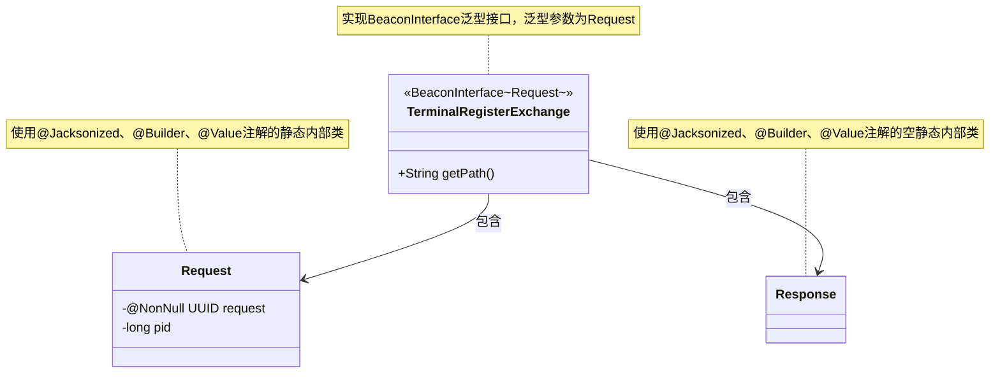
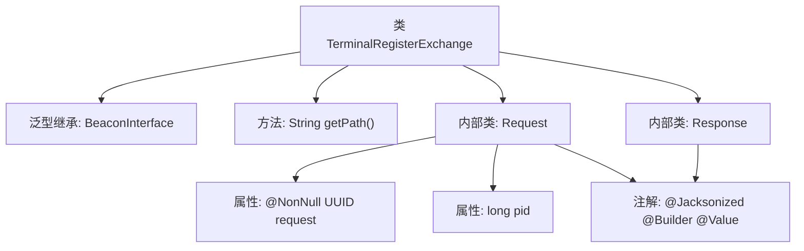

# 基础信息

|      |      |
|------|------|
| 名称 | TerminalRegisterExchange |
| 编码语言 | .java |
| 代码路径 | xpipe/beacon/src/main/java/io/xpipe/beacon/api/TerminalRegisterExchange.java |
| 包名 | io.xpipe.beacon.api |
| 依赖项 | ['io.xpipe.beacon.BeaconInterface', 'lombok.Builder', 'lombok.NonNull', 'lombok.Value', 'lombok.extern.jackson.Jacksonized', 'java.util.UUID'] |
| 概述说明 | 终端注册交换接口，含请求类（UUID和pid字段）和空响应类。 |

# 说明

这是一个名为TerminalRegisterExchange的类，继承自BeaconInterface泛型类，泛型类型为内部类Request。该类重写了getPath方法，返回路径字符串"/terminal/register"。包含两个静态内部类：Request和Response，都使用了@Jacksonized、@Builder和@Value注解。Request类包含两个字段：非空的UUID类型request和long类型pid；Response类为空结构。整个类设计用于终端注册交换场景。

# 类列表 Class Summary

| 名称   | 类型  | 说明 |
|-------|------|-------------|
| TerminalRegisterExchange | class | 终端注册交换接口类，包含请求和响应结构。 |

## 类 TerminalRegisterExchange

|      |      |
|------|------|
| 访问范围 | public |
| 类型 | class |
| 名称 | TerminalRegisterExchange |
| 说明 | 终端注册交换接口类，包含请求和响应结构。 |

### UML类图

该类图展示了TerminalRegisterExchange类及其两个静态内部类Request和Response的结构关系。TerminalRegisterExchange实现了泛型接口BeaconInterface，其泛型参数为内部类Request。Request类包含UUID类型的request字段（带@NonNull注解）和long类型的pid字段，两者均为私有属性。Response类为空结构，所有类均采用Lombok的@Jacksonized、@Builder和@Value注解实现不可变性和构建模式。整体设计用于处理终端注册请求/响应的数据序列化和反序列化。

### 内部方法调用关系图

该流程图展示了TerminalRegisterExchange类的结构，它是一个继承自BeaconInterface泛型类的实现，包含getPath方法路径定义和两个内部数据类。Request内部类使用Lombok注解标记，包含不可空的UUID请求标识和进程ID字段；Response内部类仅作空结构体使用。整体设计用于终端注册场景的请求/响应数据封装，符合Jackson序列化规范。

### 字段列表 Field List

| 名称  | 类型  | 说明 |
|-------|-------|------|

### 方法列表 Method List

| 名称  | 类型  | 说明 |
|-------|-------|------|
| getPath | String | 重写getPath方法，返回路径"/terminal/register"。 |

