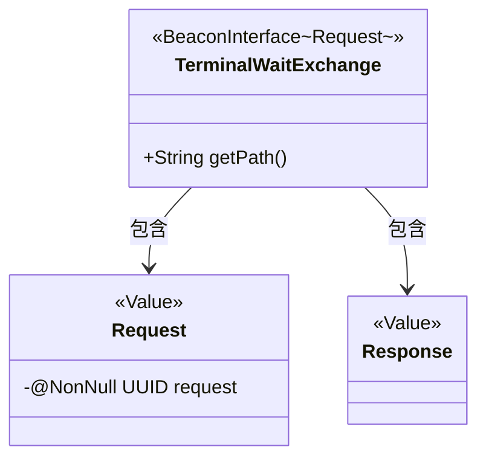
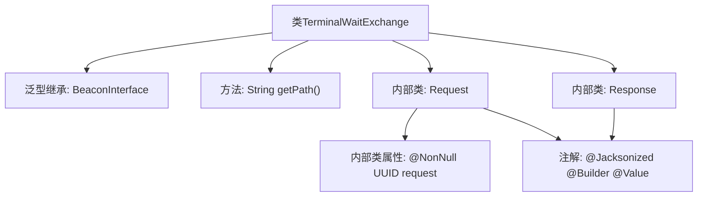

# 基础信息

|      |      |
|------|------|
| 名称 | TerminalWaitExchange |
| 编码语言 | .java |
| 代码路径 | xpipe/beacon/src/main/java/io/xpipe/beacon/api/TerminalWaitExchange.java |
| 包名 | io.xpipe.beacon.api |
| 依赖项 | ['io.xpipe.beacon.BeaconInterface', 'lombok.Builder', 'lombok.NonNull', 'lombok.Value', 'lombok.extern.jackson.Jacksonized', 'java.util.UUID'] |
| 概述说明 | 终端等待交换接口，含请求和响应类。请求需UUID，路径为/terminal/wait。 |

# 说明

这是一个名为TerminalWaitExchange的Beacon接口实现类，用于处理终端等待交换请求。该类定义了请求路径为"/terminal/wait"。包含一个静态内部类Request，使用@NonNull注解标记必填字段request（UUID类型），并采用@Jacksonized、@Builder和@Value注解实现序列化和不可变性。另有一个空的静态内部类Response，同样使用上述注解。整个类结构简洁，专注于终端等待交换功能。

# 类列表 Class Summary

| 名称   | 类型  | 说明 |
|-------|------|-------------|
| TerminalWaitExchange | class | 终端等待交换接口，含请求路径和UUID请求体。 |

## 类 TerminalWaitExchange

|      |      |
|------|------|
| 访问范围 | public |
| 类型 | class |
| 名称 | TerminalWaitExchange |
| 说明 | 终端等待交换接口，含请求路径和UUID请求体。 |

### UML类图

这段类图展示了TerminalWaitExchange类及其嵌套类Request和Response的结构。TerminalWaitExchange实现了泛型接口BeaconInterface<Request>，包含获取路径的公有方法getPath()。Request类使用Lombok注解标记为不可变值对象，包含非空的UUID类型request字段；Response是空值对象。两个嵌套类都使用了Jacksonized和Builder注解，表明它们支持JSON序列化和建造者模式创建。

### 内部方法调用关系图

该流程图展示了TerminalWaitExchange类的结构，它是一个继承自BeaconInterface泛型类的终端等待交换类。主要包含一个返回路径字符串的getPath方法，以及两个用@Jacksonized、@Builder和@Value注解标记的静态内部类Request和Response。其中Request类有一个非空的UUID类型属性request，而Response类为空结构。整个类设计简洁，主要用于处理终端等待请求的序列化和反序列化操作。

### 字段列表 Field List

| 名称  | 类型  | 说明 |
|-------|-------|------|

### 方法列表 Method List

| 名称  | 类型  | 说明 |
|-------|-------|------|
| getPath | String | 重写getPath方法，返回路径"/terminal/wait"。 |

